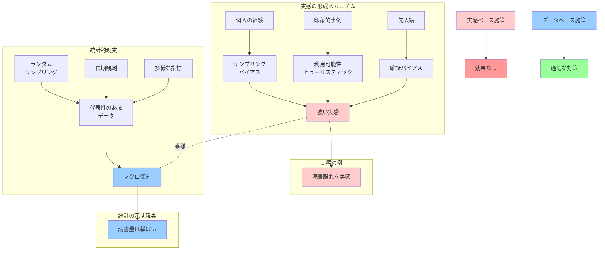

## 要約（Summary）

- 個人の「実感」は強い確信を生むが、マクロな統計データとはしばしば乖離する
- 出版業界では「本が読まれなくなった」という実感が支配的だが、統計は読書量の長期安定を示す
- 実感ベースの議論は施策立案を誤らせるため、データに基づく客観的分析が不可欠

## 本文（Body）

人間の「実感」は、個人の経験に基づく強い確信を生む。しかし実感は、認知バイアス・サンプリングの偏り・時間経過による記憶の歪みなどの影響を受けやすく、社会全体の傾向（マクロデータ）と一致しないことが多い。

### 背景・問題意識

出版業界では「本が読まれなくなった」「読書離れが進んでいる」という実感が広く共有されている。この実感は、出版市場の縮小という経済的現実と重なり、強固な「常識」として定着している。

しかし統計データを見ると：
- 書籍の読書量：戦後一貫して「おおむね5割前後」（読書世論調査）
- 年齢別読書量：高校卒業後はほぼ横ばい（文化庁調査）
- 労働時間と読書量：相関が見られない（黒田・山本論文）

実感と統計が乖離している。

### アイデア・主張

**個人の実感は貴重な観察であり尊重されるべきだが、社会全体の傾向を論じる際は、実感ではなく統計データに基づくべきである。実感ベースの施策は、問題の所在を誤認し、効果のない対策に資源を浪費するリスクがある。**

実感と統計が乖離する主な理由：

1. **サンプリングバイアス**
   - 自分の周囲＝全体、という認知の誤り
   - 出版関係者は「本好きの集団」であり、一般層とは異なる

2. **利用可能性ヒューリスティック**
   - 印象的な事例（書店閉店など）が記憶に強く残る
   - 目立たない安定（毎日少しずつ本を読む層）は認識されにくい

3. **原因の誤帰属**
   - 市場縮小（経済現象）→ 読書量減少（行動変化）と誤解
   - 実際は流通構造の変化、価格、代替メディアなど複合要因

4. **時間軸の混同**
   - 自分の若い頃（学生時代）と現在（社会人）を比較
   - これは加齢効果であり、世代効果や時代効果ではない

5. **確証バイアス**
   - 「読書離れ」を信じている人は、それを裏付ける事例を選択的に記憶

### 内容を視覚化するMermaid図

### 具体例・ケース

**体感治安と犯罪統計**
- 実感：「最近、治安が悪くなった」
- 統計：刑法犯認知件数は長期的に減少傾向
- メカニズム：センセーショナルな事件報道が記憶に強く残る

**宗教人口の実感**
- 実感：「周りにクリスチャンが多い」（特定のコミュニティにいる人）
- 統計：日本のキリスト教徒は人口の約1%
- メカニズム：自分の属するコミュニティ＝社会全体、という錯覚

**出版業界の読書離れ実感**
- 実感：「昔に比べて本が売れなくなった」
- 統計：読書量（冊数）は横ばい
- メカニズム：
  - 市場縮小（売上減）と読書量減少を混同
  - 書店網の縮小が可視化されやすい
  - 出版関係者は「本好き」であり、一般層とは異なる

**労働時間と読書の関係**
- 実感：「忙しくて本が読めない」
- 統計：労働時間短縮後も読書量は増えていない（黒田・山本論文）
- メカニズム：余暇時間の使い方は多様であり、読書だけが選ばれるわけではない

### 反論・限界・条件

**実感には価値がある場合**
- 質的な変化：統計に表れにくい「読書の質」の変化を捉える
- 初期シグナル：マクロデータに遅れて表れる変化の予兆
- 当事者の生の声：政策の受益者がどう感じているかは重要

**統計にも限界がある**
- 測定不可能な領域：電子書籍、オーディオブックなどの捕捉漏れ
- 定義の曖昧さ：「読書」とは何か（拾い読み、再読など）
- ラグ：調査から公表まで時間がかかる

**実感と統計の統合**
- 実感→仮説生成、統計→仮説検証、という組み合わせ
- 実感で「何か変だ」と気づき、統計で「何が起きているか」を特定
- 両者を対立させるのではなく、補完的に使う

**文脈依存性**
- 地域・業界・年齢層によっては実感が正しい場合もある
- マクロの安定性と、ミクロの多様性は両立する

## 関連ノート（Links）

- [[20251215010140-reading-quantity-purchase-quantity-decoupling|読書量と購買量の非相関性]] 読書量と購買量の非相関性
- [[20251215010141-magazine-book-statistical-confusion|書籍と雑誌の統計的混同]] 書籍と雑誌の統計的混同
- [[20251215010143-working-hours-reading-decoupling|労働時間と読書量の非相関]] 労働時間と読書量の非相関
- [[20251215010144-bestseller-ranking-representativeness-bias|ベストセラーランキングの代表性バイアス]] ベストセラーランキングの代表性バイアス

## To-Do / 次に考えること

- [ ] 実感と統計の乖離が大きい他の領域を調査（経済、医療、教育など）
- [ ] 「実感の精度」を高める方法論を検討（日記、定量記録など）
- [ ] 出版業界の政策立案において、データリテラシーを高める取り組みを提案
- [ ] 認知バイアスを軽減するためのチェックリストを作成
