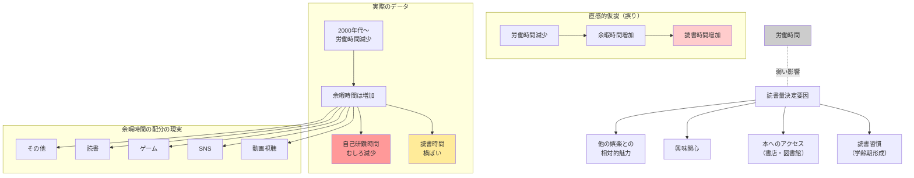

## 要約（Summary）

- 労働時間の長短と読書量の間には、マクロデータ上明確な相関が見られない
- 日本では長時間労働是正が進んだが、読書量は増加していない（自己研鑽時間も減少）
- 「時間があれば読書する」という仮説は、余暇時間の使い方の多様性を見落としている

## 本文（Body）

直感的には「忙しいから本が読めない」「時間ができれば本を読む」と考えがちだが、社会全体のデータを見ると、労働時間と読書量の間に明確な因果関係は見られない。

### 背景・問題意識

三宅香帆『なぜ働いていると本が読めなくなるのか』では、日本人の長時間労働が読書量減少の主因とされた。しかし複数の統計データはこの仮説を支持しない。

観察される事実：
- 読書量は学齢期（働く前）に大きく減少し、就労開始後は横ばい
- 小学生：月12.1冊 → 中学生：3.9冊 → 高校生：1.4冊 → 社会人：1.5冊前後
- 2000年代以降、日本の労働時間は減少傾向（特に週60時間以上の長時間労働者）
- しかし読書量は増加していない

### アイデア・主張

**労働時間の長短は読書量に対して決定的な影響を持たない。余暇時間が増えても、それが自動的に読書に振り向けられるわけではなく、娯楽の選択肢が多様化している現代では、読書は数ある選択肢の一つに過ぎない。**

論拠となるデータ：

**厚生労働省「わが国の過去50年間（1973年～2023年）の労働時間の推移についての考察」（2024年）**
- 週60時間以上働く長時間労働者の割合が低下
- 男性労働者では週35～42時間の層の割合が上昇
- 結論：「日本社会の『半身』化は進んでいる」

**黒田祥子・山本勲「長時間労働是正と人的資本投資との関係」（2019年）**
- 労働時間が減っても、自己研鑽の時間は増えていない
- 40歳以上でわずかに増加（年5時間未満）
- 結論：「残業削減で学習が増える」効果はほぼ見られない

**各種読書調査**
- 文化庁「国語に関する世論調査」：年齢別の読書量に大きな差はない
- 働き盛り世代と退職世代で読書量に顕著な差は見られない

### 内容を視覚化するMermaid図

### 具体例・ケース

**日本の長時間労働是正（2000年代〜2020年代）**
- 政策：働き方改革関連法（2019年施行）など
- 結果：週60時間以上労働者の減少
- 読書への影響：ほぼなし（横ばい継続）
- 他の活動：動画配信サービス、SNSの利用時間が増加

**定年退職者の読書量**
- 仮説：時間ができるから読書量が増えるはず
- 実態：60代以上の読書量は、40〜50代と大差ない
- 文化庁調査：「読まない」割合は全年齢で大きな差がない

**学生から社会人への移行**
- 高校生：月1.4冊
- 社会人：月1.5冊
- 労働時間が大幅に増えたにもかかわらず、読書量はほぼ同じ
- むしろ「学生は時間があるはず」なのに少ない

**黒田・山本論文の示唆**
- 労働時間削減 → 余暇増加 → しかし自己研鑽（読書含む）は増えず
- 余暇時間は「休息」や「娯楽」に配分される
- 読書は「学習」として認識されると選択されにくい

### 反論・限界・条件

**個人レベルでは相関がある場合も**
- 極端な長時間労働（週70時間以上など）は読書を物理的に困難にする
- ただしマクロでは、そのような労働者は少数

**読書の「質」は労働時間に影響されるかも**
- 量は変わらなくても、疲労により集中力が下がる可能性
- 難解な本を避け、軽い本を選ぶ傾向があるかもしれない
- ただし、これを示すデータは乏しい

**他の制約要因の存在**
- 通勤時間：労働時間以外の時間制約
- 家事・育児：特に女性の時間制約（本稿では触れられていない論点）
- 経済的余裕：可処分所得が読書量に影響する可能性

**娯楽の競合**
- 2000年代以降：YouTube、Netflix、ソーシャルメディアの台頭
- 余暇時間の奪い合い：読書 vs 動画・SNS
- 労働時間減少の効果が、他のメディアに吸収された可能性

**「読書の位置づけ」の変化**
- かつて：娯楽の主要選択肢の一つ
- 現在：多数の選択肢の一つ
- 余暇が増えても、読書が選ばれる確率は低下している可能性

## 関連ノート（Links）

- [[20251215010140-reading-quantity-purchase-quantity-decoupling|読書量と購買量の非相関性]] 読書量と購買量の非相関性
- [[20251215010141-magazine-book-statistical-confusion|書籍と雑誌の統計的混同]] 書籍と雑誌の統計的混同
- [[20251215010142-subjective-feeling-vs-statistics|実感と統計データの乖離]] 実感と統計データの乖離

## To-Do / 次に考えること

- [ ] 余暇時間の配分に関する時間利用調査を詳細に分析する
- [ ] デジタルメディア（動画、SNS）の利用時間と読書時間の代替関係を定量化
- [ ] 「読書を選ばせる」要因（動機づけ、環境、コミュニティなど）を探る
- [ ] 労働時間以外の時間制約（通勤、家事、育児）と読書量の関係を調査
- [ ] 政策含意：労働時間削減だけでは読書促進にならない→別のアプローチが必要
