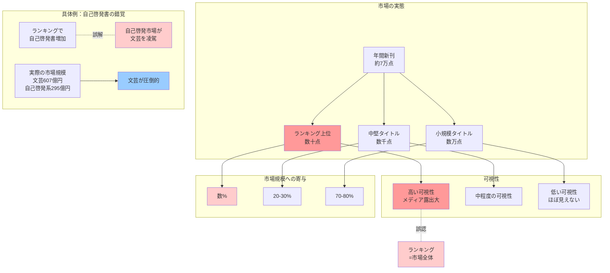

## 要約（Summary）

- ベストセラーランキングは市場の「上澄み」であり、市場全体の構造を代表しない
- 自己啓発書がランキングで目立っても、市場規模では文芸が圧倒的に大きい
- 「目立つもの」と「ボリュームゾーン」を混同すると、市場分析を誤る

## 本文（Body）

ベストセラーランキングは可視性が高く、メディアでも頻繁に取り上げられるため、「今、何が売れているか」を知る上で便利な情報源である。しかしランキングは市場の一部（上位数十〜数百タイトル）しか反映しておらず、年間数万点発行される書籍全体の傾向を代表するものではない。

### 背景・問題意識

三宅香帆『なぜ働いていると本が読めなくなるのか』では、社会学者・牧野智和の研究を引用し、「年間ベストセラー上位における自己啓発書の割合が増えている」ことから、自己啓発書の市場が文芸市場を凌駕しているかのような主張がなされた。

しかし実際のデータを見ると：
- **日本文学小説物語**：607.18億円（2024年、推定発行金額）
- **自己啓発書が含まれうるカテゴリー合計**：約295億円
  - 心理学：63.85億円
  - 倫理学：33.31億円
  - 経営：86.64億円
  - 教育：60.20億円
  - その他（宗教、伝記など）：約52億円

文芸市場は、自己啓発書を含みうる全カテゴリーを合わせた額の2倍以上である。

### アイデア・主張

**ベストセラーランキングは市場の「上澄み」であり、「目立つ」ものを映すが「全体像」を映さない。市場分析においては、ランキングではなく、市場規模（金額・冊数）や流通実態などの「すそ野」のデータに基づくべきである。**

ベストセラーランキングの特性：
- **極端な値の過大代表**：数百万部の大ヒット vs 数千部の大多数
- **トレンドの強調**：その年の話題＝長期的構造とは限らない
- **カテゴリー偏り**：一部ジャンル（実用書など）はランキングに入りやすい
- **販売チャネル依存**：調査対象書店の傾向に左右される

### 内容を視覚化するMermaid図

### 具体例・ケース

**自己啓発書の「見かけ上の隆盛」**
- 牧野智和の分析：年間ベストセラー上位の自己啓発書冊数
  - 1990年代以前：10年間で20冊未満
  - 2000年代：37冊
  - 2010年代：77冊
- 解釈の誤り：「自己啓発書市場が急成長」
- 実態：ランキング上位での目立ち度が上昇しただけ
- 市場規模：文芸（607億円）>> 自己啓発系全体（約295億円）

**なぜこの誤解が生じるか**
1. ランキングは可視性が高い（新聞、ネットニュースで頻繁に報道）
2. 自己啓発書はタイトルが印象的で記憶に残りやすい
3. 文芸の大半は「地味に安定して売れる」ため目立たない
4. ランキング = 市場全体、という思い込み

**同様の錯覚が起きやすい他の領域**
- 芸能ニュース：トップタレント ≠ 芸能界全体
- SNSのバズ：バズった投稿 ≠ SNS全体の傾向
- ニュース：報道される事件 ≠ 犯罪全体の傾向（体感治安問題）

**正しい市場分析の例**
- 出版科学研究所『出版指標年報』：推定発行金額・部数をカテゴリー別に集計
- これを見ると、文芸が最大カテゴリーであることが明確
- ランキングだけ見ていては、この構造を見落とす

### 反論・限界・条件

**ランキングにも価値がある場面**
- **トレンド把握**：「今年の話題」を知るには有用
- **マーケティング**：ヒット作のパターンを研究
- **読者の関心**：何が注目されているかを知る手がかり
- **メディア報道**：話題性を持つタイトルの特定

**市場全体データの限界**
- **集計の遅れ**：年報は翌年にならないと出ない
- **電子書籍の捕捉**：完全な把握が難しい
- **古書市場**：統計に含まれない

**使い分けが重要**
- ランキング：「話題性」「トレンド」を見る
- 市場規模データ：「構造」「全体像」を把握
- 両方を併用し、それぞれの限界を認識する

**「すそ野」が測定しにくい場合**
- 新興市場：データ整備が追いついていない
- ニッチ分野：集計対象外になることがある
- その場合、ランキングや部分的データに頼らざるを得ない
- ただし「これは部分的情報である」ことを明記すべき

## 関連ノート（Links）

- [[20251215010140-reading-quantity-purchase-quantity-decoupling|読書量と購買量の非相関性]] 読書量と購買量の非相関性
- [[20251215010142-subjective-feeling-vs-statistics|実感と統計データの乖離]] 実感と統計データの乖離
- [[20251215010141-magazine-book-statistical-confusion|書籍と雑誌の統計的混同]] 書籍と雑誌の統計的混同

## To-Do / 次に考えること

- [ ] 他の産業（音楽、映画など）でも同様のランキング錯覚があるか調査
- [ ] 「ロングテール」理論と本事例の関係を整理
- [ ] 電子書籍時代のランキングの意味の変化を考察（Kindleランキングなど）
- [ ] データ可視化において「上澄み」と「すそ野」を同時に見せる手法を検討
- [ ] 市場規模データへのアクセスを容易にする取り組み（出版業界向け）を提案
