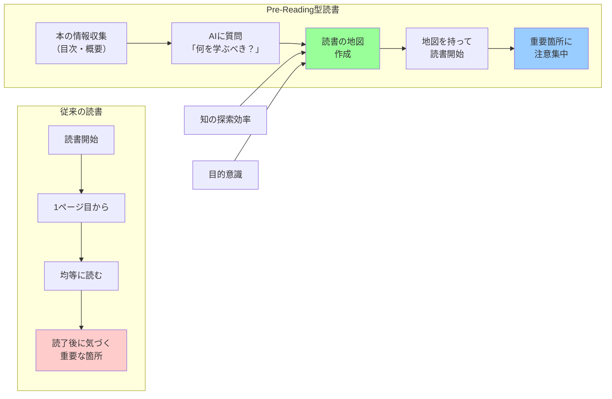

## 要約（Summary）

- 読書の前にAIに「この本から何を学べばいいか」を質問し、読書の地図を作成する手法
- 知の探索効率を高め、目的意識を持って読書を開始できる
- Pre-Readingによって、読書中の彷徨を防ぎ、重要な箇所への注意力を向上させる

## 本文（Body）

読書において「いきなり読み始める」のではなく、AIに事前質問することで「読書の地図」を手に入れるアプローチ。従来の速読術や目次チェックをAIで強化した手法と言える。

### 背景・問題意識

仕事のために本を読む際、効率を上げたいという動機がある。しかし従来の読書法では：

- どこが重要か分からず、全体を均等に読んでしまう
- 読み終わってから「自分に必要な部分はここだった」と気づく
- 読書空間で彷徨い、時間を浪費する

特にビジネス書や専門書において、全ページを均等に読む必要はなく、自分の文脈に関連する部分に集中すべきだが、それを事前に判断するのは難しい。

### アイデア・主張

**本を読む前にAIに「この本は何について書いているのか」「今の自分はどんな知識を得るべきか」と質問することで、読書の見取り図を作成する。これにより、地図を持たずに読書空間で彷徨うことを防ぎ、知の探索効率を高める。**

実践手順：
1. 本のタイトル・概要・目次をAIに提示
2. 「この本の主要なテーマは何か」を質問
3. 「自分の現在の状況（職種、課題など）を踏まえて、どこを重点的に読むべきか」を質問
4. AIの回答から、読書の優先順位と注目ポイントを明確化
5. この地図を持って実際の読書を開始

効果：
- 読書前に全体像を把握できる
- 自分にとって重要な箇所が事前に分かる
- 読書中の注意力が適切に配分される
- 読後の満足度が向上する

### 内容を視覚化するMermaid図

### 具体例・ケース

**ケース1：専門書の効率的読書**
- 状況：エンジニアがマイクロサービスの本を読む
- Pre-Reading質問：「私はモノリシックなシステムの保守経験がある。この本から何を学ぶべきか」
- AI回答：「第3章の分散システムの課題、第7章のデータ整合性パターンを重点的に」
- 結果：400ページの本の中で、120ページに集中して読み、実務に直結する知識を獲得

**ケース2：ビジネス書の文脈理解**
- 状況：経営層が戦略論の本を読む
- Pre-Reading質問：「この本の主張は何か。賛否両論はあるか」
- AI回答：「著者はポジショニング戦略を重視。ただし近年のネットワーク効果には触れていない」
- 結果：読書前に批判的視点を持ち、より深い理解が可能に

**ケース3：学際的な本の読み方**
- 状況：『銃・病原菌・鉄』のような学際書
- Pre-Reading質問：「この本の核心的な主張は何か。どの章で展開されるか」
- AI回答：「地理的決定論の議論が第1部、具体例が第2-3部」
- 結果：第1部を精読し、第2-3部は事例として斜め読み

### 反論・限界・条件

**バイアスのレンズを作る弊害**
- Pre-ReadingはAIの解釈を通じた「色眼鏡」を作る
- 予想外の発見や、著者の意図しない読み方の可能性を狭める
- 特に文学や哲学書では、先入観なく読む価値が高い

**AIの理解の限界**
- AIが本の内容を正確に把握しているとは限らない
- 特に新刊や専門性の高い本では、AIの知識が不足している可能性
- 誤った地図を持つと、かえって読書を歪める

**適用範囲の限定**
- 小説や文学：ネタバレになるため不向き
- 詩歌・エッセイ：言葉そのものの味わいが重要なため不向き
- 適しているのは：ビジネス書、専門書、教科書、論文など「知識獲得」が目的の読書

**本来の読書体験の喪失**
- 著者が意図した順序で読む体験の価値
- 迷いながら読むこと自体の学習効果
- 「効率」を重視しすぎることで失われるもの

**前提条件**
- 目的が明確な読書（仕事、学習など）
- 時間制約がある状況
- AIが本の内容について最低限の情報を持っている

## 関連ノート（Links）

- [[20251215085308-ai-highlight-structuring|AIによるハイライト構造化]] - Pre-Readingの次のステップ
- [[20251215085315-critical-perspective-integration|批判的視点の統合による読書深化]] - 読書後の深化プロセス
- [[20251215085320-notebook-lm-knowledge-crystallization|Notebook LMによる知識結晶化]] - 視覚化による定着
- [[20251215085324-knowledge-creation-reading|知識生成型読書への転換]] - 全体的な読書パラダイムの変化
- [[20251215010143-working-hours-reading-decoupling|労働時間と読書量の非相関]] - 読書効率化の文脈

## To-Do / 次に考えること

- [ ] Pre-Readingの効果を測定する方法を考える（読了時間、理解度、応用可能性など）
- [ ] どの程度のバイアスが許容されるか、ジャンル別に検証する
- [ ] AIが持っていない本（新刊など）でのPre-Reading代替手法を探る
- [ ] Pre-Readingを使った読書と使わない読書の比較実験をデザインする
- [ ] 教育現場での応用可能性を検討する（学生の予習効率化など）
