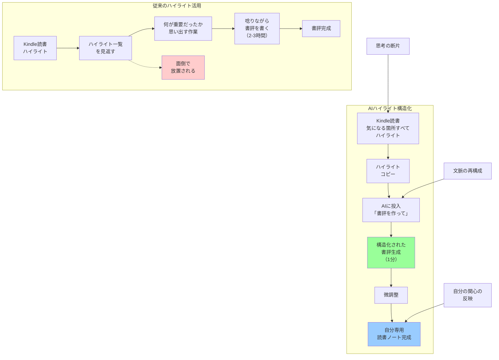

## 要約（Summary）

- Kindleでハイライトした「思考の断片」をAIに渡し、自分の視点で構造化された書評・読書ノートを生成する手法
- 断片を繋ぎ合わせる作業を自動化し、読書の解釈時間を劇的に短縮
- 「自分が気になった箇所」のみで構成されるため、個別化された読書ノートになる

## 本文（Body）

読書後の「ハイライトを見返す→書評を書く」という時間のかかるプロセスを、AIで自動化・高速化する手法。重要なのは、ハイライト箇所が「自分の関心」を反映しているため、生成される書評も「自分専用」になる点。

### 背景・問題意識

読書において、重要な箇所にマーカーを引く行為は古くから行われてきた。しかし：

- ハイライトは「点」であり、それ自体は文脈を持たない断片
- ハイライトを見返しても、なぜそこが重要だったのか思い出せない
- 断片を繋ぎ合わせて書評を書くには、唸りながら数時間かかる
- 書評を書かないと、ハイライトは死蔵される

特に仕事で読む専門書では、「読んだ証拠」や「知識の定着」のために書評・要約が必要だが、その作業コストが高すぎた。

### アイデア・主張

**Kindleでハイライトした箇所をテキストとして抽出し、AIに「これをもとに、私の視点で書評を作って」と命じることで、断片的なハイライトを構造化された読書ノートに変換する。従来数時間かかっていた作業が1分で完了し、しかも「自分が気になった箇所」だけで構成されるため、個別化された読書記録になる。**

実践手順：
1. Kindleで読書しながら、気になった箇所をすべてハイライト
2. PC版Kindleを開き、ハイライト一覧をコピー
3. テキストエディタに貼り付け（この時点では文章の脈絡がない断片集）
4. AIに断片集を渡し、「私の視点で書評を書いて」とプロンプト
5. AIが断片を繋ぎ合わせ、構造化された書評を生成
6. 必要に応じて微調整

生成される書評の特徴：
- ハイライト箇所（＝自分の関心）を反映
- 断片が論理的に繋がった文章
- 自分専用の読書ノート
- 読んだ本人だけが心に残った点を盛り込んだレビュー

時間効率：
- 従来：書評作成に2〜3時間
- AI活用：書評作成に1分
- 短縮率：99%以上

### 内容を視覚化するMermaid図

### 具体例・ケース

**ケース1：専門書の読書ノート作成**
- 本：マイクロサービスアーキテクチャの技術書（400ページ）
- ハイライト：80箇所
- AI生成書評：「分散システムの課題」「データ整合性パターン」「モニタリング戦略」の3セクション構成、約2000字
- 結果：チーム内で共有できる読書メモが1分で完成

**ケース2：ビジネス書からの洞察抽出**
- 本：戦略論の古典（300ページ）
- ハイライト：50箇所（主に事例とフレームワーク）
- AI生成書評：事例がフレームワークの文脈で整理され、自社への応用ポイントが明確化
- 結果：経営会議のプレゼン資料のベースとして活用

**ケース3：学際書の理解深化**
- 本：『銃・病原菌・鉄』
- ハイライト：地理的決定論の議論、農業の起源、病原菌の影響など60箇所
- AI生成書評：著者の主張が明確に構造化され、因果関係が整理された
- 結果：読み返しが容易になり、他者への説明も可能に

### 反論・限界・条件

**書評を書く過程での学習の喪失**
- 書評を自分で書く行為は、「悪戦苦闘する過程で得られる知識の蒸留」を含む
- この過程をスキップすることで、深い理解が得られない可能性
- 特に学生の学習においては、プロセスそのものが重要

**AIの解釈の介入**
- ハイライトを繋ぐ際、AIが独自の解釈を加える
- 自分の意図と異なる文脈で繋がれる可能性
- 「自分の言葉で書く」という行為の価値が失われる

**ハイライトの質への依存**
- ハイライトが不適切だと、書評も不適切になる
- 「気になった箇所」が必ずしも「重要な箇所」ではない
- ハイライトのスキル自体が問われる

**知識の定着率**
- 自分で書く場合と比較して、記憶への定着率が低い可能性
- 「楽に得た知識」は忘れやすいという認知科学の知見
- ただし、書評を書かずに放置するよりは定着する

**適用範囲**
- 効果的：専門書、ビジネス書、論文など、「情報抽出」が目的の読書
- 不向き：小説、エッセイ、詩歌など、「体験」が目的の読書
- 中間：思想書、哲学書（解釈の多様性が重要なため、AIに任せるべきか微妙）

**前提条件**
- デジタル読書環境（Kindle、PDF等）が必要
- ハイライト機能が使える
- AIへのアクセス
- タイパ（タイムパフォーマンス）を重視する読書

## 関連ノート（Links）

- [[20251215085259-pre-reading-ai-reading-map|Pre-Reading：AIによる読書前の地図作成]] - 読書の前段階
- [[20251215085315-critical-perspective-integration|批判的視点の統合による読書深化]] - ハイライト構造化の次のステップ
- [[20251215085320-notebook-lm-knowledge-crystallization|Notebook LMによる知識結晶化]] - 構造化後の視覚化
- [[20251215085324-knowledge-creation-reading|知識生成型読書への転換]] - 全体的な読書パラダイム
- [[20251215010143-working-hours-reading-decoupling|労働時間と読書量の非相関]] - 読書効率化の重要性を示す背景

## To-Do / 次に考えること

- [ ] AIによる書評と手書き書評の質の比較実験を設計する
- [ ] ハイライトのスキルを高める方法を探る（良いハイライトの条件とは何か）
- [ ] AI生成書評の精度を高めるプロンプトエンジニアリング
- [ ] 生成された書評を「自分の言葉」に翻訳する軽量な編集プロセスの開発
- [ ] 知識の定着率を測定する方法（AI書評 vs 手書き書評）
- [ ] 紙の本でも使える代替手法の検討（写真→OCR→AI？）
