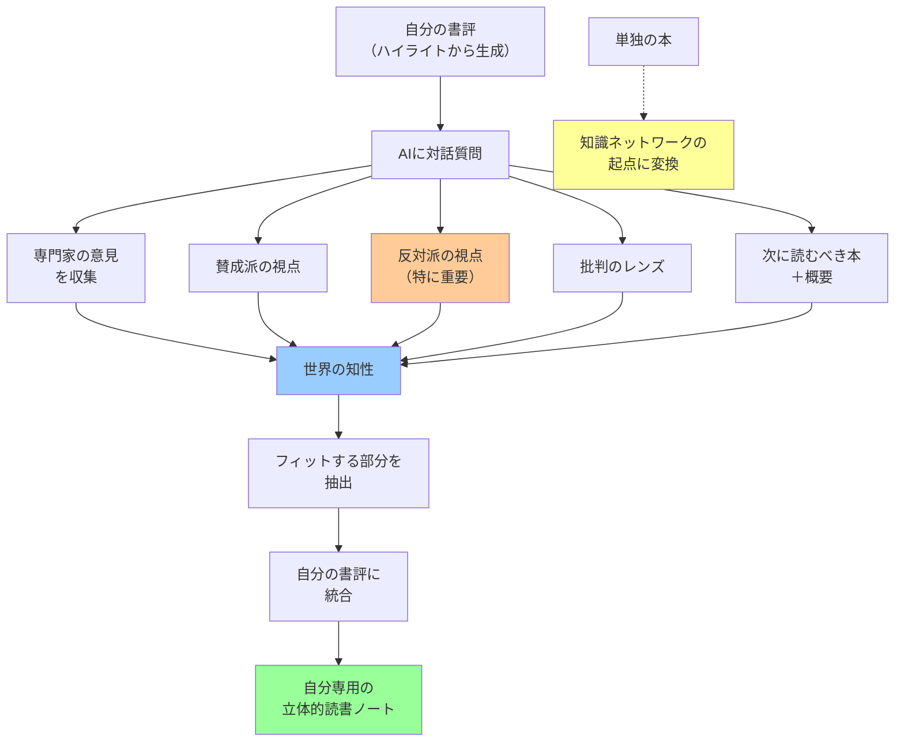

## 要約（Summary）

- 自分の書評をベースに、AIに「賛成派・反対派の視点」「関連する専門家の意見」「次に読むべき本」を収集させ、対話的に読書を深化させる手法
- 他人の読書から得た知性を自分の知性に統合し、自分専用の解釈を育てる
- 世界の知性と自分の書評を融合させ、一冊の本から立体的な理解を得る

## 本文（Body）

自分の書評（AI生成でも手書きでも）を出発点として、AIとの対話を通じて「世界中の知性」を取り込み、多角的な理解を構築する読書手法。単独の本を読むだけでなく、その本を巡る議論全体にアクセスする。

### 背景・問題意識

従来の読書は「一冊の本を読んで終わり」というモデルだった。しかし：

- 著者の主張には必ず前提や限界がある
- 反論や代替理論を知らないと、偏った理解になる
- 関連する専門家の議論を知ることで、理解が深まる
- しかし、それらを自力で探すのは時間がかかりすぎる

特に専門書やビジネス書では、「この本は正しいのか？」「どの程度普遍的なのか？」を判断する必要があるが、個人の知識だけでは限界がある。

### アイデア・主張

**自分の書評を作成した後、AIに「この本に関連する国内外の専門家の意見を集めて」「賛成派・特に反対派の視点を教えて」「次に読むべき本とその概要」を質問することで、一冊の本を起点とした知識ネットワークを構築する。AIが収集した世界の知性を自分の書評に統合することで、自分専用の立体的な読書体験を作り上げる。**

実践手順（対話モード）：
1. 自分の書評（ハイライトから生成したもの）を準備
2. AIに追加質問を投げる：
   - 「この本に関連する専門家の意見を教えて」
   - 「この本の主張への賛成派・反対派の視点は？」
   - 「批判的なレンズで見ると、どんな問題がある？」
   - 「次に読むべき本は？その概要も」
3. AIの回答から、自分の解釈にフィットする部分を抽出
4. 自分の書評に統合・更新
5. 必要に応じて、さらに深掘り質問を繰り返す

効果：
- 一冊の本が「知識の起点」になる
- 賛否両論を知ることで、批判的思考が養われる
- 「次に読むべき本」のキュレーションが自動化
- 他人の読書知を自分の知性に統合できる
- 自分の書評と世界の知性が融合した「自分専用の本」ができる

特に価値が高いのは：
- **反対派の視点**：著者の主張の限界や前提が明確になる
- **批判のレンズ**：盲目的な受容を防ぐ

### 内容を視覚化するMermaid図

### 具体例・ケース

**ケース1：『銃・病原菌・鉄』の多角的理解**
- 自分の書評：「地理的決定論による文明発展の説明が説得力ある」
- AIへの質問：「この本への批判的視点を教えて」
- AI回答：
  - 賛成派：進化生物学者、考古学者の支持
  - 反対派：文化人類学者からの批判「文化の役割を過小評価」
  - 代替理論：制度論、技術決定論
- 統合後：「地理的決定論は説得力あるが、文化や制度の役割も考慮すべき」という立体的理解

**ケース2：ビジネス書の実務適用判断**
- 自分の書評：「リーン・スタートアップは魅力的」
- AIへの質問：「この手法の限界や失敗例は？」
- AI回答：
  - 適用範囲：B2C、短期検証可能な仮説に有効
  - 限界：B2B、長期投資が必要な事業には不向き
  - 批判：「早すぎるピボット」のリスク
- 統合後：「自社のB2B事業には一部修正が必要」という実務判断

**ケース3：次に読む本の戦略的選択**
- 読了書：マイクロサービスの入門書
- AIへの質問：「次に読むべき本は？」
- AI回答：
  1. 『Building Microservices』（詳細な実装パターン）
  2. 『Domain-Driven Design』（設計の前提知識）
  3. 『Release It!』（運用の現実）
- 結果：自分のニーズに合わせて『Release It!』を選択、読む前に概要も把握

**ケース4：学際書の理論的背景の理解**
- 読了書：行動経済学の本
- AIへの質問：「この本の理論的基盤となっている研究は？」
- AI回答：カーネマン＆トヴェルスキーのプロスペクト理論、セイラーのナッジ理論
- 結果：原著論文へのアクセスパス獲得、より深い理解へ

### 反論・限界・条件

**AIの情報の正確性**
- AIが提示する「専門家の意見」は必ずしも正確ではない
- 特に新しい本や日本語の議論は、AIが十分に把握していない可能性
- ファクトチェックが必要だが、それには時間がかかる

**情報過多による混乱**
- あまりに多くの視点を統合しようとすると、かえって混乱する
- 「どれが正しいのか分からない」状態に陥るリスク
- 適度な統合レベルを見極める判断力が必要

**自分の解釈の希薄化**
- 世界の知性を統合しすぎると、自分独自の解釈が薄まる
- 「AIが集めた意見の寄せ集め」になってしまう危険
- 自分の軸を持つことの重要性

**対話のコスト**
- AIとの対話を深めるほど時間がかかる
- 「効率化」が目的だったはずが、かえって時間がかかることも
- どこまで深掘りするか、投資対効果の判断が必要

**批判的思考の外注化**
- 「反対派の視点」をAIに頼ることで、自分で批判的に考える力が衰える可能性
- 批判的思考は訓練が必要なスキル
- AIはサポート役に留めるべき

**前提条件**
- 自分の書評（何らかの形で自分の解釈）が既に存在する
- AIが対象の本について最低限の知識を持っている
- 対話的に思考を深める時間的余裕がある
- 批判的思考の基礎スキルを持っている

## 関連ノート（Links）

- [[20251215085259-pre-reading-ai-reading-map|Pre-Reading：AIによる読書前の地図作成]] - 読書前の準備
- [[20251215085308-ai-highlight-structuring|AIによるハイライト構造化]] - 対話の起点となる書評作成
- [[20251215085320-notebook-lm-knowledge-crystallization|Notebook LMによる知識結晶化]] - 対話後の視覚化
- [[20251215085324-knowledge-creation-reading|知識生成型読書への転換]] - 全体的なパラダイム
- [[20251215010142-subjective-feeling-vs-statistics|実感と統計データの乖離]] - 批判的視点の重要性を示す例

## To-Do / 次に考えること

- [ ] AIが提示する「専門家の意見」の信頼性を検証する方法を開発
- [ ] 対話の深さと時間投資の最適バランスを探る
- [ ] 自分の軸を保ちながら世界の知性を統合する技術を体系化
- [ ] 批判的思考スキルの訓練とAI活用の組み合わせ方を検討
- [ ] 「反対派の視点」を効率的に収集するプロンプトライブラリを構築
- [ ] 対話ログを構造化して、知識グラフに変換する方法を探る
