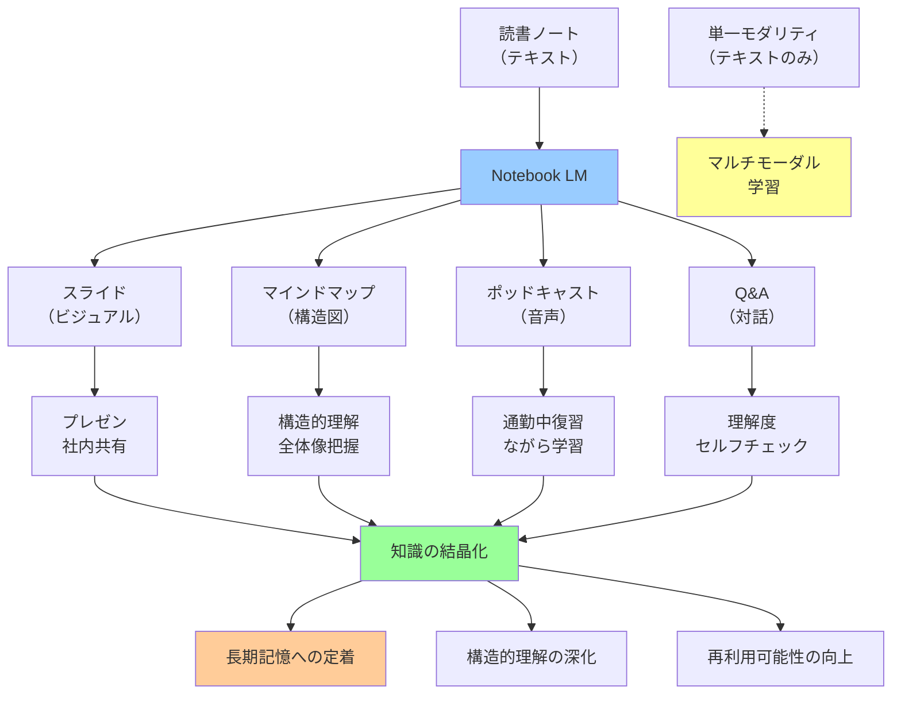

## 要約（Summary）

- 読書ノートをNotebook LMに投入し、スライド・マインドマップ・ポッドキャストなど多様な形式に変換する手法
- 視覚化・音声化によって、本の内容が頭の中で「結晶化」される
- 異なるモダリティでの再体験により、知識の定着と理解の深化を促進

## 本文（Body）

読書の最終ステップとして、作成した読書ノートを異なる形式（ビジュアル、音声など）に変換し、知識を多角的に定着させる手法。Notebook LMというツールを使うことで、テキストベースのノートを様々な形式で再体験できる。

### 背景・問題意識

従来の読書ノートは「テキストを読む」という単一のモダリティでしか利用されなかった：

- 読書ノートを作っても、二度と見返さない
- テキストだけでは、構造が見えにくい
- 複雑な概念の関係性が把握しづらい
- 「読んだはずなのに、内容を忘れている」

認知科学の知見によれば、情報を異なる形式で再体験すると、記憶への定着率が向上する。しかし、スライド化・図解・マインドマップ作成は時間がかかりすぎた。

### アイデア・主張

**読書ノートをNotebook LMに投げ込み、「スライドにして」「ポッドキャストにして」「マインドマップにして」と指示することで、テキスト情報を多様な形式に自動変換する。ビジュアル化されると、本の内容が頭の中で結晶化され、構造的理解と長期記憶への定着が促進される。**

実践手順：
1. 作成した読書ノート（ハイライト構造化＋対話で深化させたもの）を準備
2. Notebook LMに投入
3. 用途に応じて変換を指示：
   - スライド：プレゼン・共有用
   - マインドマップ：構造把握用
   - ポッドキャスト：通勤中の復習用
   - Q&A形式：理解度チェック用
4. 生成されたコンテンツで本の内容を再体験
5. 必要に応じて調整・カスタマイズ

効果：
- **視覚化による構造理解**：マインドマップで概念の階層や関係性が一目で分かる
- **マルチモーダル学習**：テキスト、ビジュアル、音声で複数回接触
- **知識の結晶化**：漠然とした理解が、明確な構造として定着
- **再利用可能性の向上**：スライドは社内勉強会で使える、ポッドキャストは通勤中に聞ける
- **記憶への定着**：異なる形式での再体験により、長期記憶に移行

Notebook LMの特徴：
- テキストから自動でスライド生成
- AIによるポッドキャスト生成（二人の対話形式）
- マインドマップ、サマリー、Q&A生成
- 「いい感じに」整形してくれる高い自動化度

### 内容を視覚化するMermaid図

### 具体例・ケース

**ケース1：技術書のチーム共有**
- 本：『マイクロサービスアーキテクチャ』
- 読書ノート：2000字の構造化メモ
- Notebook LM処理：
  - スライド15枚生成
  - マインドマップで「分散システムの課題」の階層構造を可視化
- 結果：チームの勉強会で使用、チーム全体の知識底上げ

**ケース2：ビジネス書の自己学習**
- 本：戦略論の古典
- 読書ノート：フレームワークと事例の統合メモ
- Notebook LM処理：
  - ポッドキャスト20分（AIが二人の対話形式で解説）
  - Q&A形式で重要ポイントを抽出
- 結果：通勤中にポッドキャストで復習、フレームワークが身体化

**ケース3：学際書の理解深化**
- 本：『銃・病原菌・鉄』
- 読書ノート：地理的決定論と批判的視点の統合メモ
- Notebook LM処理：
  - マインドマップで「地理→農業→人口→技術→征服」の因果連鎖を図示
  - スライドで「賛成派vs反対派」の対立構造を可視化
- 結果：複雑な議論の構造が一目で理解できる

**ケース4：資格試験の学習**
- 本：専門資格のテキスト
- 読書ノート：重要概念の整理
- Notebook LM処理：
  - Q&A形式で「この概念は何か？」「なぜ重要か？」を自動生成
  - ポッドキャストで音声学習
- 結果：移動中の隙間時間で効率的に復習

### 反論・限界・条件

**視覚化の質の問題**
- AIが生成するスライドやマインドマップが、必ずしも最適ではない
- 自分の理解と異なる構造で図示される可能性
- 結局、手動で調整が必要になることも

**ツール依存**
- Notebook LM（Google製品）への依存
- ツールの仕様変更や終了リスク
- 他のツールで同等の機能が得られるか不明

**過度な自動化による思考の放棄**
- 「自分で構造を考える」プロセスをスキップすることで、深い理解が得られない可能性
- 特に学習段階では、手を動かして図解する行為自体に価値がある
- 「楽に得た理解」は浅い理解になりがち

**マルチモーダル学習の効果の個人差**
- 視覚優位、聴覚優位など、学習スタイルには個人差がある
- すべての人にマルチモーダルが効果的とは限らない
- 自分に合った形式を見極める必要がある

**情報過多による逆効果**
- スライド、マインドマップ、ポッドキャストすべてを作ると、かえって情報過多
- 「どれを見ればいいのか分からない」状態になるリスク
- 用途に応じた選択的な利用が必要

**前提条件**
- 質の高い読書ノート（テキスト）が既に存在する
- Notebook LMなどのツールへのアクセス
- 生成されたコンテンツを活用する場面がある（プレゼン、復習など）
- 視覚的・聴覚的な学習スタイルに適性がある

**適用範囲**
- 効果的：構造的な知識（フレームワーク、因果関係、階層など）
- やや効果的：事実の羅列（年表、用語集など）
- 不向き：感覚的・芸術的な内容（詩、文学の解釈など）

## 関連ノート（Links）

- [[20251215085259-pre-reading-ai-reading-map|Pre-Reading：AIによる読書前の地図作成]] - 読書全体の最初のステップ
- [[20251215085308-ai-highlight-structuring|AIによるハイライト構造化]] - 結晶化の前段階
- [[20251215085315-critical-perspective-integration|批判的視点の統合による読書深化]] - 結晶化する内容の深化
- [[20251215085324-knowledge-creation-reading|知識生成型読書への転換]] - 全体的な読書パラダイム

## To-Do / 次に考えること

- [ ] Notebook LM以外のツールでも同様のワークフローが実現できるか調査
- [ ] 自動生成と手動作成の学習効果を比較する実験を設計
- [ ] どの形式（スライド、マインドマップ、ポッドキャスト）が最も効果的か、用途別に整理
- [ ] 視覚化の質を高めるための、より良いプロンプト技術を開発
- [ ] 長期記憶への定着率を測定する方法を探る
- [ ] 生成されたコンテンツをObsidianなどのPKMツールに統合する方法を検討
