## 要約（Summary）

- 従来の「読む→理解する→忘れる」読書から、「見取り図→読む→解釈→世界の知性統合→構造化ストック」へのパラダイムシフト
- AI活用により、読書が「知識を得る行為」から「知識を生成する行為」に変容
- 受動的な情報受容から、能動的な知識創造プロセスへの転換

## 本文（Body）

AI技術の導入により、読書という行為そのものが根本的に変容しつつある。単に「情報を受け取る」のではなく、「自分専用の知識を生成する」プロセスとして再定義される。

### 背景・問題意識

従来の読書モデルの問題点：

**受動的な情報受容**
- 著者が書いた順序で、受動的に情報を受け取る
- 自分の文脈や必要性を考慮せず、均等に読む
- 読了が目的化し、理解や応用が疎かに

**知識の揮発性**
- 読んでいる間は理解しているが、数週間で忘れる
- 「読んだはずなのに、何も覚えていない」
- ノートを取っても、二度と見返さない

**孤立した読書体験**
- 一冊の本を単独で読み、それで完結
- 関連する議論や批判的視点に触れない
- 知識が点のまま、ネットワーク化されない

**時間効率の悪さ**
- 重要な部分と瑣末な部分を区別できない
- 書評や要約を書く時間がない
- 読書後のアウトプットまで辿り着かない

これらは、「読書＝情報の一方的な受容」というパラダイムに起因する構造的問題。

### アイデア・主張

**AI技術を読書プロセスに組み込むことで、読書は「知識を得る行為」から「知識を生成する行為」に転換される。Pre-Reading、ハイライト構造化、批判的視点の統合、視覚化という一連のプロセスを通じて、「自分専用の知識成果物」が生成される。これは従来の受動的読書とは異なる、能動的な知識創造プロセスである。**

### 従来の読書モデル

```
読む → 理解する → 忘れる
```

**特徴：**
- 線形プロセス
- 受動的
- 揮発性が高い
- 一冊の本で完結

### AI活用型の読書モデル

```
読む前に見取り図 → 読む → 自分の視点で解釈 → 世界の知性を吸収し再解釈 → 構造化してストック
```

**特徴：**
- 反復・循環的プロセス
- 能動的・創造的
- 永続的なストック
- 知識ネットワークの一部

### 知識生成のメカニズム

1. **個別化（Personalization）**
   - Pre-Readingで自分の文脈に合わせた地図を作成
   - ハイライトは自分の関心を反映
   - 結果：「誰にでも当てはまる要約」ではなく、「自分専用の読書ノート」

2. **構造化（Structuring）**
   - 断片的なハイライトをAIが構造化
   - マインドマップで視覚化
   - 結果：散在していた情報が、整理された知識体系に

3. **拡張（Expansion）**
   - 一冊の本を起点に、関連する議論・批判・次の本へ
   - 世界の知性を統合
   - 結果：本の内容が、知識ネットワークの一部に

4. **定着（Retention）**
   - 多様な形式（テキスト、ビジュアル、音声）で再体験
   - 結晶化のプロセス
   - 結果：短期記憶から長期記憶へ、漠然とした理解から明確な構造へ

5. **再利用（Reusability）**
   - スライド、ポッドキャスト、構造化ノートとして再利用
   - 結果：読書が一回限りの体験ではなく、継続的に価値を生む資産に

### 内容を視覚化するMermaid図

```mermaid
graph TB
    subgraph "従来の読書パラダイム"
        A1["読書開始"] --> A2["受動的に<br/>情報受容"]
        A2 --> A3["理解<br/>（一時的）"]
        A3 --> A4["忘却"]
        
        style A4 fill:#ffcccc
    end
    
    subgraph "知識生成型読書パラダイム"
        B1["Pre-Reading<br/>（見取り図）"] --> B2["目的意識を持って<br/>読書"]
        B2 --> B3["ハイライト<br/>（関心の記録）"]
        B3 --> B4["AI構造化<br/>（自分の解釈）"]
        B4 --> B5["対話深化<br/>（世界の知性統合）"]
        B5 --> B6["視覚化<br/>（結晶化）"]
        B6 --> B7["永続的ストック<br/>再利用可能資産"]
        
        style B7 fill:#99ff99
    end
    
    C["受動的情報受容"] -.変容.-> D["能動的知識生成"]
    E["揮発性"] -.変容.-> F["永続性"]
    G["孤立した読書"] -.変容.-> H["ネットワーク化された知識"]
    
    style D fill:#99ccff
    style F fill:#ffcc99
    style H fill:#ffff99
    
    I["読書の目的"] --> J["知識を得る"]
    I --> K["知識をつくる"]
    
    style J fill:#cccccc
    style K fill:#99ff99
```



### 具体例・ケース

**ケース1：エンジニアの技術書学習**
- 従来：400ページを順番に読む → 読了に2週間 → 内容の60%を忘れる
- AI活用型：
  - Pre-Reading（10分）：重要な120ページを特定
  - 読書（4日）：重点箇所に集中
  - 構造化（5分）：ハイライトから書評生成
  - 対話（15分）：批判的視点を統合
  - 視覚化（5分）：スライドとマインドマップ生成
  - 結果：1週間で、再利用可能な知識資産を獲得、チーム共有も実現

**ケース2：経営層のビジネス書学習**
- 従来：読む → 「良い本だった」で終わり → 具体的に何も変わらない
- AI活用型：
  - Pre-Reading：自社の課題との関連性を明確化
  - 読書：事例とフレームワークにハイライト
  - 構造化：自社への適用ポイントを整理
  - 対話：この手法の限界と代替案を把握
  - 視覚化：経営会議用のスライドに
  - 結果：読書が経営判断の具体的インプットに

**ケース3：研究者の文献レビュー**
- 従来：論文を読む → メモを取る → ファイルに埋もれる → 再度読む
- AI活用型：
  - Pre-Reading：研究課題との関連箇所を特定
  - 読書：重要な主張と証拠をハイライト
  - 構造化：論文の主張を自分の言葉で整理
  - 対話：反論と支持論文を収集
  - 視覚化：研究の位置づけをマインドマップで図示
  - 結果：文献レビューが研究の一部として統合、論文執筆時に即座に参照可能

**ケース4：学生の教科書学習**
- 従来：教科書を読む → マーカーを引く → 試験前に見返す → 忘れる
- AI活用型：
  - Pre-Reading：試験範囲の重点ポイントを把握
  - 読書：理解困難な箇所を重点的に
  - 構造化：ハイライトから学習ノート生成
  - 対話：「なぜこうなるのか」をAIに質問
  - 視覚化：ポッドキャストで通学中に復習
  - 結果：知識の定着率向上、応用問題への対応力強化

### 反論・限界・条件

**読書体験の本質的価値の喪失**
- 効率化・知識生成を追求するあまり、読書そのものの楽しみが失われる
- 著者の文章を味わう、行間を読む、ゆっくり考える時間の価値
- すべての読書を「生産的」にする必要はない

**適用範囲の限定**
- 効果的：ビジネス書、専門書、教科書など「知識獲得」が目的の読書
- 不向き：小説、詩、エッセイなど「体験」「感動」が目的の読書
- 文学作品に対してPre-Readingや効率化を求めることの不適切さ

**コストと学習曲線**
- AIツールの使い方を学ぶ必要がある
- プロンプトエンジニアリングのスキル
- ツールへの課金コスト
- 最初は従来より時間がかかる可能性

**AI依存のリスク**
- 自分で考える力、批判的思考の弱体化
- AIの解釈に引きずられる
- 技術的なトラブルへの脆弱性

**深い理解の不確実性**
- 効率化された読書が、本当に深い理解につながるのか
- 「悪戦苦闘する過程」自体に学習価値があるという認知科学の知見
- 短期的な効率と長期的な学習の トレードオフ

**社会的・文化的側面**
- 読書は個人的で内省的な行為という文化的価値
- 共通の読書体験（同じ本を同じように読む）の共有可能性
- 「効率的な読書」を強いる社会的圧力の問題

**前提条件**
- タイパ（タイムパフォーマンス）重視の読書
- 知識労働に従事している
- デジタルツールへのアクセス
- 一定のAIリテラシー
- 読書の目的が明確（仕事、学習、研究など）

## 関連ノート（Links）

- [[20251215085259-pre-reading-ai-reading-map|Pre-Reading：AIによる読書前の地図作成]] - パラダイム転換の第一歩
- [[20251215085308-ai-highlight-structuring|AIによるハイライト構造化]] - 知識生成プロセスの中核
- [[20251215085315-critical-perspective-integration|批判的視点の統合による読書深化]] - 知識の拡張メカニズム
- [[20251215085320-notebook-lm-knowledge-crystallization|Notebook LMによる知識結晶化]] - 知識の定着と再利用
- [[20251215010143-working-hours-reading-decoupling|労働時間と読書量の非相関]] - 効率化の必要性を示す背景

## To-Do / 次に考えること

- [ ] 知識生成型読書の長期的効果を測定する方法を開発（理解度、応用力、記憶定着など）
- [ ] どの読書にこのパラダイムを適用すべきか、ジャンル別ガイドラインを作成
- [ ] 従来の読書と知識生成型読書の共存モデルを探る
- [ ] 教育現場での応用可能性と課題を検討
- [ ] 「読書の楽しみ」と「知識生成の効率」のバランスをどう取るか
- [ ] 10年後、20年後の読書はどうなっているか、長期的トレンドを考察
- [ ] デジタルネイティブ世代にとっての読書のあり方を探る
