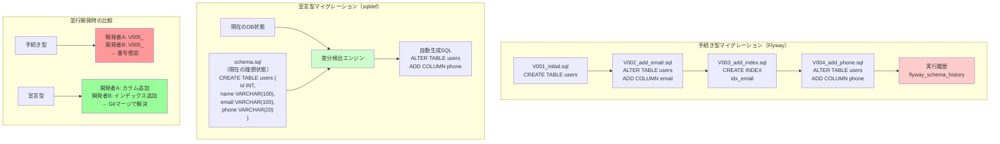

## 要約（Summary）

- DBマイグレーションには手続き型（差分SQLを順次実行）と宣言型（理想状態を定義し差分を自動生成）の2つのアプローチがある
- 手続き型は制御が細かいが、並行開発での衝突や履歴管理が課題になりやすい
- 宣言型は並行開発に強く、設計変更への追従が容易だが、複雑な移行処理には向かない場合がある

## 本文（Body）

DBスキーマのマイグレーション手法には、大きく分けて手続き型と宣言型の2つのパラダイムが存在する。それぞれが異なる哲学と実用性のトレードオフを持つ。

### 背景・問題意識

Flywayのような手続き型ツールは業界標準として広く使われているが、複数案件の並行開発や頻繁な設計変更が発生する環境では、マイグレーション管理自体が開発のボトルネックになることがある。

### アイデア・主張

**手続き型マイグレーションは「どう変更するか」を記述し、宣言型マイグレーションは「どうあるべきか」を記述する。並行開発や設計変更が頻繁な環境では、宣言型のほうが開発効率を高められる。**

#### 手続き型マイグレーション（例：Flyway）

**特徴：**
- マイグレーションファイルを時系列順に実行
- 各ファイルには具体的なDDL/DML（`ALTER TABLE ADD COLUMN`など）を記述
- ファイル名にバージョン番号を付与（`V001__initial.sql`、`V002__add_user_email.sql`など）
- 実行履歴をDBのメタテーブル（`flyway_schema_history`など）で管理

**長所：**
- 細かい制御が可能（データ移行処理、条件分岐など）
- 実行順序が明確
- 複雑な移行ロジックを実装できる

**短所：**
- 並行開発でバージョン番号が衝突する
- 設計変更時に過去のマイグレーションファイルを修正すると、履歴の整合性が崩れる
- マイグレーションファイルが蓄積し続ける

#### 宣言型マイグレーション（例：sqldef）

**特徴：**
- 理想的なスキーマ定義を単一ファイル（または少数のファイル）で記述
- ツールが現在のDB状態と定義を比較し、差分SQLを自動生成
- 実行履歴は重要でなく、「現在の状態」と「あるべき状態」のみが重要

**長所：**
- 並行開発でもファイル衝突が起きにくい（マージ時にGitの通常の競合解決で対応可能）
- 設計変更時にスキーマ定義を直接修正すればよい（過去の履歴を気にしなくてよい）
- スキーマ定義ファイルが肥大化しない

**短所：**
- 複雑なデータ移行処理（既存データの変換など）は記述しにくい
- ツールの差分検出ロジックに依存する（想定外の差分が生成されるリスク）
- ロールバックは「前の状態の定義」を再適用する形になる

### 内容を視覚化するMermaid図

### 具体例・ケース

**『Airレジ オーダー』での Flyway の課題**

状況：
- 複数の案件を複数の環境で並行開発
- 開発中にDB設計の変更が頻繁に発生

問題：
1. 環境を切り替えるたびにマイグレーションファイルの番号が衝突
2. 設計変更時に既存のマイグレーションファイルを修正すると、適用済み環境での整合性が崩れる
3. 開発順序とリリース順序がズレると、マイグレーション番号の再採番が必要
4. プロダクトの歴史とともにマイグレーションファイルが膨大に

**sqldef 導入後の改善**

- カラムの追加・削除などの単純な変更は、スキーマ定義を直接編集すればよい
- 複数の開発者が並行して作業しても、Gitのマージで通常通り解決できる
- マイグレーションファイルの番号管理が不要
- スキーマ定義が単一ファイルで完結し、見通しが良い

**Terraform との類似性**

宣言型マイグレーションは、Infrastructure as Code の Terraform と同じ思想：
- Terraform: 「インフラの理想状態」を定義 → `terraform apply` で差分を適用
- sqldef: 「DBスキーマの理想状態」を定義 → `sqldef` で差分を適用

### 反論・限界・条件

**宣言型が向かないケース**

1. **複雑なデータ移行**
   - 例：`full_name`カラムを`first_name`と`last_name`に分割し、既存データを変換
   - 手続き型なら移行SQLを書けるが、宣言型では難しい

2. **段階的な移行が必要な場合**
   - 例：カラムを削除する前に、アプリケーション側で参照を削除し、数週間の猶予期間を設ける
   - 手続き型なら「カラムを非推奨にする」マイグレーションを挟める

3. **条件分岐が必要な場合**
   - 例：特定の環境だけ異なるスキーマにする
   - 宣言型は「単一の理想状態」を前提とするため、環境ごとの差異を扱いにくい

**ハイブリッドアプローチ**

実務では、以下のような使い分けが有効：
- 通常のスキーマ変更：宣言型（sqldef）
- 複雑なデータ移行：手続き型の補助スクリプト（手動実行、または別の自動化）

**ツールの成熟度**

宣言型ツール（sqldef、Atlas、Prisma Migrateなど）は、手続き型ツール（Flyway、Liquibase）に比べて歴史が浅く、エッジケースでの挙動が未知数の場合がある。

## 関連ノート（Links）

- [[20251215090821-sqldef-features|sqldefの特徴と差分検出の仕組み]] - 宣言型ツールの具体的な実装
- [[20251215090822-parallel-development-migration-conflict|並行開発におけるマイグレーション衝突問題]] - 手続き型の課題
- [[20251215090823-oss-contribution-feature-addition|OSSコントリビュートによる機能追加戦略]] - ツール選定とカスタマイズ
- [[20251215090824-migration-operation-safety-pattern|マイグレーション操作の安全化パターン]] - 運用レベルのベストプラクティス

## To-Do / 次に考えること

- [ ] Terraformなど他の宣言型ツールとの比較を深掘りする
- [ ] 複雑なデータ移行を宣言型で扱う手法（例：Atlas Versioned Migrations）を調査
- [ ] 自プロジェクトでマイグレーション方式を選定する際のチェックリストを作成
- [ ] 宣言型と手続き型のハイブリッド運用パターンを整理
- [ ] RailsのActive Record Migrationsなど、他の代表的なマイグレーションツールの思想を調査
