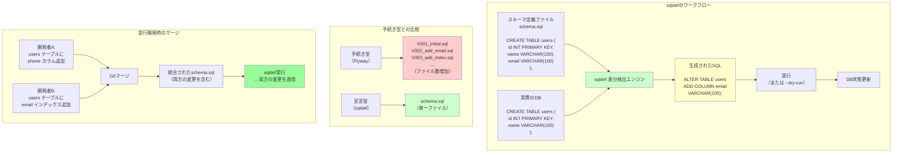

## 要約（Summary）

- sqldefは宣言型DBマイグレーションツールで、理想状態のスキーマ定義と現在のDB状態の差分から、適用すべきSQLを自動生成する
- 単一ファイルでスキーマを管理でき、並行開発での衝突や設計変更への追従が容易
- OSSであり、プロジェクト固有の要件に応じてカスタマイズ可能

## 本文（Body）

sqldefは、「DBスキーマの理想状態」をSQLファイルで定義し、現在のDB状態との差分を自動検出してマイグレーションSQLを生成する宣言型ツールである。

### 背景・問題意識

手続き型マイグレーションツール（Flyway、Liquibaseなど）では、複数の案件を並行開発する際にマイグレーションファイルの番号衝突や履歴管理の複雑化が課題となる。「どう変更するか」ではなく「どうあるべきか」を記述できるツールが必要だった。

### アイデア・主張

**sqldefは「現在の状態」と「あるべき状態」の差分検出に特化することで、マイグレーション管理の複雑さを大幅に削減する。スキーマ定義が単一ファイルで完結し、Gitの通常のワークフローに自然に統合できる。**

#### sqldefの基本的な仕組み

```
1. スキーマ定義ファイル（schema.sql）を用意
   ↓
2. sqldefがDBに接続し、現在のスキーマ情報を取得
   ↓
3. 定義ファイルと現在の状態を比較し、差分を検出
   ↓
4. 差分を埋めるためのSQLを自動生成
   ↓
5. 生成されたSQLを実行（または--dry-runで確認のみ）
```

#### 主要な特徴

**1. 宣言型アプローチ**
- スキーマの「理想状態」を記述
- マイグレーション履歴を管理しない（履歴テーブル不要）
- 「現在 → 理想」への最短経路を自動計算

**2. 単一ファイル管理**
- スキーマ定義を1つ（または少数）のファイルで管理
- マイグレーションファイルが無限に増えない
- 「現在のスキーマはどうなっているか」が一目でわかる

**3. Gitフレンドリー**
- 複数開発者が同じファイルを編集してもGitのマージで解決
- ブランチごとに異なるスキーマ定義を持てる
- 設計変更時は定義ファイルを直接修正すればよい

**4. 差分検出の自動化**
- テーブル、カラム、インデックス、制約、ビューなどの差分を検出
- 追加・削除・変更を判定し、適切なDDLを生成
- `--dry-run`で実行前に確認可能

**5. OSSで拡張可能**
- GitHubで公開されており、コントリビュート可能
- プロジェクト固有の要件に応じてフォーク・機能追加できる

#### 対応DBMS

sqldefは複数のDBMSに対応している：
- `mysqldef`: MySQL/MariaDB
- `psqldef`: PostgreSQL
- `sqlite3def`: SQLite
- `mssqldef`: Microsoft SQL Server

### 内容を視覚化するMermaid図



### 具体例・ケース

**『Airレジ オーダー』での導入事例**

**導入前（Flyway）の問題：**
1. 複数環境・複数案件の並行開発でマイグレーション番号が衝突
2. 設計変更時のマイグレーション適用が煩雑
3. 開発順序とリリース順序のズレ
4. マイグレーション履歴の肥大化

**sqldef導入による改善：**
- カラムの追加・削除が`schema.sql`の編集で完結
- 環境切り替え時のマイグレーション衝突が解消
- マイグレーションファイルの番号管理が不要
- 現在のスキーマ状態が1ファイルで把握可能

**プロジェクト固有の課題と対応：**

『Airレジ オーダー』では、検証環境で同じクラスター内の異なるデータベースに同名のビューが存在していた。sqldefの既存実装では、ビュー名だけで対象を絞り込んでいたため、想定外のビュー定義を取得してしまう問題があった。

この課題に対し、チームはsqldefにコントリビュートし、**ビュー名に加えてDB名でも対象を絞り込む**機能を追加した。これにより、複数DB環境でも正しくビューを処理できるようになった。

**関連プロジェクトへの展開：**

『Airレジ オーダー』での成功を受けて、『Airレジ オーダー モバイルオーダー』でもFlywayからsqldefに移行。

新たな要望として、`ALTER TABLE`実行時に`ALGORITHM`オプション（MySQLのオンラインDDL制御）を指定したいというニーズが発生。再度sqldefにコントリビュートしてオプション付与機能を追加した。

**典型的な使い方**

```bash
# 差分を確認（dry-run）
mysqldef -u user -p password -h localhost dbname --dry-run < schema.sql

# 差分を適用
mysqldef -u user -p password -h localhost dbname < schema.sql

# 現在のスキーマをエクスポート
mysqldef -u user -p password -h localhost dbname --export > current_schema.sql
```

### 反論・限界・条件

**sqldefの限界**

1. **複雑なデータ移行には向かない**
   - 例：カラム分割時の既存データ変換
   - 対策：別途移行スクリプトを用意

2. **差分検出の精度に依存**
   - ツールが想定していないスキーマ構造では、意図しない差分が生成される可能性
   - 対策：必ず`--dry-run`で確認してから適用

3. **ロールバックの手間**
   - 前の状態のスキーマ定義を保持する必要がある
   - 対策：Gitでバージョン管理する、適用前にバックアップを取る

4. **段階的な移行が必要な場合**
   - 例：カラム削除前にアプリ側で参照を削除し、数週間の猶予期間を設ける
   - 対策：手続き型との併用、または段階的に定義を変更

5. **学習コストとツールの成熟度**
   - 手続き型ツールほど情報やベストプラクティスが蓄積されていない
   - OSSコミュニティの規模が小さい場合、サポートが限定的

**適用条件**

以下の条件を満たすプロジェクトで特に効果的：
- 複数の開発者・チームが並行して開発
- DB設計の変更が頻繁に発生
- カラム追加・削除などの単純な変更が主
- スキーマの可視性を重視

**併用パターン**

実務では以下のような使い分けも有効：
- **通常のスキーマ変更**：sqldefで自動化
- **複雑なデータ移行**：手動スクリプト（`--dry-run`で確認 → 手動実行）
- **本番適用前のレビュー**：生成されたSQLを確認してから実行

## 関連ノート（Links）

- [[20251215090820-declarative-vs-imperative-migration|宣言型マイグレーションと手続き型マイグレーションの比較]] - 基本思想の違い
- [[20251215090822-parallel-development-migration-conflict|並行開発におけるマイグレーション衝突問題]] - sqldefが解決する具体的な課題
- [[20251215090823-oss-contribution-feature-addition|OSSコントリビュートによる機能追加戦略]] - プロジェクト固有要件への対応
- [[20251215090824-migration-operation-safety-pattern|マイグレーション操作の安全化パターン]] - sqldefの安全な運用方法

## To-Do / 次に考えること

- [ ] 他の宣言型マイグレーションツール（Atlas、Prisma Migrate）とsqldefを比較
- [ ] sqldefの差分検出アルゴリズムの内部実装を調査
- [ ] 自プロジェクトでsqldef導入時のチェックリストを作成
- [ ] 複雑なデータ移行が必要な場合のハイブリッド運用パターンを整理
- [ ] sqldefのコントリビュート事例から、OSSへの貢献プロセスを学ぶ
