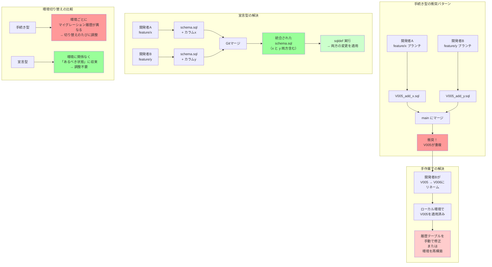

## 要約（Summary）

- 手続き型マイグレーションでは、複数開発者が並行開発するとマイグレーションファイルの番号やタイムスタンプが衝突する
- 開発順序とリリース順序がズレると、マイグレーション適用順序の調整が必要になる
- 宣言型マイグレーションでは、スキーマ定義ファイルをGitの通常のマージで解決できる

## 本文（Body）

複数の開発者や案件が並行してDB設計を変更する環境では、手続き型マイグレーションツールの「時系列順に実行する」という前提が破綻しやすい。

### 背景・問題意識

『Airレジ オーダー』では、複数の大型機能を複数の環境（開発、ステージング、本番）で並行開発していた。各開発者が独立してマイグレーションファイルを作成すると、以下のような問題が頻発した：

1. **マイグレーションファイルの番号衝突**
2. **環境切り替え時の不整合**
3. **開発順序とリリース順序のズレ**
4. **設計変更時のマイグレーション修正の煩雑さ**

これらの問題により、「DBマイグレーションを正しく行うこと」自体に多くの時間を費やし、開発効率が低下していた。

### アイデア・主張

**手続き型マイグレーションの「順序依存性」が、並行開発における主要なボトルネックとなる。宣言型マイグレーションは「現在の状態」と「理想の状態」のみを扱うため、順序の問題を回避できる。**

#### 衝突の典型的なパターン

**パターン1: 番号衝突**

```
開発者A（機能X開発中）:
  V005__add_column_x.sql

開発者B（機能Y開発中、Aの作業を知らない）:
  V005__add_column_y.sql

→ 両方をマージすると、V005が2つ存在してしまう
→ どちらかを V006 にリネームする必要があるが、
   既にローカル環境でV005を適用済みの場合、履歴の整合性が崩れる
```

**パターン2: タイムスタンプ衝突**

```
開発者A: V20251215_1000__add_x.sql
開発者B: V20251215_1000__add_y.sql

→ 同じタイムスタンプになる可能性
→ より細かい粒度（秒、ミリ秒）にしても、完全には防げない
```

**パターン3: 環境ごとのマイグレーション状態の不一致**

```
開発環境A: V001, V002, V003, V005（機能Xのマイグレーション）
開発環境B: V001, V002, V003, V004（機能Yのマイグレーション）

環境Bで環境Aのコードをチェックアウトすると:
  - V004は適用済みだがV005がない → V005を適用
  - しかしV004はmainにマージされていない → V004の履歴が中途半端に残る
```

**パターン4: 開発順序とリリース順序のズレ**

```
開発順序:
  機能X（先に開発開始） → V005__feature_x.sql
  機能Y（後に開発開始） → V006__feature_y.sql

リリース順序（ビジネス判断で逆転）:
  機能Y（先にリリース） → V006を適用
  機能X（後にリリース） → V005を適用...しかし本番にはV006が既に存在

→ V005の内容をV007にコピーして再作成する必要
→ 履歴が「V005は未適用、V007は適用済み」という不自然な状態に
```

**パターン5: 設計変更時のマイグレーション修正**

```
機能X開発中:
  V005__create_table_x.sql を作成・適用

数日後、設計レビューでテーブル構造の変更が必要に:
  - 手続き型の正しい対応:
    V006__alter_table_x.sql を追加
  - 開発者がやりがちな誤った対応:
    V005の内容を修正 → 適用済み環境で不整合

→ 設計変更のたびにマイグレーションファイルが増える
→ 開発中の段階でも履歴が肥大化
```

### 内容を視覚化するMermaid図



### 具体例・ケース

**『Airレジ オーダー』での実体験**

**状況:**
- 複数の大型案件を並行開発
- 各案件で専用の開発環境を使用
- 開発中に頻繁にDB設計の変更が発生

**Flywayでの問題:**

1. **番号衝突の頻発**
   - 週に数回、マイグレーションファイルの番号が衝突
   - 衝突のたびに番号の振り直しと環境の再構築が必要

2. **環境切り替え時の混乱**
   - 案件Aの環境から案件Bの環境に切り替えるたびに、マイグレーション履歴の不整合が発生
   - `flyway repair`や手動での履歴修正が必要

3. **設計変更への対応コスト**
   - 開発途中で設計変更が発生するたびに、新しいマイグレーションファイルを追加
   - レビュー時に「このテーブルの最終的な構造は？」を把握するのが困難

4. **リリース順序変更時の混乱**
   - ビジネス判断でリリース順序が変わると、マイグレーションファイルの番号を振り直す必要
   - 本番環境の履歴との整合性を保つのが困難

**sqldef導入後の改善:**

1. **番号衝突の解消**
   - `schema.sql`を編集するだけ
   - Gitのマージで自動解決（通常の開発フローと同じ）

2. **環境切り替えの簡素化**
   - 環境に関係なく`sqldef`を実行すれば、自動的に「あるべき状態」に収束
   - 履歴の不整合を気にする必要がない

3. **設計変更への迅速な対応**
   - `schema.sql`を直接編集すればよい
   - マイグレーションファイルが増えない

4. **リリース順序の柔軟性**
   - どの順序でリリースしても、最終的なスキーマ定義は同じ
   - 番号の振り直しが不要

**定量的な効果:**
- マイグレーション関連のトラブルシューティング時間が週10時間 → 1時間以下に削減（推定）
- 開発者の満足度が向上（アンケート結果）

### 反論・限界・条件

**宣言型でも起こる衝突**

宣言型でもGitのマージ衝突は発生する：
- 例：開発者Aと開発者Bが同じカラムに異なる型を定義
- しかし、これは「設計の衝突」であり、手続き型の「ファイル名の衝突」とは本質が異なる
- 設計の衝突はレビューで解決すべき問題であり、ツールの問題ではない

**段階的なマイグレーションが必要な場合**

以下のようなケースでは、宣言型だけでは対応が難しい：
- カラムを削除する前に、アプリ側で参照を削除し、数週間の猶予期間を設ける
- データ移行を伴う大規模な構造変更

対策：
- 手続き型との併用（通常は宣言型、複雑な移行は手続き型）
- スキーマ定義を段階的に変更（まず非推奨、後で削除）

**チーム全体の理解が必要**

宣言型マイグレーションは手続き型とパラダイムが異なるため、チーム全体が以下を理解する必要がある：
- マイグレーション履歴ではなく「現在の状態」が重要
- 差分SQLは自動生成されるため、レビューでの確認が必須
- ロールバックは「前の定義に戻す」という形になる

**ツールの成熟度**

宣言型ツールは手続き型ほど広く使われていないため：
- エッジケースでの挙動が不明
- トラブル時の情報が少ない

対策：
- 必ず`--dry-run`で確認してから適用
- 本番適用前にステージング環境で検証

## 関連ノート（Links）

- [[20251215090820-declarative-vs-imperative-migration|宣言型マイグレーションと手続き型マイグレーションの比較]] - 根本的な思想の違い
- [[20251215090821-sqldef-features|sqldefの特徴と差分検出の仕組み]] - 宣言型ツールの具体実装
- [[20251215090824-migration-operation-safety-pattern|マイグレーション操作の安全化パターン]] - 衝突を防ぐ運用方法
- [[20251129164131-control-expansion-task-management|タスク管理におけるコントロールの拡大]] - 並行開発の管理手法

## To-Do / 次に考えること

- [ ] Gitのマージ戦略（rebase vs merge）とマイグレーション管理の関係を整理
- [ ] 並行開発でのマイグレーション衝突を防ぐチーム運用ルールを策定
- [ ] 手続き型と宣言型のハイブリッド運用パターンを調査
- [ ] 他のプロジェクトでの並行開発マイグレーション管理の事例を収集
- [ ] マイグレーション衝突時のトラブルシューティングガイドを作成
