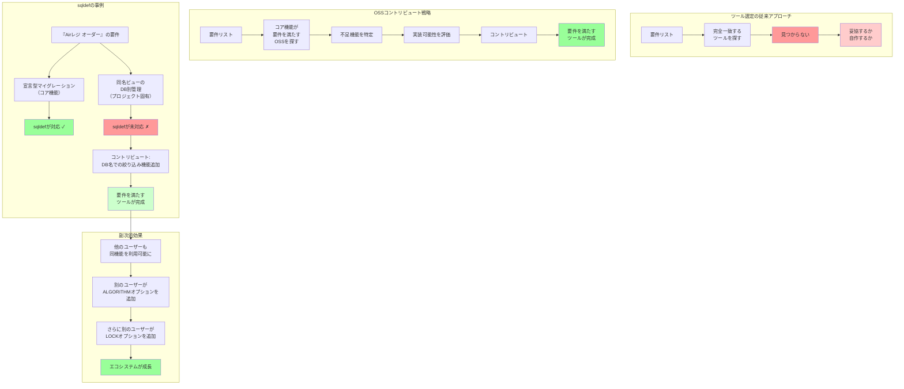

## 要約（Summary）

- OSSツールを選定する際、プロジェクト固有の要件に合わない機能があっても、コントリビュートで対応できる可能性がある
- sqldefでは、ビュー定義の取得問題を解決するためDB名での絞り込み機能を追加、ALGORITHMオプション指定機能を追加した
- OSSへのコントリビュートは、自プロジェクトの課題解決だけでなく、コミュニティ全体への貢献にもなる

## 本文（Body）

商用ツールと異なり、OSSツールは「ソースコードが公開されている」という特性を活かして、プロジェクト固有の要件に応じた機能追加が可能である。

### 背景・問題意識

ツールを選定する際、「既存機能がすべての要件を満たしているか」を基準にすると、選択肢が大幅に狭まる。特にニッチな要件やプロジェクト固有の制約がある場合、完全に要件を満たすツールが存在しないことも多い。

一方、「要件を満たさない部分を自分たちで実装できるか」という視点でツールを評価すれば、選択肢が広がる。

### アイデア・主張

**OSSツールを選定する際は、「現時点で完璧か」ではなく「コアの設計思想が自分たちの課題を解決するか」「拡張可能な設計か」を重視すべき。不足機能はコントリビュートで補える。**

#### OSSコントリビュートの戦略的価値

**1. プロジェクトの要件に対応**
- 商用ツールでは「機能追加を待つ」しかない
- OSSなら自分たちで実装できる

**2. コミュニティ全体への貢献**
- 自分たちの課題は、他のユーザーも抱えている可能性がある
- コントリビュートすることで、ツール自体が改善される

**3. ツールの継続性確保**
- OSSは開発が停止するリスクがある
- コントリビュートすることで、ツールの維持に関与できる

**4. 技術力の向上**
- OSSのコードリーディング、設計思想の理解
- PRレビューを通じた学習

**5. エコシステムの成長**
- 機能追加により、他のユーザーの導入障壁が下がる
- 「自分が追加した機能を、別の誰かが追加した機能で補完」という好循環

### 内容を視覚化するMermaid図

### 具体例・ケース

**『Airレジ オーダー』でのsqldefコントリビュート事例**

**課題1: 同名ビューのDB別管理**

**状況:**
- 検証環境で、同じクラスター内の異なるデータベースに同名のビューが存在
- sqldefの既存実装では、ビュー名だけで対象を絞り込んでいた
- 結果：想定外のDB のビュー定義を取得してしまう

**対応:**
- sqldefのコードを調査し、ビュー定義取得のクエリを特定
- `WHERE table_name = ?`に加えて`AND table_schema = ?`の条件を追加
- PRを作成し、メンテナーにレビュー依頼
- マージされ、次バージョンで機能が利用可能に

**課題2: ALGORITHMオプション指定**

**状況:**
- 『Airレジ オーダー モバイルオーダー』でsqldefを導入
- MySQLのオンラインDDL制御のため、`ALTER TABLE`実行時に`ALGORITHM=INPLACE`などのオプションを指定したい
- sqldefは`ALTER TABLE`を自動生成するが、オプション指定には未対応

**対応:**
- 設定ファイルまたはコマンドラインオプションで`ALGORITHM`を指定できる機能を追加
- PRを作成し、マージ

**波及効果:**
- 別のユーザーが`LOCK`オプションも指定したいという要望を出す
- 同様の仕組みで実装され、マージされる
- sqldefが「MySQLのオンラインDDL制御に対応したツール」として成熟

**学びとノウハウ蓄積:**
- OSSのコントリビュートプロセス（Issue作成、PR、レビュー対応）を経験
- sqldefの内部実装（差分検出ロジック、SQL生成）を深く理解
- チーム内で「OSSにコントリビュートして解決する」文化が醸成

**他の事例：Terraformでの類似パターン**

Terraformでも同様のパターンが見られる：
1. プロバイダー（AWS、GCP、Azureなど）が標準で提供されている
2. ニッチなサービスや新機能は、プロバイダーが未対応の場合がある
3. ユーザーがプロバイダーにコントリビュートして機能追加
4. エコシステムが成長し、カバレッジが向上

### 反論・限界・条件

**コントリビュートのコスト**

1. **学習コスト**
   - OSSのコードベース、設計思想、コーディング規約を理解する必要
   - 小規模プロジェクトなら数時間〜数日、大規模プロジェクトなら数週間

2. **実装とレビュー対応のコスト**
   - PRを作成してもすぐにマージされるとは限らない
   - レビューでの指摘に対応する必要
   - メンテナーの反応が遅い場合もある

3. **維持コスト**
   - 追加した機能が原因でバグが発生した場合、修正が必要
   - メンテナーから「この機能をどう改善すべきか」相談される場合もある

**判断基準：いつコントリビュートすべきか**

以下の条件を満たす場合、コントリビュートが有効：
- ✓ コア機能が要件を満たしている
- ✓ 不足機能が明確で、スコープが限定的
- ✓ OSSのメンテナンス状況が良好（最近のコミット、活発なIssue/PR）
- ✓ 自分たちで実装できる技術力がある
- ✓ コントリビュートのコストを投資する価値がある

以下の場合は、コントリビュートよりも他の選択肢を検討すべき：
- ✗ コア機能が要件を満たしていない（そもそもツールが合わない）
- ✗ 不足機能が大規模で、実装に数ヶ月かかる
- ✗ OSSのメンテナンスが停止している
- ✗ 自分たちの要件がニッチすぎて、他のユーザーには不要（フォークを検討）

**フォーク vs コントリビュート**

プロジェクト固有の要件が強い場合、フォークも選択肢：
- **フォーク**: 自分たちのリポジトリで独自に開発
- **コントリビュート**: 本家リポジトリにPRを送る

判断基準：
- 他のユーザーにも有用 → コントリビュート
- 自分たちだけに有用 → フォーク
- 本家のメンテナーが受け入れない → フォーク

**メンテナンスの継続性**

コントリビュートした機能は、本家のメンテナンスに依存する：
- 本家が新バージョンをリリースすれば、自動的に恩恵を受ける
- 本家のメンテナンスが停止すれば、フォークに移行する必要があるかもしれない

**組織の方針**

企業によっては、OSSへのコントリビュートに制約がある場合も：
- セキュリティ上の懸念（社内情報の漏洩リスク）
- 法務上の制約（ライセンス、著作権）
- 労働時間の制約（業務時間内にOSS活動が認められるか）

対策：
- 社内でOSSコントリビュートのガイドラインを整備
- コントリビュートの価値（開発効率向上、技術力向上）を経営層に説明

## 関連ノート（Links）

- [[20251215090821-sqldef-features|sqldefの特徴と差分検出の仕組み]] - コントリビュート対象のツール
- [[20251215090820-declarative-vs-imperative-migration|宣言型マイグレーションと手続き型マイグレーションの比較]] - ツール選定の背景
- [[20251215090822-parallel-development-migration-conflict|並行開発におけるマイグレーション衝突問題]] - コントリビュートで解決した課題

## To-Do / 次に考えること

- [ ] 自社でのOSSコントリビュートガイドライン策定
- [ ] コントリビュート対象OSSの選定基準を整理
- [ ] チーム内でのOSSコードリーディング勉強会を開催
- [ ] 他のOSSでのコントリビュート事例を収集（Terraform、Kubernetes、etc.）
- [ ] コントリビュートの投資対効果を定量化する方法を検討
- [ ] フォーク vs コントリビュートの判断フローチャートを作成
