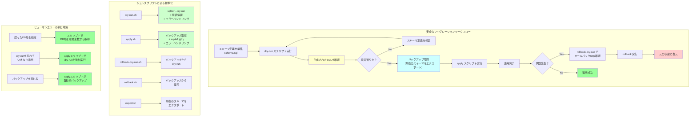

## 要約（Summary）

- DBマイグレーションは高リスクな操作のため、dry-run、バックアップ、標準化されたスクリプトなどで安全性を高める必要がある
- 『Airレジ オーダー』では、sqldefの各操作をシェルスクリプトでラップし、コマンドの標準化とヒューマンエラー削減を実現
- dry-run → 確認 → 適用 → バックアップ保持 というワークフローを確立

## 本文（Body）

DBマイグレーションは、本番環境のデータに直接影響を与える高リスクな操作である。ツールの選定だけでなく、運用レベルでの安全策が不可欠。

### 背景・問題意識

宣言型マイグレーション（sqldef）は開発効率を高めるが、「差分SQLを自動生成する」という特性上、意図しない変更が適用されるリスクがある。

例：
- カラム名のタイポ → 既存カラムが削除され、新カラムが作成される（データ消失）
- インデックスの定義ミス → パフォーマンスに影響
- 外部キー制約の誤設定 → アプリケーションが正常に動作しなくなる

手続き型マイグレーション（Flyway）でも同様のリスクはあるが、宣言型の場合「ツールが何をするか」が明示的でない分、確認の重要性が増す。

### アイデア・主張

**DBマイグレーションの安全性は、ツールの機能だけでなく、運用ワークフローで確保する。特に以下の3点が重要：(1) 適用前の確認（dry-run）、(2) ロールバックの準備（バックアップ）、(3) ヒューマンエラー削減（標準化）。**

#### 安全化の3原則

**1. 適用前の確認（Dry-Run）**
- 実際にDBを変更する前に、適用されるSQLを確認
- レビューで「この変更は意図通りか」を検証

**2. ロールバックの準備（Backup）**
- 適用前にスキーマ定義をバックアップ
- 問題が発生した場合、迅速にロールバック可能

**3. ヒューマンエラー削減（Standardization）**
- コマンドを標準化し、オプションの指定ミスを防ぐ
- スクリプト化により、手順の抜け漏れを防止

### 内容を視覚化するMermaid図



### 具体例・ケース

**『Airレジ オーダー』でのスクリプト実装**

チームは以下のシェルスクリプトを用意し、sqldefの操作を標準化した：

**1. dry-run.sh（差分確認用）**

```bash
#!/bin/bash
set -euo pipefail

# 環境変数から接続情報を取得
DB_HOST=${DB_HOST:-localhost}
DB_USER=${DB_USER:-root}
DB_NAME=${DB_NAME:-airorder}

echo "Running dry-run for $DB_NAME..."
mysqldef -h "$DB_HOST" -u "$DB_USER" -p"$DB_PASSWORD" "$DB_NAME" \
  --dry-run < schema.sql

echo "Dry-run completed. Please review the output above."
```

**効果:**
- 接続情報の指定ミスを防ぐ
- `--dry-run`オプションの付け忘れを防ぐ
- 実行前にDB名を表示し、誤った環境への適用を防ぐ

**2. apply.sh（スキーマ適用用）**

```bash
#!/bin/bash
set -euo pipefail

DB_HOST=${DB_HOST:-localhost}
DB_USER=${DB_USER:-root}
DB_NAME=${DB_NAME:-airorder}
BACKUP_DIR=./backups
BACKUP_FILE="$BACKUP_DIR/schema_$(date +%Y%m%d_%H%M%S).sql"

# バックアップディレクトリを作成
mkdir -p "$BACKUP_DIR"

# 現在のスキーマをバックアップ
echo "Creating backup: $BACKUP_FILE"
mysqldef -h "$DB_HOST" -u "$DB_USER" -p"$DB_PASSWORD" "$DB_NAME" \
  --export > "$BACKUP_FILE"

# dry-runを実行して確認を促す
echo "Running dry-run first..."
./dry-run.sh

# ユーザーに確認を求める
read -p "Do you want to apply these changes? (yes/no): " CONFIRMATION
if [ "$CONFIRMATION" != "yes" ]; then
  echo "Aborted."
  exit 1
fi

# 適用
echo "Applying changes to $DB_NAME..."
mysqldef -h "$DB_HOST" -u "$DB_USER" -p"$DB_PASSWORD" "$DB_NAME" \
  < schema.sql

echo "Applied successfully. Backup saved at: $BACKUP_FILE"
```

**効果:**
- 適用前に自動でバックアップを取得（ロールバックの準備）
- dry-runを強制実行し、変更内容を再確認
- 確認プロンプトでヒューマンエラーを防止

**3. rollback-dry-run.sh（ロールバック確認用）**

```bash
#!/bin/bash
set -euo pipefail

if [ -z "$1" ]; then
  echo "Usage: $0 <backup-file>"
  exit 1
fi

BACKUP_FILE=$1
DB_HOST=${DB_HOST:-localhost}
DB_USER=${DB_USER:-root}
DB_NAME=${DB_NAME:-airorder}

echo "Running rollback dry-run from $BACKUP_FILE..."
mysqldef -h "$DB_HOST" -u "$DB_USER" -p"$DB_PASSWORD" "$DB_NAME" \
  --dry-run < "$BACKUP_FILE"

echo "Rollback dry-run completed. Please review the output above."
```

**効果:**
- ロールバック前に、どのような変更が適用されるかを確認

**4. rollback.sh（ロールバック実行用）**

```bash
#!/bin/bash
set -euo pipefail

if [ -z "$1" ]; then
  echo "Usage: $0 <backup-file>"
  exit 1
fi

BACKUP_FILE=$1
DB_HOST=${DB_HOST:-localhost}
DB_USER=${DB_USER:-root}
DB_NAME=${DB_NAME:-airorder}

# dry-runで確認
echo "Running rollback dry-run first..."
./rollback-dry-run.sh "$BACKUP_FILE"

# 確認プロンプト
read -p "Do you want to rollback to this backup? (yes/no): " CONFIRMATION
if [ "$CONFIRMATION" != "yes" ]; then
  echo "Aborted."
  exit 1
fi

# ロールバック実行
echo "Rolling back to $BACKUP_FILE..."
mysqldef -h "$DB_HOST" -u "$DB_USER" -p"$DB_PASSWORD" "$DB_NAME" \
  < "$BACKUP_FILE"

echo "Rollback completed successfully."
```

**5. export.sh（現在のスキーマをエクスポート）**

```bash
#!/bin/bash
set -euo pipefail

DB_HOST=${DB_HOST:-localhost}
DB_USER=${DB_USER:-root}
DB_NAME=${DB_NAME:-airorder}

OUTPUT_FILE=${1:-schema_exported.sql}

echo "Exporting current schema from $DB_NAME..."
mysqldef -h "$DB_HOST" -u "$DB_USER" -p"$DB_PASSWORD" "$DB_NAME" \
  --export > "$OUTPUT_FILE"

echo "Exported to $OUTPUT_FILE"
```

**効果:**
- 現在のスキーマを簡単に取得可能
- 環境間でのスキーマ比較に使用

**運用フロー**

```
1. 開発環境でスキーマを変更
   $ vim schema.sql

2. dry-runで確認
   $ ./dry-run.sh

3. 問題なければ適用
   $ ./apply.sh
   （バックアップが自動取得される）

4. テスト実施
   （問題があればロールバック）

5. ステージング環境で同様の手順
   $ ./dry-run.sh
   $ ./apply.sh

6. 本番環境で適用
   $ ./dry-run.sh
   $ ./apply.sh
```

**さらなる安全策**

- **CI/CDでのdry-runチェック**
  - PRマージ前に、dry-runの結果をGitHub Actionsで自動生成
  - レビュアーが差分SQLを確認できる

- **複数環境でのテスト**
  - 開発 → ステージング → 本番 の順に適用
  - 各環境で動作確認

- **本番適用時の体制**
  - 複数人で確認（ダブルチェック）
  - オフピーク時間に適用
  - ロールバック手順を事前に確認

### 反論・限界・条件

**スクリプト化のオーバーヘッド**

- 小規模プロジェクトでは、スクリプト作成のコストが見合わない場合も
- ただし、一度作れば再利用可能

**完全な安全性は保証されない**

- dry-runで確認しても、本番データの特性によっては予期しない問題が発生する可能性
- 例：一意制約違反、外部キー制約違反など

**ロールバックの限界**

- データの削除を伴う変更は、ロールバックでは完全には復元できない
- 例：カラム削除 → データ消失 → ロールバックでカラムは復活するが、データは戻らない
- 対策：データのバックアップも別途取得

**自動化の落とし穴**

- スクリプトに過度に依存すると、スクリプトのバグが致命的になる
- スクリプト自体のテストとレビューが必要

**環境差異**

- 開発環境とステージング環境、本番環境でデータ量や特性が異なる
- ステージングで問題なくても、本番で問題が発生する可能性

## 関連ノート（Links）

- [[20251215090821-sqldef-features|sqldefの特徴と差分検出の仕組み]] - 安全化の対象ツール
- [[20251215090820-declarative-vs-imperative-migration|宣言型マイグレーションと手続き型マイグレーションの比較]] - ツールの特性理解
- [[20251215090822-parallel-development-migration-conflict|並行開発におけるマイグレーション衝突問題]] - 運用上の課題
- [[20251129160319-ai-guardrails|AI開発におけるガードレールの重要性]] - 安全性確保の一般原則

## To-Do / 次に考えること

- [ ] CI/CDでのdry-run自動化を実装
- [ ] 本番適用時のチェックリストを作成（ダブルチェック、ロールバック手順など）
- [ ] データバックアップの自動化スクリプトを追加
- [ ] スクリプトのテストとレビュー体制を整備
- [ ] マイグレーション失敗時のポストモーテム（事後分析）プロセスを確立
- [ ] 他のチームのマイグレーション安全化パターンを調査
