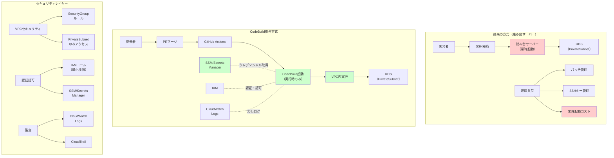

## 要約（Summary）

- sqldefをAWS CodeBuildと統合することで、VPC内のRDSへの安全なマイグレーション実行環境を構築できる
- Secrets Manager/SSMでクレデンシャルを管理し、IAM認証でアクセス制御することでセキュアなパイプラインを実現
- 踏み台サーバーなしで閉域網内のDBへアクセスでき、サーバーレスで運用コストを削減できる

## 本文（Body）

sqldefによる宣言的マイグレーションを本番環境で安全に実行するには、適切なCI/CD環境の構築が必要。AWS CodeBuildを活用することで、セキュアでサーバーレスな実行環境を実現できる。

### 背景・問題意識

本番DBへのマイグレーション実行には、以下の要件がある：

1. **閉域網アクセス**: PrivateSubnet内のRDSへアクセスする必要がある
2. **クレデンシャル管理**: DB接続情報を安全に管理する必要がある
3. **監査可能性**: 誰が、いつ、どのマイグレーションを実行したかを記録する
4. **運用コスト**: 常時起動する踏み台サーバーはコストがかかる

従来は踏み台サーバー経由でマイグレーションを実行していたが、以下の問題があった：
- サーバー維持コスト（EC2インスタンス料金、パッチ管理）
- 手動オペレーションによるヒューマンエラー
- アクセス管理の複雑さ

### アイデア・主張

**CodeBuildをVPC内で実行し、IAM認証とSecrets Manager連携を組み合わせることで、踏み台サーバー不要で安全かつサーバーレスなマイグレーション実行環境を構築できる。実行時のみ課金されるため、運用コストも最小化される。**

#### CodeBuild統合の主要な利点

**1. VPC内実行による閉域網アクセス**

CodeBuildをVPC内で実行するよう構成することで、PrivateSubnet内のRDSへ直接アクセスできる：

```yaml
# buildspec.yml の環境設定（Terraformなどで設定）
# CodeBuildプロジェクトをVPC内で実行
vpc_config:
  vpc_id: vpc-xxxxx
  subnets: [subnet-private-a, subnet-private-b]
  security_group_ids: [sg-codebuild-rds-access]
```

これにより：
- 踏み台サーバーが不要
- RDSにパブリックアクセスを許可する必要がない
- セキュリティグループでアクセス制御できる

**2. IAM認証とSecrets Manager/SSMによるクレデンシャル管理**

DB接続情報をSecrets ManagerやSSM Parameter Storeで管理し、CodeBuildに読み取り権限のみを付与：

```yaml
# buildspec.yml
phases:
  pre_build:
    commands:
      - echo "Fetching database connection parameters from SSM..."
      - |
        export DB_USER=$(aws ssm get-parameter \
          --name "/prod/db/user" \
          --with-decryption \
          --query "Parameter.Value" \
          --output text)
      - |
        export DB_PASS=$(aws ssm get-parameter \
          --name "/prod/db/password" \
          --with-decryption \
          --query "Parameter.Value" \
          --output text)
      - |
        export DB_HOST=$(aws ssm get-parameter \
          --name "/prod/db/host" \
          --query "Parameter.Value" \
          --output text)
      - |
        export DB_PORT=$(aws ssm get-parameter \
          --name "/prod/db/port" \
          --query "Parameter.Value" \
          --output text)
      - |
        export DB_NAME=$(aws ssm get-parameter \
          --name "/prod/db/name" \
          --query "Parameter.Value" \
          --output text)
```

IAMポリシーで最小権限を付与：
```json
{
  "Version": "2012-10-17",
  "Statement": [
    {
      "Effect": "Allow",
      "Action": [
        "ssm:GetParameter",
        "secretsmanager:GetSecretValue"
      ],
      "Resource": [
        "arn:aws:ssm:region:account:parameter/prod/db/*",
        "arn:aws:secretsmanager:region:account:secret:prod/db/*"
      ]
    }
  ]
}
```

これにより：
- クレデンシャルがコードに埋め込まれない
- アクセス権限をIAMで一元管理
- パスワードローテーション時も、SSM/Secrets Managerの値を更新するだけ

**3. サーバーレスで運用コスト削減**

CodeBuildは実行時のみ課金される：
- 踏み台サーバー（常時起動）: 月額数千円〜
- CodeBuild（実行時のみ）: 数分×月数回 = 数十円〜数百円

また、以下の運用コストも削減：
- パッチ管理不要
- SSHキー管理不要
- 踏み台サーバーのモニタリング不要

#### 実装例

**buildspec.yml（簡略版）**

```yaml
version: 0.2

phases:
  install:
    runtime-versions:
      nodejs: 22
    commands:
      - echo "Installing psqldef..."
      - wget -q "https://github.com/sqldef/sqldef/releases/download/v3.6.5/psqldef_linux_amd64.tar.gz"
      - tar -xzf psqldef_linux_amd64.tar.gz
      - chmod +x psqldef
      - mv psqldef /usr/local/bin/
      - psqldef --version

  pre_build:
    commands:
      - echo "Fetching database connection parameters from SSM..."
      # 上述のように各パラメータを取得

  build:
    commands:
      - echo "Running database migration with psqldef..."
      - |
        PGPASSWORD="$DB_PASS" psqldef \
          -U "$DB_USER" \
          -h "$DB_HOST" \
          -p "$DB_PORT" \
          "$DB_NAME" \
          < migration/schema.sql
      - echo "Database migration completed successfully"
```

**マイグレーション実行フロー**

1. 開発者がマイグレーション用PRをマージ
2. GitHub ActionsなどからCodeBuildをトリガー
3. CodeBuildがVPC内で起動
4. SSMからクレデンシャルを取得
5. sqldefバイナリをダウンロード
6. RDSに接続してマイグレーション実行
7. 実行ログをCloudWatch Logsに記録
8. 完了後、CodeBuildは自動終了

### 内容を視覚化するMermaid図



### 具体例・ケース

**Sapeetでの実装例**

プロダクト立ち上げ時にsqldefをCodeBuildと統合：

**環境構成:**
- DB: PostgreSQL on RDS（PrivateSubnet）
- IaC: Terraform
- CI/CD: GitHub Actions → CodeBuild

**buildspec.yml の主要部分:**
```yaml
phases:
  install:
    commands:
      - wget -q "https://github.com/sqldef/sqldef/releases/download/v3.6.5/psqldef_linux_amd64.tar.gz"
      - tar -xzf psqldef_linux_amd64.tar.gz
      - mv psqldef /usr/local/bin/
  
  pre_build:
    commands:
      # SSMから各パラメータを取得（上述の通り）
  
  build:
    commands:
      - PGPASSWORD="$DB_PASS" psqldef -U "$DB_USER" -h "$DB_HOST" -p "$DB_PORT" "$DB_NAME" < migration/schema.sql
```

**結果:**
- 踏み台サーバー不要
- マイグレーション実行時のみ課金
- クレデンシャルをコードに含めない
- 実行履歴をCloudWatch Logsで追跡可能

**リクルート『Airレジ オーダー』での実装（推定）**

記事には明示されていないが、同様の構成が推測される：
- MySQL on RDS
- CodeBuild + SSM Parameter Store
- dry-run.sh / apply.sh をCodeBuild内で実行

### 反論・限界・条件

**CodeBuildのコールドスタート**
- 初回起動時に数十秒かかる
- 頻繁にマイグレーションする場合は待ち時間が気になる可能性
- ただし、本番マイグレーションは頻繁でないため、通常は問題にならない

**ネットワーク設定の複雑さ**
- VPC、Subnet、SecurityGroupの設定が必要
- IaCツール（Terraform、CloudFormationなど）を使わないと管理が煩雑
- ただし、一度設定すれば変更はほぼ不要

**デバッグの難しさ**
- ローカル環境と異なり、CodeBuild内でのデバッグは間接的
- CloudWatch Logsを見る必要がある
- dry-runで事前確認することで緩和可能

**IAM権限の設定ミス**
- 最小権限の原則に従うが、設定ミスでアクセスできない可能性
- Terraformなどでコード化し、テストすることで緩和

**コスト考慮**
- マイグレーション頻度が極端に高い場合、CodeBuildのコストが増える可能性
- ただし、踏み台サーバーの常時起動コストと比較すれば、通常は安価

**ロールバック戦略**
- sqldefは前の状態に戻すには「前の定義」を再適用する
- CodeBuildで自動化する場合、ロールバック用のパイプラインも用意すべき
- [[20251215090824-migration-operation-safety-pattern|マイグレーション操作の安全化パターン]] で対応

## 関連ノート(Links)

- [[20251215090821-sqldef-features|sqldefの特徴と差分検出の仕組み]] - sqldefの基本機能
- [[20251215090824-migration-operation-safety-pattern|マイグレーション操作の安全化パターン]] - dry-run、バックアップなどの安全策
- [[20251215090820-declarative-vs-imperative-migration|宣言型マイグレーションと手続き型マイグレーションの比較]] - 宣言型マイグレーションの利点
- [[20251215092911-learning-cost-minimization|学習コストと認知負荷の最小化戦略]] - 学習コスト最小化の原則

## To-Do / 次に考えること

- [ ] CodeBuildのVPC設定をTerraformでコード化する具体例を記録
- [ ] マイグレーション実行の承認フロー（手動承認ステップ）の設計
- [ ] ロールバック用のCodeBuildパイプラインの設計
- [ ] マイグレーション実行時のSlack通知などのアラート設定
- [ ] 複数環境（dev, staging, prod）での実行パターン
