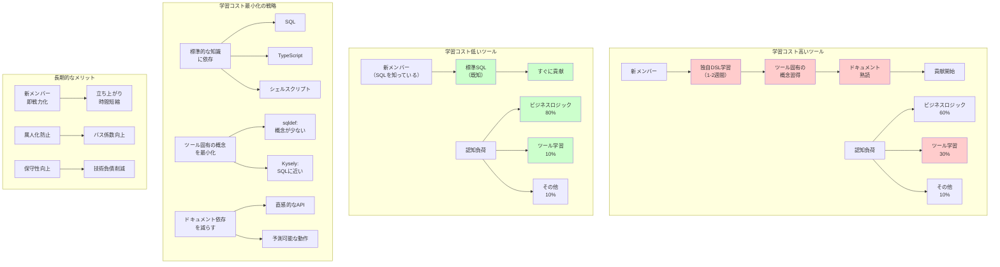

## 要約（Summary）

- ツール選定において、機能の豊富さよりも「学習コスト」と「認知負荷」の最小化を優先するアプローチ
- 標準的な知識（標準SQL、基本的なシェルスクリプト）に依存するツールを選ぶことで、新メンバーの立ち上がりを早める
- ツール固有のDSLや作法を最小化することで、チーム全体の認知負荷を削減し、開発スピードを維持する

## 本文（Body）

技術スタックの選定では、機能の豊富さや最先端性が重視されがちだが、チームの成長速度と長期的な保守性を考えると、「学習コスト」と「認知負荷」の最小化が重要な判断基準となる。

### 背景・問題意識

プロダクト開発において、以下のような状況はよくある：

- **チームメンバーの増加**: 新しいエンジニアがジョインする
- **技術の入れ替わり**: 一部のツールやライブラリを更新・置き換える必要がある
- **知識の属人化**: 特定のツールに詳しい人だけがメンテナンスできる状態

このような状況で、ツール固有のDSLや複雑な設定を覚える必要があると：
- 新メンバーの立ち上がりが遅い
- ドキュメントやトレーニングのコストが増大
- 属人化が進み、バス係数が低下する

### アイデア・主張

**ツール選定において「標準的な知識で扱えるか」を重視することで、学習コストと認知負荷を最小化できる。特に、業界標準の知識（SQL、シェルスクリプト、JSON/YAML）に依存するツールを選ぶことで、新メンバーの即戦力化とチーム全体の生産性向上を実現できる。**

#### 学習コスト最小化の原則

**1. 標準的な知識に依存する**

業界標準のスキルセットで扱えるツールを選ぶ：

| ツール | 必要な知識 | 学習コスト |
|--------|-----------|-----------|
| sqldef | 標準SQL | 低（SQLを知っていれば使える） |
| Prisma | Prisma DSL | 高（独自の文法を学ぶ必要） |
| Flyway | SQL + 命名規則 | 中（SQLは知っているが、命名規則を覚える必要） |
| Kysely | SQL + TypeScript | 低（SQLとTypeScriptを知っていれば使える） |

**例: sqldefのスキーマ定義**

```sql
-- 標準的なCREATE TABLE構文
CREATE TABLE users (
    id UUID PRIMARY KEY DEFAULT gen_random_uuid(),
    email VARCHAR(255) NOT NULL UNIQUE,
    name VARCHAR(255) NOT NULL,
    created_at TIMESTAMP WITH TIME ZONE NOT NULL DEFAULT CURRENT_TIMESTAMP
);
```

誰でも読める。PostgreSQLのドキュメントを読めば理解できる。

**例: Prismaのスキーマ定義（独自DSL）**

```prisma
model User {
  id        String   @id @default(uuid())
  email     String   @unique
  name      String
  createdAt DateTime @default(now()) @map("created_at")
  
  @@map("users")
}
```

Prisma独自の文法（`@id`、`@default`、`@map`など）を学ぶ必要がある。

**2. ツール固有の概念を最小化する**

新しい概念を導入するツールは、その分だけ認知負荷を増やす：

**Flywayの概念:**
- バージョニング規則（`V001__`, `V002__`）
- リピータブルマイグレーション
- `flyway_schema_history` テーブル
- Baseline、Repair、Validateなどのコマンド

**sqldefの概念:**
- 理想状態のスキーマ定義（標準SQL）
- `--dry-run`（差分確認）
- それだけ

**3. 「見てわかる」を重視する**

コードやログを見たときに、「何が起きているか」が直感的にわかることが重要。

**sqldefの実行ログ:**
```sql
-- Apply --
BEGIN;
ALTER TABLE "users" ADD COLUMN "phone" VARCHAR(20);
CREATE INDEX "idx_users_phone" ON "users"("phone");
COMMIT;
```

→ 実際に実行されるSQLがそのまま表示される。DBに詳しくないメンバーでも理解しやすい。

**4. ドキュメントへの依存を減らす**

ツールが直感的であれば、ドキュメントを読む時間が減る：
- 標準SQLを書くだけでスキーマ管理できる（sqldef）
- SQLに近い構文でクエリを書ける（Kysely）

複雑なツールは、常にドキュメントを参照する必要がある：
- Prismaの複雑なリレーション設定
- Flywayのマイグレーション競合解決

#### 認知負荷削減のメリット

**新メンバーの立ち上がり時間短縮**

標準的な知識で扱えるツールは、新メンバーがすぐに貢献できる：

```
多機能ORM（Prisma）:
  入社 → ORM DSL学習（1-2週間） → 貢献開始

軽量ツール（sqldef + Kysely）:
  入社 → SQLとTypeScriptを知っていればすぐ貢献
```

**属人化の防止**

誰でも扱えるツールは、特定の人に依存しない：
- 「このツールは〇〇さんしか知らない」状態を避ける
- バス係数を上げる（チームの安定性向上）

**メンタルスペースの確保**

複雑なツールに認知リソースを取られると、本質的な問題（ビジネスロジック、アーキテクチャ設計）に集中できない：

```
認知リソースの配分:

多機能ORM:
  ビジネスロジック: 60%
  ORMの学習・トラブルシュート: 30%
  その他: 10%

軽量ツール:
  ビジネスロジック: 80%
  ツールの学習・トラブルシュート: 10%
  その他: 10%
```

**長期的な保守性**

ツールが廃れたり、メジャーバージョンアップで大幅に変更されても：
- 標準SQLは変わらない
- シェルスクリプトは変わらない
- 基本的なTypeScript構文は変わらない

→ ツール依存を最小化することで、長期的な技術負債を減らす

### 内容を視覚化するMermaid図



### 具体例・ケース

**Sapeetでのツール選定**

記事では、以下のように述べられている：

> 「メンバーが増えた際、特定のORM独自のマイグレーションDSLや作法を覚える学習コストは一定かかるものです。このシンプルな構成であれば、学習コストも一定抑えつつ、アプリケーションのシンプルさを保つことも可能です」

**選定理由:**
1. **標準SQLで完結**: CREATE TABLE構文を書くだけ
2. **Kysely**: SQLに近い構文（SQLを知っていれば理解できる）
3. **認知負荷の削減**: 複雑なORM DSLを覚える必要がない

**結果:**
- 新メンバーがすぐに貢献できる
- DBスキーマ管理がシンプルに保たれる
- スピード感のある開発を維持

**他の事例: リクルート『Airレジ オーダー』**

記事には直接言及されていないが、類似の記事から推測される選定理由：
- 複数案件の並行開発
- 頻繁なスキーマ変更
- メンバーの入れ替わり

→ sqldefの宣言的アプローチで、マイグレーション管理の認知負荷を削減

**反例: Prismaの学習コスト**

Prismaは強力だが、以下を学ぶ必要がある：
- Prisma Schema Language（独自DSL）
- Prisma Client API
- Prisma Migrate
- リレーション設定（`@relation`）
- パフォーマンス最適化（N+1問題）

→ 新メンバーが貢献するまでに1-2週間の学習期間が必要

### 反論・限界・条件

**標準的な知識を持たないメンバー**
- SQLに不慣れなメンバーには、ORMのほうが扱いやすい可能性
- ただし、SQLは汎用的なスキルなので、長期的には学習価値が高い
- チームのスキルレベルに応じて判断すべき

**複雑な機能を提供するツールの利点**
- Prismaの強力なリレーション処理やN+1最適化は、手動で実装するのが大変
- シンプルなツールは、高度な機能を提供しない
- トレードオフを理解した上で選択すべき

**プロジェクトの規模と複雑さ**
- 小規模プロジェクトでは、シンプルなツールが有利
- 大規模プロジェクトでは、多機能ORMの恩恵が大きい可能性
- ただし、複雑さはコントロールできないと技術負債になる

**ツールの成熟度とエコシステム**
- Prismaのようなメジャーツールは、情報が豊富
- sqldef + Kyselyの組み合わせは、情報が少ない
- 情報の入手しやすさも学習コストに影響する

**初期セットアップの手間**
- シンプルなツールを組み合わせる場合、初期セットアップに手間がかかる
- 多機能ORMは、セットアップが簡単（1つのCLIで完結）
- ただし、長期的な保守性では、シンプルなツールが有利

## 関連ノート(Links)

- [[20251215090821-sqldef-features|sqldefの特徴と差分検出の仕組み]] - sqldefのシンプルさ
- [[20251215090820-declarative-vs-imperative-migration|宣言型マイグレーションと手続き型マイグレーションの比較]] - 宣言型のシンプルさ
- [[20251215092710-sqldef-codebuild-integration|sqldefのCodeBuild統合パターン]] - セキュアなCI/CD環境構築

## To-Do / 次に考えること

- [ ] チームのスキルレベルとツール選定の関係を分析
- [ ] 学習コストの定量的な測定方法（立ち上がり時間、ドキュメント参照回数など）
- [ ] 認知負荷理論（Cognitive Load Theory）の観点から分析
- [ ] 他のドメイン（フロントエンド、インフラなど）での学習コスト最小化戦略
- [ ] 「シンプルさ」と「機能の豊富さ」の最適なバランスを探る
