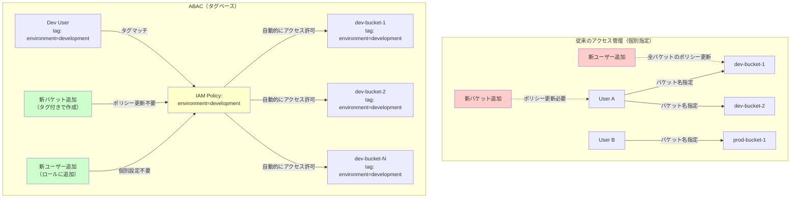

## 要約（Summary）

- Amazon S3の属性ベースアクセス制御（ABAC）は、タグベースで自動的にアクセス権を管理する機能
- バケットとIAMプリンシパルのタグが一致すれば、個別のポリシー更新なしにアクセスが許可される
- 大規模組織における権限管理の複雑さとメンテナンスコストを大幅に削減

## 本文（Body）

### 背景・問題意識

組織の成長に伴い、ストレージリソースのアクセス許可管理は指数関数的に複雑化する。新しいメンバーの追加、役割変更、新規バケット作成のたびに、複数のポリシーを手動で更新しなければならない。

**従来のアクセス管理の課題：**
- 人の出入りごとにIAMポリシーを更新
- 新規バケット作成時にアクセスポリシーを個別設定
- マルチテナント環境での権限管理の煩雑さ
- 共有データセットへのアクセス権制御の困難さ

### アイデア・主張

**属性（タグ）ベースのアクセス制御により、リソースとプリンシパルの属性マッチングで自動的にアクセス権を付与できる。これにより、ポリシーの静的定義だけで動的なアクセス管理が実現する。**

ABACが解決する本質的な問題：
1. **スケーラビリティ**: リソースやユーザーが増えてもポリシー更新が不要
2. **保守性**: タグ付けルールさえ守れば、一貫したアクセス制御が維持される
3. **柔軟性**: プロジェクト、チーム、環境などの論理的グループで権限管理
4. **監査性**: タグベースでアクセスログを追跡しやすい

### 内容を視覚化するMermaid図



### 具体例・ケース

**開発環境バケットへのアクセス管理**

従来の方法：
```json
{
  "Effect": "Allow",
  "Action": ["s3:GetObject", "s3:PutObject"],
  "Resource": [
    "arn:aws:s3:::dev-bucket-1/*",
    "arn:aws:s3:::dev-bucket-2/*",
    "arn:aws:s3:::dev-bucket-3/*"
  ]
}
```
→ 新規バケット追加のたびにポリシー更新が必要

ABACでの方法：
```json
{
  "Effect": "Allow",
  "Action": ["s3:GetObject", "s3:PutObject"],
  "Resource": ["*"],
  "Condition": {
    "StringEquals": {
      "aws:ResourceTag/environment": "development"
    }
  }
}
```
→ `environment:development`タグがついたバケットすべてに自動適用

**マルチテナント環境での顧客別分離**
- バケットに`customer:acme`タグ
- IAMロールに同じ`customer:acme`タグ
- 顧客ごとにデータアクセスが自動的に分離される
- 新規顧客追加時もタグ付けだけで完結

### 反論・限界・条件

**ABAC導入の前提条件**
- タグ付け規則の組織的な標準化が必要
- タグ管理の規律がなければ混乱を招く
- 既存環境への適用には慎重な移行計画が必要

**適用が難しいケース**
- バケット単位で細かくアクセス権を変えたい場合
- タグベースで表現できない複雑な条件（IPアドレス制限、時間制限など）
- 一時的・例外的なアクセス許可（ABACと個別ポリシーの併用が必要）

**運用上の注意点**
- タグの変更がアクセス権に直結するため、タグ変更の権限管理が重要
- コスト配分タグとアクセス制御タグを兼用する場合の影響範囲の理解
- 誤ったタグ付けによる意図しないアクセス許可のリスク

**セキュリティ考慮事項**
- タグは比較的簡単に変更できるため、タグ変更の監査が必須
- `aws:TagKeys`と`aws:RequestTag`でタグ付けを強制する仕組みが推奨
- CloudTrailでのアクセスログ監視が重要

## 関連ノート（Links）

- [[20251215095244-tag-matching-authentication|タグマッチング認証メカニズム]] - タグベース認証の仕組み
- [[20251215095316-s3-abac-migration-strategy|S3 ABAC有効化と既存タグ移行戦略]] - ABAC移行の実装
- [[20251215095358-tag-enforcement-governance|作成時タグ強制によるガバナンス戦略]] - タグ付けの強制

## To-Do / 次に考えること

- [ ] タグベース認証の具体的な実装手順とベストプラクティスを調査
- [ ] 既存のIAMポリシーからABACへの移行戦略をまとめる
- [ ] コスト配分タグとアクセス制御タグの関係を整理
- [ ] 他のAWSサービス（EC2、Lambda等）でのABAC適用パターンと比較
