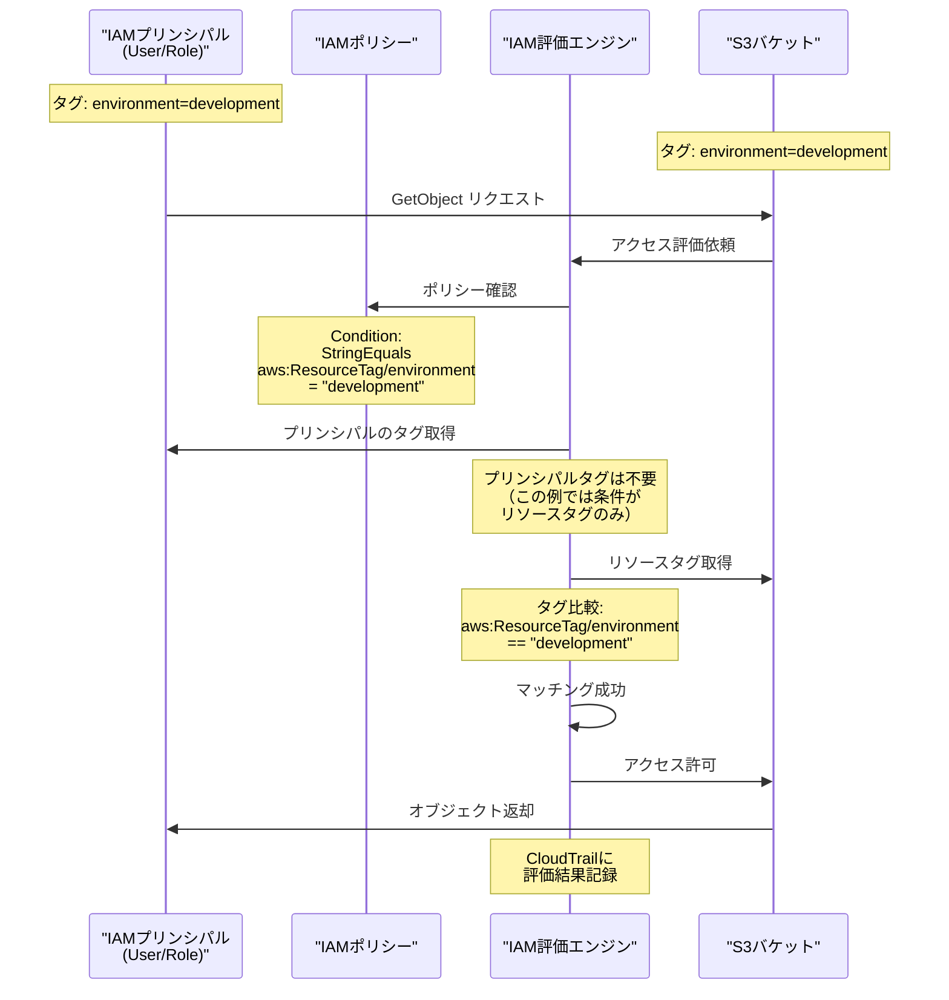

## 要約（Summary）

- タグマッチング認証は、リソースのタグとプリンシパルのタグを照合してアクセス可否を判断する仕組み
- IAMポリシー内の条件キー（`aws:ResourceTag`、`aws:PrincipalTag`）でタグ比較を行う
- バケット名ではなく「属性（タグ）」でアクセス制御を行うことで、動的な権限管理を実現

## 本文（Body）

### 背景・問題意識

従来のアクセス制御では、リソースを「名前」で特定してアクセス権を付与していた。しかしこの方式では、リソースが増えるたびにポリシーを更新する必要があり、スケールしない。

**名前ベースの制限：**
- リソースARNを明示的に列挙する必要がある
- 新規リソース追加時にポリシー更新が必須
- 論理的なグループ（環境、プロジェクト等）で権限を管理できない

### アイデア・主張

**タグという「属性」を使ってリソースとプリンシパルを照合することで、名前に依存しない柔軟なアクセス制御が可能になる。これは「何であるか（identity）」ではなく「どのような属性を持つか（attributes）」で判断する認証モデルへの転換である。**

タグマッチングの核心的なメリット：
1. **動的性**: リソースが後から追加されても、タグが一致すれば自動的にアクセス可能
2. **抽象化**: 具体的なリソース名ではなく、役割や環境という概念でポリシーを記述
3. **一貫性**: 同じタグ付けルールを守れば、組織全体で統一的なアクセス制御が実現

### 内容を視覚化するMermaid図



### 具体例・ケース

**基本的なタグマッチングポリシー**

リソースタグのみで判断：
```json
{
  "Version": "2012-10-17",
  "Statement": [{
    "Effect": "Allow",
    "Action": ["s3:GetObject", "s3:PutObject", "s3:ListBucket"],
    "Resource": ["*"],
    "Condition": {
      "StringEquals": {
        "aws:ResourceTag/environment": "development"
      }
    }
  }]
}
```
→ `environment:development`タグを持つすべてのS3バケットにアクセス可能

**プリンシパルタグとリソースタグの両方で判断**

より厳密な制御：
```json
{
  "Condition": {
    "StringEquals": {
      "aws:ResourceTag/project": "${aws:PrincipalTag/project}"
    }
  }
}
```
→ プリンシパルとリソースの`project`タグが一致する場合のみアクセス許可

**複数タグの組み合わせ**

AND条件でのマッチング：
```json
{
  "Condition": {
    "StringEquals": {
      "aws:ResourceTag/environment": "production",
      "aws:ResourceTag/sensitivity": "high"
    }
  }
}
```
→ 本番環境かつ機密性高のバケットのみアクセス可能

**チーム別アクセス分離の実装例**

設定：
- S3バケット: `analytics-data` に `team:analytics` タグ
- IAMロール: `analytics-team-role` を作成
- ポリシー: `team`タグでマッチング

```json
{
  "Effect": "Allow",
  "Action": ["s3:*"],
  "Resource": ["*"],
  "Condition": {
    "StringEquals": {
      "aws:ResourceTag/team": "analytics"
    }
  }
}
```

結果：
- Analyticsチームメンバーは自チームのバケットのみアクセス可能
- 新規チームバケット追加時もタグ付けだけで自動的にアクセス権が付与される

### 反論・限界・条件

**タグマッチングの制約**
- タグは文字列比較のみ（数値範囲、正規表現マッチは不可）
- 複雑な論理（OR条件の組み合わせ等）は表現しづらい
- タグの値を間違えると意図しないアクセス許可/拒否が発生

**パフォーマンスへの影響**
- タグ評価のオーバーヘッドは通常無視できるレベル
- ただし大量のタグがある場合の評価時間は未検証

**タグの可変性リスク**
- タグは後から変更可能
- タグ変更により意図せずアクセス権が変わる可能性
- `aws:TagKeys`条件でタグキーの存在を強制することが重要

**監査とトラブルシューティング**
- 名前ベースより「なぜアクセスできたか」の追跡が複雑
- CloudTrailログでタグ値まで記録されるため、ログ分析で対応可能
- IAM Policy Simulatorでタグ条件のテストが推奨される

**段階的導入の重要性**
- 既存の名前ベースポリシーとABACを併用する移行期間が必要
- 一度にすべてをABACに切り替えると、予期しないアクセス拒否が発生しうる

## 関連ノート（Links）

- [[20251215095206-s3-abac-overview|S3 ABACによるスケーラブルなアクセス管理]] - ABACの全体像と動機

## To-Do / 次に考えること

- [ ] IAM Policy Simulatorでのタグ条件テスト手順を整理
- [ ] タグの命名規則とベストプラクティスをまとめる
- [ ] CloudTrailログでのタグベースアクセスの監査方法を調査
- [ ] プリンシパルタグとリソースタグの動的マッチングのユースケースを拡充
