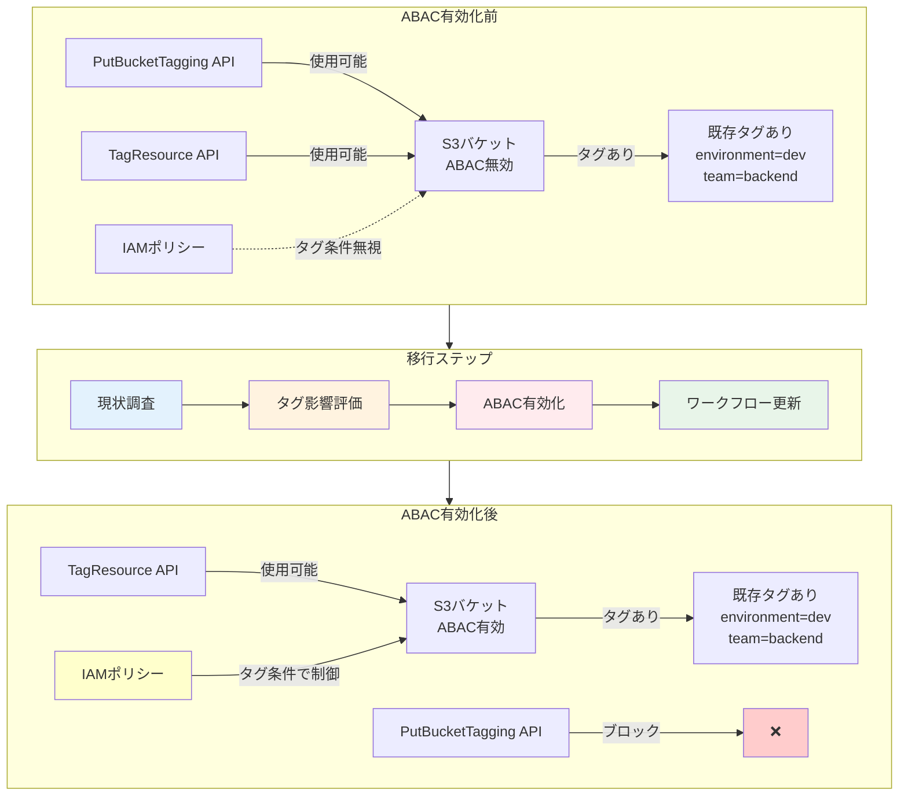

## 要約（Summary）

- S3 ABACはバケットごとに明示的に有効化が必要（デフォルトでは無効）
- ABAC有効化後は`PutBucketTagging` APIがブロックされ、`TagResource` APIのみ使用可能
- 既存タグをそのまま使える一方、アクセス制御への影響を事前評価することが重要

## 本文（Body）

### 背景・問題意識

新機能を既存環境に導入する際、既存のタグ付け慣行やワークフローとの互換性が課題となる。特にタグがアクセス制御に直結する場合、慎重な移行計画が必要。

**移行時の懸念事項：**
- 既存のタグ付けワークフローへの影響
- 意図しないアクセス許可/拒否の発生リスク
- コスト配分タグとアクセス制御タグの関係
- API変更に伴うアプリケーションへの影響

### アイデア・主張

**S3 ABACは「オプトイン」設計により、既存環境への影響を最小化しつつ段階的な導入を可能にしている。ただし、ABAC有効化はタグ管理APIの変更を伴うため、事前の影響調査と移行計画が不可欠である。**

段階的導入のための設計思想：
1. **明示的有効化**: バケット単位で選択的にABACを有効化
2. **API制限**: ABAC有効化後はアクセス制御用の安全なAPIのみ使用可能
3. **既存タグの再利用**: 新たなタグ体系を作らず、既存タグをそのまま活用可能
4. **監査可能性**: AWS ConfigとCloudTrailでABAC状態とAPI使用を追跡

### 内容を視覚化するMermaid図



### 具体例・ケース

**基本的な有効化手順**

AWS CLIでの有効化：
```bash
aws s3api put-bucket-abac \
  --bucket my-demo-development-bucket \
  --abac-status Status=Enabled \
  --region us-east-2
```

AWS CloudFormationでの有効化：
```yaml
Resources:
  MyBucket:
    Type: AWS::S3::Bucket
    Properties:
      BucketName: my-demo-development-bucket
      AbacStatus: Enabled
      Tags:
        - Key: environment
          Value: development
        - Key: team
          Value: platform
```

**既存タグの影響評価プロセス**

ステップ1: 現在のタグ使用状況を確認
```bash
# すべてのバケットのタグを取得
aws s3api list-buckets --query 'Buckets[].Name' | \
  xargs -I {} aws s3api get-bucket-tagging --bucket {}
```

ステップ2: PutBucketTagging API の使用状況を確認（CloudTrail）
```bash
aws cloudtrail lookup-events \
  --lookup-attributes AttributeKey=EventName,AttributeValue=PutBucketTagging \
  --max-results 50
```

ステップ3: IAM Policy Simulatorで影響をテスト
- 既存のIAMポリシーにタグ条件を追加
- シミュレータで各プリンシパルのアクセス可否を確認
- 意図しない拒否が発生しないか検証

**既存タグをコスト配分とABACで兼用する例**

タグ設計：
```json
{
  "Tags": [
    {"Key": "environment", "Value": "production"},
    {"Key": "cost-center", "Value": "engineering"},
    {"Key": "project", "Value": "analytics"}
  ]
}
```

AWS Billingコンソールでコスト配分タグとして有効化：
- `environment`, `cost-center`, `project` をコストアロケーションタグに設定

IAMポリシーで同じタグを使用：
```json
{
  "Condition": {
    "StringEquals": {
      "aws:ResourceTag/environment": "production",
      "aws:ResourceTag/project": "analytics"
    }
  }
}
```

結果：
- 同一のタグでコスト分析とアクセス制御の両方が実現
- タグ管理の一元化によりオーバーヘッド削減

**段階的なABAC導入計画**

フェーズ1（検証環境）:
1. 非本番環境の数個のバケットでABACを有効化
2. タグベースポリシーを適用してアクセステスト
3. CloudTrailログで動作確認

フェーズ2（本番環境の一部）:
1. 新規作成するバケットのみABACを有効化
2. 既存バケットは従来のポリシーを維持
3. タグ付けワークフローを`TagResource` APIに移行

フェーズ3（全面展開）:
1. 既存バケットを順次ABAC有効化
2. 古いポリシーを段階的に削除
3. AWS Configルールでタグ付け規則を強制

### 反論・限界・条件

**PutBucketTagging API ブロックの影響**
- レガシーアプリケーションで`PutBucketTagging`を使用している場合、コード変更が必須
- Terraformなどのインフラコードも更新が必要（新しいプロバイダーバージョンで対応）
- 一度ABAC有効化すると、無効化して戻すには別のAPI呼び出しが必要

**既存タグの意味の変化**
- これまでメタデータとして使っていたタグが、突然アクセス制御に影響
- タグの値を変更すると、アクセス権が変わってしまう
- タグの重要性が増すため、タグ変更の承認プロセスが必要になる可能性

**移行期間の複雑性**
- ABACと従来のポリシーが混在する期間は、アクセス制御ロジックが複雑化
- どのバケットがABACか非ABACか、管理が煩雑
- AWS Configでバケットの状態を追跡することが推奨される

**コスト配分タグとの競合リスク**
- コスト分析のために自由につけていたタグが、アクセス制御に影響する
- 例：テスト目的で`environment=production`とタグ付けすると、本番アクセス権が付与される
- タグ命名規則とガバナンスの確立が前提条件

**ロールバック計画の必要性**
- ABAC有効化後に問題が発覚した場合の無効化手順を事前に準備
- 無効化してもタグは残るため、従来のポリシーで対応可能
- ただし、アプリケーションのAPI使用を戻す必要がある

## 関連ノート（Links）

- [[20251215095206-s3-abac-overview|S3 ABACによるスケーラブルなアクセス管理]] - ABACの全体像
- [[20251215095244-tag-matching-authentication|タグマッチング認証メカニズム]] - タグベース認証の仕組み

## To-Do / 次に考えること

- [ ] AWS Configルールでタグ付け規則を強制する具体的な設定例を作成
- [ ] PutBucketTaggingからTagResourceへの移行スクリプトを作成
- [ ] IAM Policy Simulatorでのタグ条件テストの自動化を検討
- [ ] ABAC有効化の判断基準（どのバケットで有効化すべきか）を整理
- [ ] Terraformでのプロバイダーバージョンとの互換性を調査
