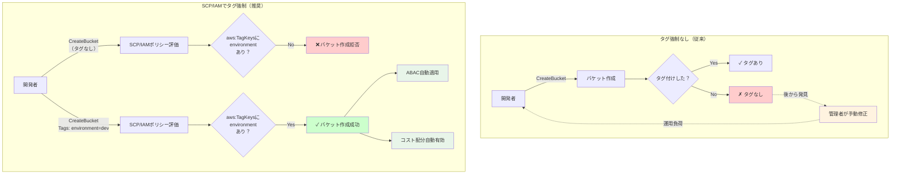

## 要約（Summary）

- SCPやIAMポリシーで`aws:TagKeys`と`aws:RequestTag`条件キーを使い、バケット作成時にタグ付けを強制できる
- タグ付けの強制により、組織全体で一貫したアクセス制御パターンとコスト配分を実現
- 作成時にタグを付与することで、「タグなしリソース」の発生を防ぐ

## 本文（Body）

### 背景・問題意識

タグベースのアクセス制御やコスト管理は、タグが正しく付与されていることが前提となる。しかし人間による手動タグ付けは、以下の問題を抱える：

**手動タグ付けの課題：**
- タグ付け忘れ（タグなしリソースの発生）
- タグのキー名や値の表記ゆれ（`Env` vs `environment`）
- 後からタグ付けする運用負荷
- タグ付けルールの周知徹底の困難さ

### アイデア・主張

**リソース作成時にタグ付けを強制することで、「タグなしリソース」の発生をゼロにし、後からの修正コストを削減する。これは「事後チェック」から「事前防止」へのシフトであり、ガバナンスの実効性を大幅に高める。**

作成時強制の利点：
1. **予防的統制**: タグなしリソースが作成できない仕組み
2. **運用負荷削減**: 後からタグを付ける手間が不要
3. **一貫性の確保**: 組織全体で統一されたタグ体系
4. **即座の可視化**: 作成と同時にコスト配分やアクセス制御が有効

条件キーによる制御の種類：
- **`aws:TagKeys`**: 特定のタグキーの存在を強制
- **`aws:RequestTag`**: 特定のタグキーと値の組み合わせを強制

### 内容を視覚化するMermaid図



### 具体例・ケース

**SCPでタグキーの存在を強制**

全AWSアカウントに適用するSCP：
```json
{
  "Version": "2012-10-17",
  "Statement": [
    {
      "Sid": "EnforceTagsOnS3BucketCreation",
      "Effect": "Deny",
      "Action": "s3:CreateBucket",
      "Resource": "*",
      "Condition": {
        "ForAllValues:StringNotEquals": {
          "aws:TagKeys": ["environment", "cost-center", "project"]
        }
      }
    }
  ]
}
```

効果：
- `environment`, `cost-center`, `project`の3つのタグがすべて付与されていない場合、バケット作成が失敗
- 組織全体で統一されたタグ体系が強制される

**IAMポリシーで特定のタグ値を強制**

開発チーム用のIAMポリシー：
```json
{
  "Version": "2012-10-17",
  "Statement": [
    {
      "Effect": "Allow",
      "Action": "s3:CreateBucket",
      "Resource": "*",
      "Condition": {
        "StringEquals": {
          "aws:RequestTag/environment": "development"
        }
      }
    }
  ]
}
```

効果：
- 開発チームは`environment=development`タグ付きのバケットしか作成できない
- 本番環境へのバケット作成を防ぐ（権限分離）

**CloudFormationテンプレートでのタグ付け**

```yaml
Resources:
  MyS3Bucket:
    Type: AWS::S3::Bucket
    Properties:
      BucketName: my-application-data
      AbacStatus: Enabled
      Tags:
        - Key: environment
          Value: production
        - Key: cost-center
          Value: engineering
        - Key: project
          Value: data-platform
```

利点：
- Infrastructure as Codeでタグ付けが自動化
- テンプレートのレビュープロセスでタグの正確性を担保
- 作成と同時にABACとコスト配分が有効化

**AWS CLIでのタグ付き作成**

```bash
aws s3api create-bucket \
  --bucket my-new-bucket \
  --region us-east-2 \
  --tagging "TagSet=[{Key=environment,Value=production},{Key=team,Value=platform}]"
```

**タグ値の命名規則を強制する高度な例**

環境名を`dev`, `staging`, `prod`のみに制限：
```json
{
  "Condition": {
    "StringNotEquals": {
      "aws:RequestTag/environment": ["dev", "staging", "prod"]
    }
  }
}
```
→ 表記ゆれ（`development`, `production`など）を防止

**段階的なタグ強制の導入戦略**

フェーズ1: タグ推奨（強制なし）
- ドキュメントでベストプラクティスを共有
- ダッシュボードでタグなしリソースを可視化

フェーズ2: 警告
- AWS Configルールでタグなしリソースを検出
- 通知は送るが、作成はブロックしない

フェーズ3: 新規リソースのみ強制
- SCPで新規バケット作成時にタグを強制
- 既存バケットには適用しない（猶予期間）

フェーズ4: 既存リソースの修正
- タグなしバケットに一括タグ付け
- 全リソースでABACを有効化

### 反論・限界・条件

**開発速度への影響**
- タグ強制により、バケット作成の手順が増える
- 実験的なリソース作成時に煩わしさを感じる可能性
- 対策：テンプレートやスクリプトで自動化

**緊急時の柔軟性の欠如**
- 障害対応など、緊急時にタグ付けの余裕がないケース
- SCPの例外設定や、特権アカウントでの作成が必要
- 事後的なタグ付けプロセスを用意しておく

**タグ体系の変更への対応**
- 組織のタグ戦略が変わった場合、SCPの更新が必要
- 既存リソースとの整合性を取るための移行期間が必要

**複数タグの組み合わせの複雑さ**
- 必須タグが増えると、条件文が複雑化
- SCPのサイズ制限（最大5,120文字）に注意
- タグの階層化や最小セットの定義が重要

**タグ値の検証の限界**
- `aws:RequestTag`では文字列完全一致のみ
- 形式チェック（例：プロジェクトコードの形式）は別途カスタムロジックが必要
- AWS Config RulesやLambdaでの追加検証を組み合わせる

**ベンダーロックインのリスク**
- AWSのタグ機能に依存した設計
- マルチクラウド戦略では抽象化レイヤーが必要
- ただし、タグ概念は他クラウドにも存在するため、移植性は比較的高い

## 関連ノート（Links）

- [[20251215095206-s3-abac-overview|S3 ABACによるスケーラブルなアクセス管理]] - ABACの全体像
- [[20251215095244-tag-matching-authentication|タグマッチング認証メカニズム]] - タグベース認証の仕組み
- [[20251215095316-s3-abac-migration-strategy|S3 ABAC有効化と既存タグ移行戦略]] - ABAC移行の実装

## To-Do / 次に考えること

- [ ] SCPとIAMポリシーの優先順位と評価順序を整理
- [ ] AWS Config Rulesでのタグコンプライアンス監視の具体例を作成
- [ ] タグ命名規則のベストプラクティス（キー名、値の形式）をまとめる
- [ ] Terraformでのタグ強制の実装例を調査
- [ ] 緊急時のタグ強制バイパス手順（BreakGlass）を設計
