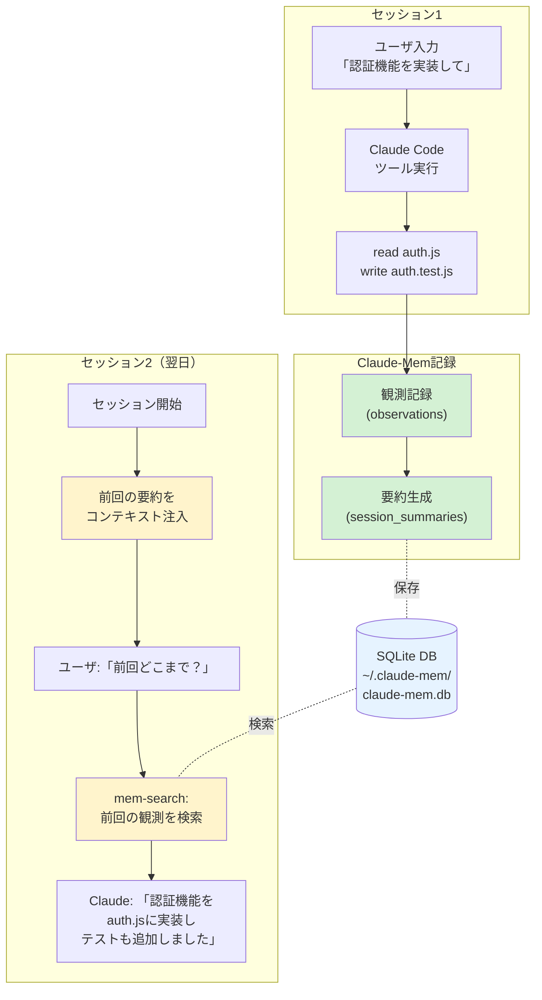

## 要約（Summary）

- Claude-Memは、Claude Code向けサードパーティプラグインで、ツール実行履歴を自動記録・要約し、次回セッションで「前回の作業内容」を思い出せる形で注入する
- 自然言語でコーディング履歴を検索できる`mem-search`機能により、「前回直したバグは？」「authはどう実装した？」といった質問に対応
- セッションをまたいだ継続記憶により、作業再開時のコンテキスト復元コストを削減する

## 本文（Body）

### 背景・問題意識

コーディングエージェントを使った開発では、セッションが途切れると「前回どこまでやったか」「なぜこの実装にしたか」の情報が失われる。新しいセッションで同じ説明を繰り返したり、過去の判断を再度調べ直すことは非効率である。

Claude-Memは、この**セッション間のコンテキスト断絶問題**を解決するために作られたツールで、Anthropic公式の「Claude Code」向けに設計されたサードパーティ製プラグインである。

### アイデア・主張

**コーディングエージェントが実行したツール操作（read/write等）とその前後関係を自動で記録・要約し、次回セッション開始時に"思い出せる形"でコンテキストとして注入すれば、開発者は過去の作業内容を自然言語で検索でき、セッション再開時のオーバーヘッドを削減できる。**

Claude-Memは以下の機能を提供する：

**1. セッションをまたいだ継続記憶**
- 前回の作業内容が新しいセッションで自動的に出てくる
- セッション終了時に要約が生成され、次回起動時にコンテキストとして注入される

**2. mem-search Skill（自然言語検索）**
- 「前回直したバグは？」「authはどう実装した？」のように自然言語で質問
- 過去のツール実行ログ（観測データ）を検索して返す
- MCP（Model Context Protocol）方式に比べて起動時のトークン消費を節約できる、という主張もある

**3. Web Viewer UI**
- `http://localhost:37777`でリアルタイム閲覧
- 記憶が増えていく様子を可視化

**4. プライバシー制御（`<private>`タグ）**
- 保存したくない情報を`<private>...</private>`で囲むとDBへ永続化しない
- エッジ処理でフィルタリング（保存前に除去）

**5. 引用可能な参照**
- 過去の観測に`claude-mem://`のようなURIで参照を付ける仕組み

### 内容を視覚化するMermaid図



### 具体例・ケース

**ケース1: バグ修正の経緯を思い出す**
```
開発者: 「前回直したバグは何だった？」
Claude (mem-search実行): 「セッション#123で、ログイン時のトークン検証エラーを
auth.js:45で修正しました。問題はトークン有効期限チェックの順序でした」
```

**ケース2: 実装判断の理由を確認**
```
開発者: 「なぜRedisではなくPostgreSQLを使ったの？」
Claude (mem-search実行): 「セッション#120で、セッション永続化が必要なため
PostgreSQLを選択。Redisはキャッシュ用途に限定する判断でした」
```

**ケース3: 実装の続きを再開**
```
# セッション開始時、自動的に前回の要約が注入される
Claude: 「前回のセッションでは、ユーザー登録APIを実装し、
バリデーション処理まで完了しました。次はメール送信機能ですね」
```

### 反論・限界・条件

**データ肥大化リスク**
- セッションを重ねるほどDB（`claude-mem.db`）が肥大化
- 長期運用では検索パフォーマンスが低下する可能性
- 定期的なクリーンアップ戦略が必要

**要約品質への依存**
- 自動要約の品質が低いと、誤った情報が継続記憶として残る
- 要約生成に使うLLMの精度に依存

**公式機能ではない**
- Anthropic公式ではなくサードパーティ製
- 将来的にClaude Codeの仕様変更で動かなくなるリスク
- 企業利用では、ライセンス（AGPL-3.0）とデータ取り扱いの事前審査が必要

**セッション境界の定義**
- どこまでを「1セッション」とするかの定義が曖昧
- 長時間セッションでは要約のタイミングが不明確

**コンテキスト注入のコスト**
- 起動時にトークンを消費（MCPよりは少ないと主張されているが）
- 不要な過去情報まで注入されると逆効果

## 関連ノート（Links）

- [[20251215100647-claude-mem-architecture|Claude-Memのアーキテクチャとデータフロー]] - 技術的な仕組みの詳細
- [[20251215100648-claude-mem-privacy-security|Claude-Memのプライバシーとセキュリティ考慮事項]] - 実運用時のリスク
- [[20251215100649-claude-mem-vs-official-memory|Claude-MemとClaude公式Memory機能の違い]] - 混同しやすい2つの機能の区別
- [[20251129165837-long-running-agent-context-window-problem|長時間実行AIエージェントのコンテキストウィンドウ問題]] - セッション継続時の課題
- [[20251214235249-context-window-management-strategy|コンテキストウィンドウ管理戦略]] - コンテキスト管理の一般的戦略

## To-Do / 次に考えること

- [ ] Claude-Memの要約品質を検証（実際に使ってみて精度を確認）
- [ ] DB肥大化対策（定期クリーンアップスクリプトの検討）
- [ ] 企業導入時のAGPLライセンス適合性を法務と確認
- [ ] MCPとの組み合わせパターンを検証（併用は可能か？相性は？）
- [ ] 公式Claude Memory機能との使い分け指針を策定
