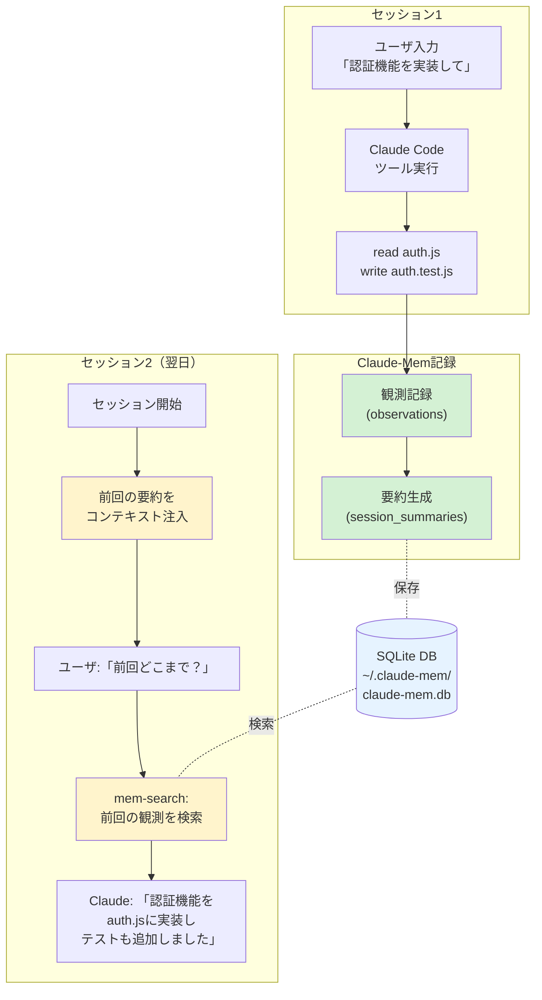

## 要約（Summary）

- Claude-Memは、Claude Code向けサードパーティプラグインで、ツール実行履歴を自動記録・要約し、次回セッションで「前回の作業内容」を思い出せる形で注入する
- 3層メモリ構造（インデックス→サマリー→原文）とセマンティック検索により、過去のセッションから関連情報を効率的に取得できる
- Endless Mode（ベータ）で通常の約20倍（約1,000回）のツール実行が可能だが、60-90秒のレイテンシ増加とメモリ使用量増加のトレードオフがある

## 本文（Body）

### 背景・問題意識

コーディングエージェントを使った開発では、2つの深刻な問題がある：

**1. セッション間のコンテキスト断絶**
- セッションが途切れると「前回どこまでやったか」「なぜこの実装にしたか」が失われる
- 新しいセッションで同じ説明を繰り返す非効率性

**2. Claude Codeのオートコンパクト問題（2025年に多数報告）**
- `/compact`や自動コンパクトが重要な情報を失う
- コンテキストが8-12%の時点で誤って発火（本来は90-95%+で発火すべき）
- コンパクト後に「Python環境での実行方法」などの基本情報すら忘れる
- 数分おきに自動コンパクトが繰り返され、NaN%表示の無限ループが発生するケースも

Claude-Memは、この**セッション間のコンテキスト断絶問題**と**オートコンパクトの記憶喪失問題**の両方を解決するために作られたサードパーティ製プラグインである。

### アイデア・主張

**コーディングエージェントが実行したツール操作を自動記録・要約し、3層メモリ構造で効率的に保存することで、セッション間の記憶を維持し、オートコンパクトの記憶喪失問題を回避できる。さらにEndless Modeによりリアルタイム圧縮を行うことで、通常の20倍のツール実行回数を実現できる。**

Claude-Memは以下の3つの強みを持つ：

**1. 完全自動のメモリ管理**
- ツール実行を監視し、重要な情報を自動抽出
- 次回セッション起動時に過去10セッション分のコンテキストを自動注入
- セッションあたり約2,250トークンの節約（実測値）
- CLAUDE.mdファイルの手動編集が不要

**2. 3層メモリ構造（人間の記憶パターンを模倣）**
- **インデックス（目次）→ サマリー（要約）→ 原文（詳細）**の3層構造
- 必要に応じて段階的に情報を読み込む
- ChromaDBベクトルストレージ + SQLite全文検索で高速検索
- セマンティック検索で「似た作業をした時の記録」を自動取得
- mem-search Skillで自然言語検索が可能

**3. Endless Mode（ベータ版）- 20倍の実行回数**
- **通常モード**: 約50回のツール実行で限界、ツール出力をそのままコンテキストに保存（O(N²)の二次関数的増加）
- **Endless Mode**: 約1,000回のツール実行まで可能、ツール出力をリアルタイム圧縮して約500トークンの「観察」に変換（O(N)の線形増加）
- トークン削減率: 約95%（10,000トークン → 500トークン）
- **重要**: これらの数値はシミュレーションベースであり、実環境での測定値ではない

**その他の機能**:
- Web Viewer UI（`http://localhost:37777`）でリアルタイム閲覧
- プライバシー制御（`<private>`タグで機密情報を永続化から除外）
- 観測のカテゴリ別整理（decision、bugfix、feature、refactor等）

### 内容を視覚化するMermaid図



### 具体例・ケース

**ケース1: バグ修正の経緯を思い出す**
```
開発者: 「前回直したバグは何だった？」
Claude (mem-search実行): 「セッション#123で、ログイン時のトークン検証エラーを
auth.js:45で修正しました。問題はトークン有効期限チェックの順序でした」
```

**ケース2: 実装判断の理由を確認**
```
開発者: 「なぜRedisではなくPostgreSQLを使ったの？」
Claude (mem-search実行): 「セッション#120で、セッション永続化が必要なため
PostgreSQLを選択。Redisはキャッシュ用途に限定する判断でした」
```

**ケース3: 実装の続きを再開**
```
# セッション開始時、自動的に前回の要約が注入される
Claude: 「前回のセッションでは、ユーザー登録APIを実装し、
バリデーション処理まで完了しました。次はメール送信機能ですね」
```

### 反論・限界・条件

**データ肥大化リスク**
- セッションを重ねるほどDB（`claude-mem.db`）が肥大化
- 長期運用では検索パフォーマンスが低下する可能性
- 定期的なクリーンアップ戦略が必要

**要約品質への依存**
- 自動要約の品質が低いと、誤った情報が継続記憶として残る
- 要約生成に使うLLMの精度に依存

**公式機能ではない**
- Anthropic公式ではなくサードパーティ製
- 将来的にClaude Codeの仕様変更で動かなくなるリスク
- 企業利用では、ライセンス（AGPL-3.0）とデータ取り扱いの事前審査が必要

**セッション境界の定義**
- どこまでを「1セッション」とするかの定義が曖昧
- 長時間セッションでは要約のタイミングが不明確

**コンテキスト注入のコスト**
- 起動時にトークンを消費（MCPよりは少ないと主張されているが）
- 不要な過去情報まで注入されると逆効果

**Endless Modeのトレードオフ**
- **レイテンシの増加**: ツール実行ごとに60〜90秒の遅延（AI による「観察」生成に時間がかかる）
- **メモリ使用量の懸念**: 長時間セッションでは数GB程度のメモリ使用が想定される（2025年8月にClaude Codeで120GB以上のメモリリーク報告あり）
- **実験的機能**: 安定版（v6.5.0）には含まれず、ベータ版（v7.1.13）への手動切り替えが必要
- **性能数値の信頼性**: 20倍の実行回数や95%のトークン削減率はシミュレーションベースであり、実環境での検証が不足
- **向き不向き**: 長時間の複雑なリファクタリングには向いているが、短時間のクイックフィックスには通常モードの方が快適

**オートコンパクト問題の部分的解決**
- claude-memは**セッション間**の記憶保持が得意
- **現在のセッション内**でのオートコンパクトによる記憶喪失には対処できない（Endless Modeが必要）
- 推奨運用: 標準モード + 定期的なセッション再起動（2-3時間ごと）

## 関連ノート（Links）

- [[20251215100647-claude-mem-architecture|Claude-Memのアーキテクチャとデータフロー]] - 技術的な仕組みの詳細
- [[20251215100648-claude-mem-privacy-security|Claude-Memのプライバシーとセキュリティ考慮事項]] - 実運用時のリスク
- [[20251215100649-claude-mem-vs-official-memory|Claude-MemとClaude公式Memory機能の違い]] - 混同しやすい2つの機能の区別
- [[20251129165837-long-running-agent-context-window-problem|長時間実行AIエージェントのコンテキストウィンドウ問題]] - セッション継続時の課題
- [[20251214235249-context-window-management-strategy|コンテキストウィンドウ管理戦略]] - コンテキスト管理の一般的戦略

## To-Do / 次に考えること

- [ ] Claude-Memの要約品質を検証（実際に使ってみて精度を確認）
- [ ] Endless Modeの実環境パフォーマンス測定（レイテンシ、メモリ使用量、実際の実行回数）
- [ ] Endless Modeの向き不向きを実タスクで検証（リファクタリング vs クイックフィックス）
- [ ] DB肥大化対策（定期クリーンアップスクリプトの検討）
- [ ] 企業導入時のAGPLライセンス適合性を法務と確認
- [ ] MCPとの組み合わせパターンを検証（併用は可能か？相性は？）
- [ ] オートコンパクト問題に対するclaude-memの実効性を検証
