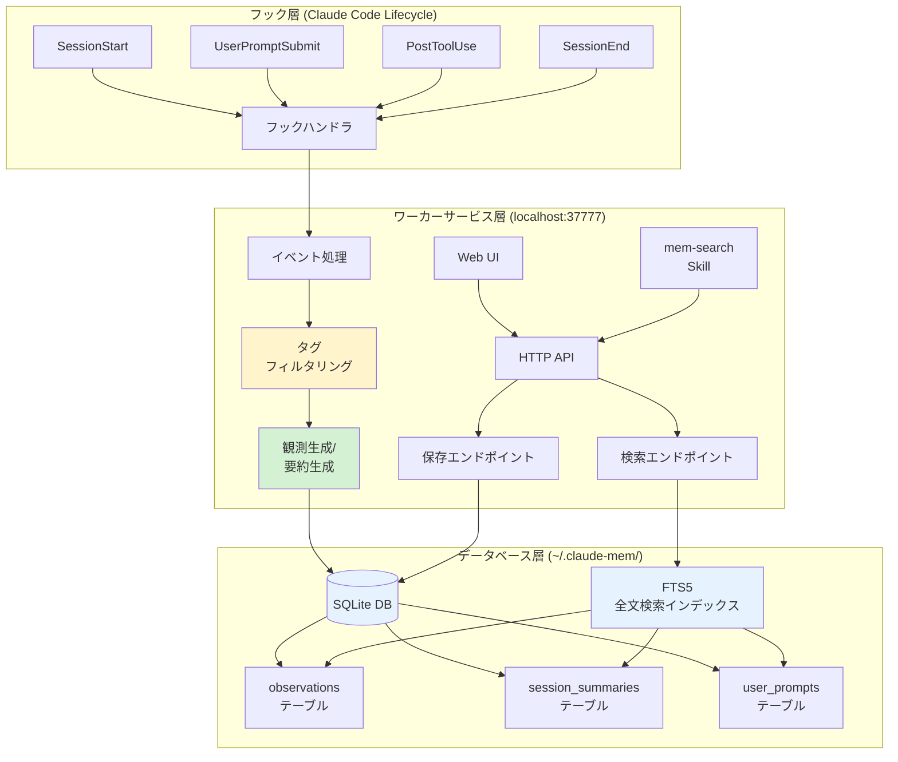

## 要約（Summary）

- Claude-Memは「フック（hooks）→ワーカーサービス→DB」の3層アーキテクチャで動作
- Claude Codeのライフサイクルフック（SessionStart/PostToolUse/SessionEnd等）でイベントを捕捉し、観測データを生成
- ローカルHTTPサーバ（ポート37777）が要約・検索APIとWeb UIを提供し、SQLite + FTS5で全文検索を実現

## 本文（Body）

### 背景・問題意識

コーディングエージェントの作業履歴を記録・検索可能にするには、以下を実現する必要がある：

1. **イベント捕捉**：ツール実行、ユーザ入力、セッション境界を漏らさず記録
2. **構造化と要約**：生データから意味のある情報を抽出
3. **高速検索**：自然言語クエリで過去データを即座に取り出す
4. **可視化**：開発者が記憶の蓄積状況を確認できる

Claude-Memは、これらを「フック→サービス→DB」という古典的だが実績のあるアーキテクチャで実現している。

### アイデア・主張

**コーディングエージェントの作業履歴を効果的に記録・検索するには、ライフサイクルフック層でイベントを捕捉し、永続化サービス層で要約・構造化し、全文検索データベース層で高速クエリを実現する3層構成が有効である。**

Claude-Memのアーキテクチャは以下の3層で構成される：

#### 1. フック層（Hooks Layer）

Claude Codeのライフサイクルフックでイベントを捕捉：

- **SessionStart**：セッション開始時（前回の要約を取得）
- **UserPromptSubmit**：ユーザ入力時（プロンプト記録）
- **PostToolUse**：ツール実行後（read/write等の観測生成）
- **Stop**：処理中断時
- **SessionEnd**：セッション終了時（要約生成・保存）

これらのフックで、**何が起きたか**（What）、**なぜそうしたか**（Why）、**結果はどうだったか**（Result）を捕捉する。

#### 2. ワーカーサービス層（Worker Service）

ローカル常駐サービス（ポート37777）が以下を提供：

**HTTP API**
- `POST /observations`：観測データ保存
- `GET /search`：自然言語検索
- `GET /sessions`：セッション一覧
- `POST /summarize`：要約生成

**Web UI**
- `http://localhost:37777`でリアルタイム閲覧
- 記憶の蓄積状況を可視化

**プライバシーフィルタ**
- `<private>`タグで囲まれた部分をDB保存前に除去（エッジ処理）

#### 3. データベース層（Database Layer）

`~/.claude-mem/claude-mem.db`（SQLite）に以下を保存：

**テーブル構成**
- `observations`：ツール実行の観測（type=decision/bugfix/feature等、narrative、関連ファイル）
- `session_summaries`：セッション要約
- `user_prompts`：生のユーザ入力

**全文検索（FTS5）**
- SQLiteのFull-Text Search拡張を利用
- 観測・要約・プロンプトすべてを横断検索
- 日本語対応（トークナイザ次第）

### 内容を視覚化するMermaid図



### 具体例・ケース

**ケース1: ツール実行の観測記録**
```
1. ユーザ: 「auth.jsを修正して」
2. Claude Code: read_file(auth.js) 実行
3. PostToolUse フック発火
4. 観測データ生成:
   {
     type: "code_read",
     file: "auth.js",
     narrative: "トークン検証ロジックの確認",
     timestamp: "2025-12-15T10:00:00Z"
   }
5. Worker Service が observations テーブルに保存
```

**ケース2: セッション終了時の要約生成**
```
1. SessionEnd フック発火
2. Worker Service が当該セッションの observations を集約
3. LLM による要約生成:
   "このセッションでは、auth.js のトークン検証バグを修正。
    有効期限チェックの順序を修正し、テストケースを追加した。"
4. session_summaries テーブルに保存
```

**ケース3: 自然言語検索**
```
1. ユーザ: 「認証関連のバグ修正は？」
2. mem-search Skill 起動 → Worker Service の /search エンドポイント
3. FTS5 で "認証 バグ修正" を検索
4. observations から該当レコードを取得
5. Claude に返却 → ユーザへ回答
```

### 反論・限界・条件

**ポート37777の衝突リスク**
- 他のローカルサービスとポート競合の可能性
- 複数のClaude Codeインスタンスを同時に使う場合に問題

**SQLiteのスケーラビリティ**
- 長期運用でDB肥大化
- FTS5の検索パフォーマンスがレコード数に依存
- 数万セッションを超えると再設計が必要かも

**フックの信頼性**
- Claude Codeの仕様変更でフックが動かなくなるリスク
- 非公式プラグインゆえのメンテナンス不安

**ワーカーサービスの可用性**
- サービスが落ちると記録が失われる
- 起動管理が必要（自動起動設定など）

**プライバシーフィルタの完全性**
- `<private>`タグを忘れると機密情報が記録される
- エッジ処理だが、完全性の保証は難しい

**依存環境**
- Node.js 18+ / Bun / SQLite が必要
- 環境構築の手間が増える

## 関連ノート（Links）

- [[20251215100646-claude-mem-overview|Claude-Memの概要と継続記憶機能]] - 全体像と目的
- [[20251215100648-claude-mem-privacy-security|Claude-Memのプライバシーとセキュリティ考慮事項]] - セキュリティ観点
- [[20251215000015-block-at-submit-hook-strategy|Block-at-Submitフック戦略]] - フックを使った制御の一般パターン
- [[20251206000003-spec-workflow-mcp-overview|spec-workflow-mcpの概要と特徴]] - MCPとの比較対象
- [[20251214235249-context-window-management-strategy|コンテキストウィンドウ管理戦略]] - 記憶管理の一般戦略

## To-Do / 次に考えること

- [ ] FTS5の日本語トークナイザ設定を確認（MeCab等が必要か）
- [ ] DB肥大化時のクリーンアップスクリプトを作成（古いセッションの削除）
- [ ] ポート番号を変更する方法を調査（設定ファイル？）
- [ ] ワーカーサービスの自動起動設定（systemd/launchd）
- [ ] フックの実装を確認（どのレベルで介入しているか）
