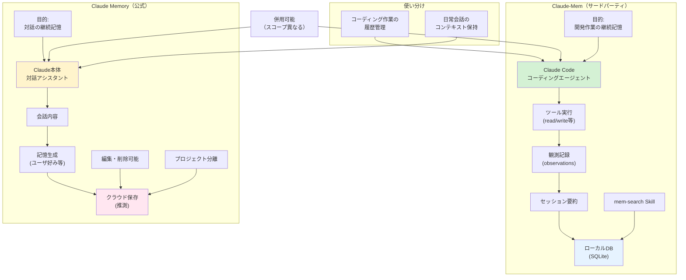

## 要約（Summary）

- Claude-Mem（サードパーティ）は「開発セッションのツール実行ログ→要約→検索」のDevログ管理ツール
- Claude Memory（公式）は「対話アシスタントとしての継続記憶」で、会話内容をプロジェクト単位で記憶
- 両者は目的・スコープ・データ形式が異なり、混同すると誤った期待や運用設計に繋がる

## 本文（Body）

### 背景・問題意識

「Claude-Mem」と「Claude Memory」は名前が似ているため混同されやすいが、**全く異なる目的と実装を持つ別物**である。

- **Claude-Mem**：Claude Code（コーディングエージェント）専用のサードパーティプラグイン
- **Claude Memory**：Claude本体（対話AI）の公式機能

この区別を理解せずに導入すると、以下のような誤解が生じる：

- 「Claude-Memを入れれば、通常の会話も覚えてくれるはず」（→ 誤り、Claude Code専用）
- 「Claude Memoryがあれば、コードの変更履歴も自動記録されるはず」（→ 誤り、対話内容のみ）
- 「両方入れると競合するのでは」（→ スコープが違うので併用可能）

### アイデア・主張

**Claude-Memは「開発作業の観測・検索（Devログ寄り）」、Claude公式Memoryは「対話の継続記憶（会話寄り）」という役割分離で捉えるべきである。両者は併用可能だが、それぞれ異なる問題を解決するため、導入判断は個別に行う必要がある。**

#### Claude-Mem（サードパーティプラグイン）の特徴

**目的**
- Claude Code（コーディングエージェント）の作業履歴を記録・検索
- 「前回どこまでやったか」「なぜこの実装にしたか」を思い出す

**記録対象**
- ツール実行（read/write等）
- ユーザプロンプト
- セッション要約

**保存場所**
- ローカル（`~/.claude-mem/claude-mem.db`）

**検索方法**
- `mem-search` Skill で自然言語クエリ

**利用シーン**
- コーディング作業の継続
- 過去の実装判断の振り返り
- バグ修正履歴の検索

**ライセンス**
- AGPL-3.0（サードパーティ）

#### Claude Memory（公式機能）の特徴

**目的**
- Claude本体の対話アシスタントとしての継続記憶
- ユーザの好み、プロジェクト文脈、過去の会話内容を記憶

**記録対象**
- 対話の内容（質問・回答）
- ユーザのプリファレンス（「私はPythonを好む」等）
- プロジェクト固有の文脈

**保存場所**
- Anthropicのクラウド（推測）

**編集可能**
- ユーザが記憶内容を編集・削除できる

**プロジェクト分離**
- プロジェクト単位で記憶を分離可能

**利用シーン**
- 日常的な対話での継続性
- 長期プロジェクトでのコンテキスト保持
- 個人的な好みの反映

**提供形態**
- 公式機能（プラン依存）

### 内容を視覚化するMermaid図



### 具体例・ケース

**ケース1: コーディング履歴の検索（Claude-Mem）**
```
開発者: 「前回の認証バグ修正はどこだった？」
Claude-Mem: mem-search実行 → 
「セッション#123でauth.js:45のトークン検証を修正」
```

**ケース2: 対話の継続記憶（Claude Memory）**
```
Day 1:
ユーザ: 「私はPythonでWebアプリを書いています」
Claude: 「承知しました」（記憶に保存）

Day 2:
ユーザ: 「DBアクセスのコード例を教えて」
Claude: 「Pythonでの例ですね（記憶から想起）。SQLAlchemyを使った例を...」
```

**ケース3: 併用シナリオ**
```
# Claude Code でコーディング → Claude-Mem が記録
開発者: 「ユーザー登録APIを実装して」
Claude Code: （実装） → Claude-Mem に観測記録

# 通常の会話で設計議論 → Claude Memory が記憶
開発者: 「このプロジェクトではREST APIではなくGraphQLを使う方針です」
Claude: 「承知しました」（Claude Memory に保存）

翌日:
# コーディング再開
開発者: 「前回どこまでやった？」
Claude Code + Claude-Mem: 「ユーザー登録APIを実装しました」

# 設計相談
開発者: 「次はクエリ最適化だね」
Claude: 「GraphQLベースで進めますね（Claude Memoryから想起）」
```

**ケース4: 混同による誤解**
```
誤解: 「Claude-Memを入れれば、通常の会話も記憶してくれる」
現実: Claude-MemはClaude Code専用。通常の会話は記録されない

誤解: 「Claude Memoryがあれば、コード変更も自動追跡される」
現実: Claude Memoryは対話内容のみ。ツール実行は追跡しない
```

### 反論・限界・条件

**併用時の混乱リスク**
- 両方使うと、「どちらに何が記録されているか」が分かりにくい
- 明確な使い分けルールが必要

**データの一貫性**
- Claude-Mem（ローカル）とClaude Memory（クラウド）でデータが分離
- 統合的な検索はできない

**公式Memoryの詳細は不明**
- Claude Memoryの正確な仕様は公開されていない部分もある
- この比較はドキュメントと推測に基づく

**Claude-Memの将来性**
- サードパーティなので、公式機能追加で不要になる可能性
- 「公式がClaude Code用のMemoryを出したら」Claude-Memは役割終了かも

**Claude Memoryの制約**
- プラン依存（無料プランでは使えない可能性）
- 編集可能だが、完全削除の保証は不明

## 関連ノート（Links）

- [[20251215100646-claude-mem-overview|Claude-Memの概要と継続記憶機能]] - Claude-Memの詳細
- [[20251215100647-claude-mem-architecture|Claude-Memのアーキテクチャとデータフロー]] - 技術的仕組み
- [[20251215100648-claude-mem-privacy-security|Claude-Memのプライバシーとセキュリティ考慮事項]] - セキュリティ観点
- [[20251129165837-long-running-agent-context-window-problem|長時間実行AIエージェントのコンテキストウィンドウ問題]] - 記憶の必要性
- [[20251214235249-context-window-management-strategy|コンテキストウィンドウ管理戦略]] - 記憶管理の一般戦略

## To-Do / 次に考えること

- [ ] Claude Memoryの正式仕様を確認（ドキュメント更新をチェック）
- [ ] 併用時のベストプラクティスを策定（どちらに何を記録すべきか）
- [ ] 公式がClaude Code用Memory機能を出すかウォッチ
- [ ] Claude-MemとMCPの比較（別の記憶管理手法）
- [ ] 社内ガイドライン作成（「開発履歴はClaude-Mem、設計議論はClaude Memory」等）
