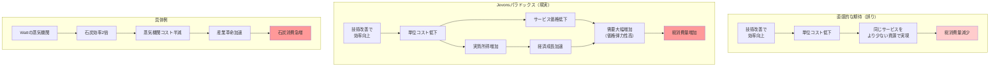

## 要約（Summary）

- 技術進歩により資源の利用効率が向上すると、使用コストが低下し、需要が増加する
- 需要増加が効率化による節約を上回ると、総消費量が増える逆説的な現象が発生
- 1865年にWilliam Stanley Jevonsが石炭消費で観察し、現代ではエネルギー・水資源・AIなど幅広い分野に適用される

## 本文（Body）

### 背景・問題意識

直感的には「効率が上がれば資源消費は減る」と考えられてきた。政府や環境団体も、効率改善を持続可能性への道筋と位置づけてきた。しかし、19世紀の経済学者William Stanley Jevonsは、効率改善が逆に資源消費を増やす可能性を指摘した。

**歴史的背景：**
1865年、イギリスでは石炭資源の枯渇が懸念されていた。専門家の多くは「技術改善で石炭消費が減る」と楽観視していたが、Jevonsは逆のことが起きると主張した。

### アイデア・主張

**技術進歩により資源利用の効率が向上すると、その資源の実質的な使用コストが低下する。需要の価格弾力性が高い場合、コスト低下により需要が大幅に増加し、効率化による節約効果を上回って総消費量が増加する。これがJevonsパラドックスである。**

**Jevonsの観察：**
- James Wattが蒸気機関の効率を劇的に改善
- 石炭1単位あたりの出力が増加 → 石炨の実質コストが低下
- 蒸気機関が幅広い産業で採用される → 総石炭消費量が急増

Jevonsの言葉：
> "It is a confusion of ideas to suppose that the economical use of fuel is equivalent to diminished consumption. The very contrary is the truth."
> （燃料の経済的使用が消費減少と同じだと考えるのは思考の混乱である。真実は全く逆だ。）

**現代への拡張：**
- エネルギー：燃費の良い車 → 運転距離の増加
- 水資源：灌漑効率の向上 → 農地拡大・水使用量増加（スペインの事例）
- AI：AIによる作業効率化 → タスク量の増加（放射線科医、翻訳者、プログラマー）

### 内容を視覚化するMermaid図

### 具体例・ケース

**1. James Wattの蒸気機関（1765年〜）**
- Newcomenの蒸気機関と比較して石炭効率が大幅に向上
- 単位動力あたりの石炭消費量が減少
- しかし、蒸気機関の適用範囲が製造業、鉱業、輸送などに拡大
- 結果：イギリスの石炭消費量は急増し、産業革命を加速

**2. 自動車の燃費改善（現代）**
- 1966-2001年の米国データ：燃費20%向上
- 予想：燃料消費20%減少
- 現実：運転距離が増加し、燃料消費は想定より多い（リバウンド効果）
- ただし、成熟市場では「直接的リバウンド効果」は比較的小さい

**3. 農業の灌漑効率（スペイン）**
- 点滴灌漑など高効率技術の導入
- 作物1単位あたりの水使用量は減少
- しかし農地が拡大し、総水使用量は増加
- 結果：水不足リスクがむしろ悪化（reservoir effect）

**4. 農業生産性の向上（パラドックスが起きなかった例）**
- 第三次農業革命で生産性が劇的に向上
- 食品価格は低下したが、食品需要は弾力性が低い（inelastic）
- 結果：食品消費量はほぼ一定、農業従事者は40%（1900年）→2%（2024年）に減少
- Jevonsパラドックスは発生せず

**5. AI技術（2020年代〜）**
- Microsoft CEO Satya NadellaがJevonsパラドックスをAIに言及
- 放射線科医：AI診断支援で1件あたりの時間短縮 → より多くの患者を診察可能
- 翻訳者：機械翻訳で効率化 → グローバル化で翻訳需要増
- プログラマー：コード生成AIで生産性向上 → より多くの機能開発が可能に

### 反論・限界・条件

**パラドックスが発生する3条件（必要条件）：**
1. 効率または生産性を高める技術変化
2. 効率向上が消費者価格の低下をもたらす
3. 価格低下が需要を大幅に増加させる（需要曲線が高弾力的）

**限界と反例：**

**需要の価格弾力性が低い場合：**
- 食品：生産性向上 → 価格低下 → 消費量はほぼ一定（胃袋の限界）
- 基礎的なサービス：需要の増加余地が小さい分野ではパラドックスは起きにくい

**成熟市場での制約：**
- 先進国の石油市場：直接的リバウンド効果は比較的小さい
- インフラ制約：道路容量、時間制約などが需要増加を抑制

**マクロとミクロの違い：**
- ミクロ（個別市場）レベル：リバウンド効果は通常100%未満
- マクロ（経済全体）レベル：経済成長効果が加わり、パラドックスが起きやすい

**政策との組み合わせ：**
- 効率化だけでは消費削減にならない可能性
- しかし炭素税やcap and tradeと組み合わせれば、消費削減は可能
- 効率化は「生活水準向上」や「価格変動への耐性」など別の便益をもたらす

**時間軸の問題：**
- 短期：リバウンド効果は小さいことが多い
- 長期：経済構造の変化により、パラドックスが顕在化する可能性

## 関連ノート（Links）

- [[20251215101828-rebound-effect-mechanism|リバウンド効果と価格弾力性の関係]] リバウンド効果と価格弾力性の関係
- [[20251215101906-khazzoom-brookes-postulate|Khazzoom-Brookes仮説：エネルギー効率化とマクロ経済成長]] Khazzoom-Brookes仮説：エネルギー効率化とマクロ経済成長
- [[20251215101945-efficiency-policy-combination|効率化政策とリバウンド抑制策の組み合わせ戦略]] 効率化政策とリバウンド抑制策の組み合わせ戦略
- [[20251215102730-software-cost-reduction-ai-agents|エージェント型AIによるソフトウェア開発コストの劇的削減]] エージェント型AIによるソフトウェア開発コストの劇的削減
- [[20251215102907-software-latent-demand-jevons|ソフトウェアの潜在需要解放とJevonsパラドックス]] ソフトウェアの潜在需要解放とJevonsパラドックス
- [[20251215104430-si-project-price-inelasticity|SI個別開発案件の価格非弾力性]] SI個別開発案件の価格非弾力性（対比：弾力性の低い市場の事例）
- [[20251129160320-ai-task-granularity|AIへのタスク粒度と効率の関係]] AIへのタスク粒度と効率の関係（AI時代の具体例）
- [[20251129225833-coding-agent-strengths-weaknesses|coding-agent-strengths-weaknesses]] コーディングエージェントの得意・苦手パターン
- [[20251129160322-junior-engineer-growth-with-ai|ジュニアエンジニアの成長戦略としてのAI活用]] ジュニアエンジニアの成長戦略としてのAI活用

## To-Do / 次に考えること

- [ ] リバウンド効果の経済メカニズム（価格弾力性との関係）を詳細に分析
- [ ] Khazzoom-Brookes仮説（マクロ経済への影響）のzettelを作成
- [ ] 効率化と政策の組み合わせ（炭素税、cap and trade）のzettelを作成
- [ ] 自分の仕事（ソフトウェア開発）でのJevonsパラドックスの事例を観察
- [ ] AIによる生産性向上が、実際にタスク量増加につながっているか検証
