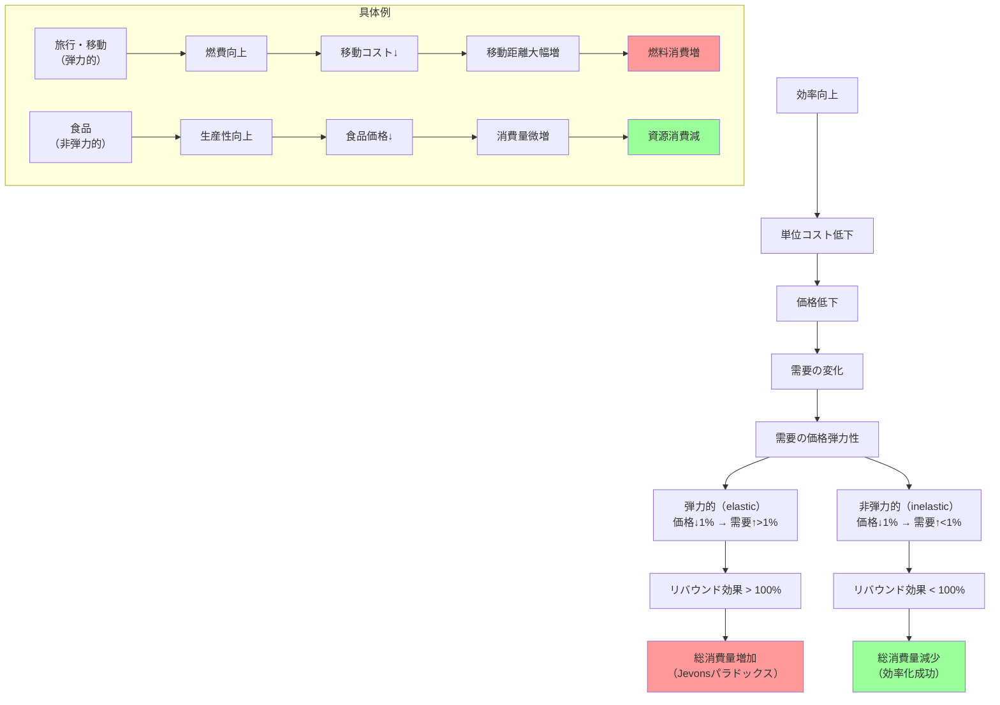

## 要約（Summary）

- リバウンド効果：効率化によるコスト低下が需要増加を引き起こし、効率化の節約効果を相殺する現象
- 需要の価格弾力性が高い（elastic）場合、リバウンド効果は100%を超え、総消費量が増加（Jevonsパラドックス）
- 需要の価格弾力性が低い（inelastic）場合、リバウンド効果は100%未満で、総消費量は減少

## 本文（Body）

### 背景・問題意識

効率化技術が導入されると、「同じサービスをより少ない資源で実現できる」ため、資源消費は減ると期待される。しかし現実には、消費者行動が変化し、効率化の効果が部分的または完全に相殺される。この「リバウンド効果（rebound effect）」のメカニズムを理解することが、効率化政策の効果を予測する上で重要である。

### アイデア・主張

**リバウンド効果は、効率化によるコスト低下が需要増加を引き起こす経済メカニズムである。その大きさは需要の価格弾力性に依存する。**

**経済メカニズム：**
1. 効率向上 → 単位サービスあたりのコスト低下
2. コスト低下 → サービス価格の低下（完全競争市場の場合）
3. 価格低下 → 需要法則により、需要量が増加
4. 需要増加の大きさが、効率向上による節約を上回るか否かで、総消費が増減

**価格弾力性との関係：**
- **需要が弾力的（elastic）**：価格が1%下がると需要が1%以上増える
  - リバウンド効果 > 100% → Jevonsパラドックス発生
  - 例：レジャー旅行、エンターテイメント、一部の産業用エネルギー
  
- **需要が非弾力的（inelastic）**：価格が1%下がっても需要は1%未満の増加
  - リバウンド効果 < 100% → 総消費量は減少
  - 例：食品、基礎的な医療、必需品

**数値例（記事より）：**
- 燃費が20%向上（効率が1.25倍）
- 実質的な移動コストが20%低下
- **弾力的需要の場合**：移動距離が40%増加 → 燃料消費増加（パラドックス）
- **非弾力的需要の場合**：移動距離が10%増加 → 燃料消費減少

### 内容を視覚化するMermaid図

### 具体例・ケース

**1. 自動車の燃費とリバウンド効果（米国1966-2001年）**
- Small & Van Dender (2005)の研究
- 燃費が向上すると、運転距離が増加
- 直接的リバウンド効果：成熟市場では比較的小さい（10-30%程度の推定が多い）
- マクロ効果を含めると、リバウンドはより大きい可能性

**2. 家庭用電化製品の効率基準（カリフォルニア）**
- カリフォルニア州エネルギー委員会が家電の効率基準を設定
- 経済学者Khazzoomが「リバウンドの可能性が無視されている」と指摘
- 効率向上 → 電気料金低下 → 使用時間増加の可能性

**3. 食品の需要弾力性（反例）**
- 農業生産性が劇的に向上（第三次農業革命）
- 食品価格は大幅に低下
- しかし消費量はほぼ一定（胃袋の物理的制約）
- 結果：農業従事者の割合が激減（40% → 2%）
- Jevonsパラドックスは発生せず

**4. 産業用エネルギー（19世紀イギリス）**
- 蒸気機関の効率向上
- 工場での使用コストが低下
- 新たな産業への応用が拡大（繊維、製鉄、鉱業、鉄道）
- 需要の弾力性が非常に高く、総エネルギー消費が急増

### 反論・限界・条件

**リバウンド効果の大きさに影響する要因：**

**1. 市場の成熟度**
- 成熟市場：直接的リバウンドは小さい傾向（インフラ制約、時間制約）
- 新興市場：リバウンドが大きい可能性（潜在需要が大きい）

**2. 代替財と補完財の存在**
- 単純な「燃料→移動」の関係だけでなく、複数の投入要素（労働、資本、材料）が絡む
- 他の投入要素の制約により、リバウンドは抑制される
- 記事："goods and services generally use more than one type of input"

**3. 所得効果（間接的リバウンド）**
- 効率化でコスト削減 → 実質所得の増加
- 他の財・サービスへの支出増加
- マクロ経済全体でのエネルギー需要増加

**4. 経済成長効果（マクロ的リバウンド）**
- ミクロレベル：リバウンド < 100%（通常）
- マクロレベル：経済成長により、全体のエネルギー需要が増加
- Khazzoom-Brookes仮説：マクロではリバウンド > 100%の可能性

**5. 時間軸**
- 短期：行動変化が限定的（リバウンド小）
- 長期：インフラ・産業構造の変化により、リバウンドが拡大

**測定の難しさ：**
- 「効率化がなかった場合」との比較が必要（反事実的推論）
- 他の要因（経済成長、技術変化、政策）の影響を分離する必要
- 実証研究により推定値は幅がある（10%〜80%以上）

## 関連ノート（Links）

- [[20251215101734-jevons-paradox-concept|Jevonsパラドックス：効率化が消費を増やす逆説]] Jevonsパラドックス：効率化が消費を増やす逆説
- [[20251215101906-khazzoom-brookes-postulate|Khazzoom-Brookes仮説：エネルギー効率化とマクロ経済成長]] Khazzoom-Brookes仮説：エネルギー効率化とマクロ経済成長
- [[20251215101945-efficiency-policy-combination|効率化政策とリバウンド抑制策の組み合わせ戦略]] 効率化政策とリバウンド抑制策の組み合わせ戦略
- [[20251215104430-si-project-price-inelasticity|SI個別開発案件の価格非弾力性]] SI個別開発案件の価格非弾力性（対比：価格弾力性の低い市場）

## To-Do / 次に考えること

- [ ] Khazzoom-Brookes仮説（マクロ経済レベルでのリバウンド）のzettelを作成
- [ ] 実証研究でのリバウンド効果の推定値をサーベイ
- [ ] 自分の消費行動でリバウンド効果を観察（例：効率的なツール導入後のタスク量）
- [ ] ソフトウェア開発での生産性向上とタスク増加の関係を分析
- [ ] リバウンド効果を抑制する政策（炭素税、規制）との組み合わせを検討
