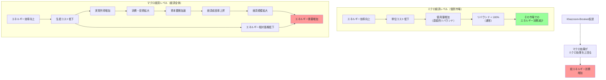

## 要約（Summary）

- Khazzoom-Brookes仮説：エネルギー効率の向上は、経済全体のエネルギー消費を減らすのではなく、増やす
- 効率向上により実質所得が増加し、経済成長が加速することで、マクロレベルでの需要が増大
- 新古典派成長理論により理論的に支持され、持続可能性政策への重要な示唆を提供

## 本文（Body）

### 背景・問題意識

1980年代、エネルギー政策の議論において「効率化すればエネルギー消費が減る」という前提が支配的だった。カリフォルニア州などで家電の効率基準が設定され、イギリス原子力公社も効率化を推進していた。

しかし、経済学者Daniel Khazzoom（1980年代）とLeonard Brookes（イギリス原子力公社主任エコノミスト）は、個別の効率改善が社会全体のエネルギー消費を増やす可能性を指摘した。

1992年、経済学者Harry Saundersがこれを「Khazzoom-Brookes仮説」と命名し、新古典派成長理論との整合性を示した。

### アイデア・主張

**エネルギー効率の向上は、ミクロレベルでは消費を削減するが、マクロ経済レベルでは経済成長を促進し、結果として社会全体のエネルギー消費を増加させる。**

**2つのメカニズム（Saundersの分析）：**

**1. 直接的リバウンド効果（ミクロ）**
- エネルギー効率向上 → 使用コスト低下
- エネルギー利用が相対的に安価に → 使用量増加
- ただし、ミクロレベルではリバウンド < 100% のことが多い

**2. マクロ経済効果（経済成長経路）**
- エネルギー効率向上 → 生産コスト低下
- 実質所得の増加 → 消費・投資の拡大
- 資本蓄積と技術進歩の加速 → 経済成長率の上昇
- 経済全体の規模拡大 → エネルギー需要の増加

**新古典派成長理論との整合性：**
Saundersは、標準的な新古典派成長モデル（Solow-Swanモデルなど）において、幅広い仮定の下でKhazzoom-Brookes仮説が成立することを示した。

**重要な区別：**
- ミクロ経済（個別市場）：効率化 → 消費減少（通常）
- マクロ経済（経済全体）：効率化 → 経済成長 → 消費増加（Khazzoom-Brookes仮説）

### 内容を視覚化するMermaid図

### 具体例・ケース

**1. 産業革命期のイギリス（Jevonsの観察）**
- Wattの蒸気機関：石炭効率が劇的に向上
- ミクロ：各工場での石炭消費は効率化
- マクロ：工業化が加速、経済成長率が上昇
- 結果：国全体の石炭消費が急増

**2. 20世紀の米国経済**
- エネルギー効率が継続的に向上（1900年→2000年）
- しかし、GDP成長に伴いエネルギー消費も増加
- 1970年代の石油危機後：効率向上が加速したが、経済成長とともにエネルギー需要も回復

**3. 情報技術革命（1990年代〜）**
- コンピュータの電力効率が向上
- しかし、コンピュータの普及が爆発的に拡大
- データセンター、クラウドコンピューティングの成長
- 結果：IT産業全体の電力消費は増加

**4. LEDライト（2000年代〜）**
- 白熱電球比で電力効率が10倍以上向上
- ミクロ：家庭の照明コストは低下
- マクロ：装飾照明、広告照明、街路照明の拡大
- 総照明電力消費への影響は複雑（地域により異なる）

### 反論・限界・条件

**仮説への批判と論争：**

**1. 実証的エビデンスの限界**
- 環境経済学者Kenneth Gillinghamら（2013）："rebound effect is overplayed"
- 成熟経済では、リバウンド効果は政策を無効化するほど大きくない
- マクロレベルでのKhazzoom-Brookes効果の実証は困難（他の要因の分離）

**2. 政策含意についての議論**
- 一部：「効率化は無駄だから、やめるべき」（誤った解釈）
- Jevons自身も認識：効率化は生活水準向上・経済成長をもたらす価値がある
- 正しい解釈：「効率化だけでは資源消費削減にならない。他の政策との組み合わせが必要」

**3. 効率化の便益（Ryan & Campbell, 2012）**
- エネルギー安全保障の向上
- 価格変動への耐性強化
- 環境負荷の軽減（消費が増えても、効率化なしの場合より少ない可能性）
- 実質所得の向上・生活水準の改善

**4. 資源制約の考慮**
- 新古典派モデル：資源制約を明示的に扱わないことが多い
- 生態経済学の批判：資源の有限性を考慮すべき
- 長期的には、物理的制約により成長が頭打ちになる可能性

**5. 時間軸と移行期**
- 短期：マクロ効果は顕在化しにくい
- 長期：経済構造の変化により、Khazzoom-Brookes効果が強まる可能性
- 化石燃料から再生可能エネルギーへの移行期には、異なるダイナミクスが働く可能性

**政策的対応：**
- 効率化と消費抑制策（炭素税、cap and trade）の組み合わせ
- Wackernagel & Rees (1997)：「効率化による節約分を課税し、自然資本の回復に再投資すべき」

## 関連ノート（Links）

- [[20251215101734-jevons-paradox-concept|Jevonsパラドックス：効率化が消費を増やす逆説]] Jevonsパラドックス：効率化が消費を増やす逆説
- [[20251215101828-rebound-effect-mechanism|リバウンド効果と価格弾力性の関係]] リバウンド効果と価格弾力性の関係
- [[20251215101945-efficiency-policy-combination|効率化政策とリバウンド抑制策の組み合わせ戦略]] 効率化政策とリバウンド抑制策の組み合わせ戦略

## To-Do / 次に考えること

- [ ] 効率化と政策の組み合わせ（炭素税、cap and trade、排出基準）のzettelを作成
- [ ] 新古典派成長理論の基礎（Solowモデル）を学び直す
- [ ] 生態経済学の視点からKhazzoom-Brookes仮説への批判を整理
- [ ] デジタル経済・AI時代における「効率化と消費増加」のパターンを観察
- [ ] 自分の仕事での生産性向上が、仕事量増加につながっているか振り返る
