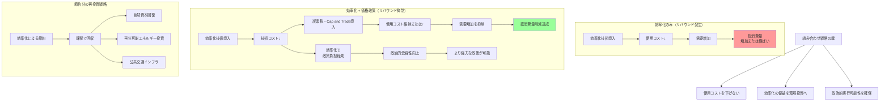

## 要約（Summary）

- 効率化だけではリバウンド効果により資源消費削減にならない可能性がある
- 炭素税、cap and trade、排出基準などの「使用コスト維持・増加」政策と組み合わせることで、リバウンドを抑制できる
- 効率化により生まれたコスト節約分を「課税で回収し、自然資本回復に再投資」する戦略が提案されている

## 本文（Body）

### 背景・問題意識

JevonsパラドックスやKhazzoom-Brookes仮説は、「効率化だけでは持続可能性を達成できない」ことを示唆する。一部の論者は「効率化は無意味だから、やめるべき」と主張するが、これは誤った極論である。

環境経済学者たちは、より建設的なアプローチを提案している：効率化の便益を活かしつつ、リバウンド効果を抑制する政策との組み合わせである。

### アイデア・主張

**効率化政策は、使用コストを一定または増加させる政策（炭素税、cap and trade、排出基準など）と組み合わせることで、リバウンド効果を抑制し、資源消費削減と経済成長を両立できる。**

**基本原理：**
- 効率化単独：コスト低下 → 需要増加 → リバウンド
- 効率化 + 課税：コスト維持 → 需要増加を抑制 → 消費削減達成
- さらに、効率化により政策の経済的負担が軽減され、政治的受容性が向上

**Wackernagel & Reesの提案（1997）：**
> 効率化による節約分を「課税や他の手段で経済循環から取り除く。できれば自然資本の回復への再投資に回すべき」

**主要な政策ツール：**

**1. 炭素税（Carbon Tax / Green Tax）**
- 化石燃料の使用に課税
- 効率化でコストが下がっても、税により使用コストを維持
- 税収を再生可能エネルギーや自然資本回復に投資

**2. Cap and Trade（排出量取引制度）**
- 総排出量に上限（cap）を設定
- 排出権を取引可能にする
- 効率化は企業にとって排出権購入コスト削減につながるが、総量は規制

**3. 排出基準（Emissions Standards）**
- 車両・工場などに排出量上限を義務付け
- 効率化技術の導入を促進しつつ、総排出量を制約

**相乗効果：**
- 効率化 → 政策の経済的コストを削減 → 政策の政治的受容性向上
- 政策 → リバウンド抑制 → 効率化の環境便益を確保

### 内容を視覚化するMermaid図

### 具体例・ケース

**1. 欧州連合排出量取引制度（EU ETS）**
- 2005年開始、世界最大のcap and trade制度
- 発電所・工場に排出上限を設定
- 企業は効率化により排出権購入コストを削減できる
- しかし総排出量は上限により規制
- 結果：効率化インセンティブを保ちつつ、総排出量を削減

**2. カリフォルニア州の気候政策**
- 家電効率基準 + 炭素価格政策の組み合わせ
- 効率基準により技術コストを押し下げ
- 炭素価格によりリバウンドを抑制
- 2006年のGlobal Warming Solutions Act (AB32)

**3. 北欧諸国の炭素税**
- スウェーデン：1991年に炭素税導入（世界で最も高い炭素税率の一つ）
- 同時にエネルギー効率改善を推進
- 結果：経済成長を維持しつつ、CO2排出量を削減
- 税収を所得税減税や再生可能エネルギー投資に活用

**4. 日本のトップランナー制度**
- 家電・自動車などの効率基準を設定
- 批判：価格低下によりリバウンドが発生する可能性
- 提案：炭素税や排出量取引との組み合わせが望ましい

**5. 燃料税と燃費基準（多くの国）**
- 自動車の燃費基準：効率改善を義務化
- 燃料税：使用コストを維持
- 組み合わせにより、効率改善とリバウンド抑制を両立

### 反論・限界・条件

**政策実施の課題：**

**1. 政治的障壁**
- 炭素税やcap and tradeは政治的に不人気（消費者・産業界の反発）
- 短期的なコスト負担が可視化されやすい
- 長期的便益（気候変動回避）は不可視で遠い

**2. 国際競争力への懸念**
- 一国だけの炭素価格導入：産業の国外移転（carbon leakage）
- 解決策：国境炭素調整（border carbon adjustment）、国際協調

**3. 所得分配への影響**
- 炭素税は逆進的（低所得層への負担が相対的に大きい）
- 対策：税収の一部を低所得層への還付に使用

**4. 最適な政策ミックスの設計**
- 効率基準・炭素税・cap and tradeの最適な組み合わせは、国・地域により異なる
- 既存の政策・インフラとの整合性
- 動的な調整が必要（技術変化、経済状況に応じて）

**5. リバウンド効果の測定の不確実性**
- リバウンドの大きさは実証的に不確実
- 過剰に政策を強化すると、経済への悪影響
- 適応的な政策設計が必要

**効率化を無意味とする議論への反論：**

**効率化の価値（Ryan & Campbell, 2012）：**
- エネルギー安全保障の向上
- 価格ショックへの耐性
- 技術革新の促進
- 生活水準の向上

**Freire-González & Puig-Ventosa (2015)：**
- 「効率化は無駄」ではなく「効率化だけでは不十分」
- 組み合わせ戦略により、効率化の便益を活かせる

**Siami & Winter (2021)：**
- 気候変動対策において、効率化は政策コストを下げることで、より野心的な目標を達成可能にする

## 関連ノート（Links）

- [[20251215101734-jevons-paradox-concept|Jevonsパラドックス：効率化が消費を増やす逆説]] Jevonsパラドックス：効率化が消費を増やす逆説
- [[20251215101828-rebound-effect-mechanism|リバウンド効果と価格弾力性の関係]] リバウンド効果と価格弾力性の関係
- [[20251215101906-khazzoom-brookes-postulate|Khazzoom-Brookes仮説：エネルギー効率化とマクロ経済成長]] Khazzoom-Brookes仮説：エネルギー効率化とマクロ経済成長
- 関連zettel候補：炭素税の設計、cap and tradeの仕組み、エネルギー政策、気候変動対策

## To-Do / 次に考えること

- [ ] 炭素税とcap and tradeの詳細な比較zettelを作成
- [ ] 各国の気候政策（EU ETS、カリフォルニア、北欧）の事例研究
- [ ] 国境炭素調整メカニズムの詳細を調査
- [ ] 日本のエネルギー政策における組み合わせ戦略の可能性を検討
- [ ] 自分の生活・仕事での効率化と「使用抑制」のバランスを考える
- [ ] ソフトウェア開発における「生産性向上 + タスク制限」の戦略を設計
