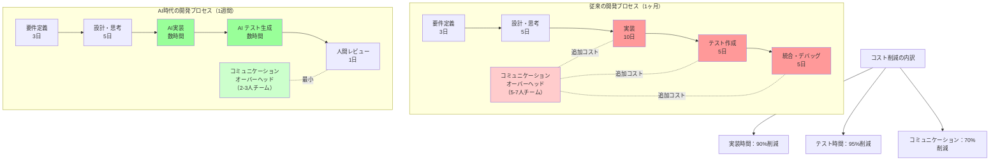

## 要約（Summary）

- エージェント型コーディングツール（Claude Code等）により、ソフトウェア開発の労働コストが劇的に削減されている
- 1ヶ月かかっていたプロジェクトが1週間で完了：思考時間は同じだが、実装時間が崩壊
- チーム規模縮小により、ブルックスの法則の逆転：コミュニケーションオーバーヘッドが消滅

## 本文（Body）

### 背景・問題意識

過去20年間、ソフトウェア開発のコスト構造は段階的に変化してきた：
- 2000年代初頭：オープンソースの普及（MySQL等）がライセンスコストを削減
- 2010年代：クラウドの登場（初期投資の削減、ただし総コストは議論の余地あり）
- 近年：複雑性の時代（TDD、マイクロサービス、React、Kubernetes）→ コストは上昇傾向

しかし2025年現在、エージェント型AIコーディングツールの登場により、労働コストが根本的に変化している。

### アイデア・主張

**エージェント型コーディングツールは、ソフトウェア開発の「実装時間」を90%削減する。思考・設計に要する時間は変わらないが、コーディング・テスト作成・CRUD実装といった実装フェーズが数時間に圧縮される。さらに、少人数チームによりコミュニケーションオーバーヘッドが消滅し、全体的な開発期間が劇的に短縮される。**

**具体的な削減ポイント：**

**1. コーディング労働時間の削減**
- 300以上のユニット/統合テストを数時間で生成（従来：数日）
- CRUD画面、ダッシュボード、グラフの自動生成
- データアクセスパターン、コアサービスの実装自動化

**2. チームサイズの縮小による間接効果**
従来の開発プロセスのオーバーヘッド：
- スタンドアップミーティング
- チケット管理
- コードレビュー
- フロントエンド・バックエンド間のハンドオフ
- ブロッカーの待ち時間

→ 少人数チーム（2-3人）で実現可能になり、これらのオーバーヘッドが消滅

**3. ブルックスの法則の逆転**
- ブルックスの法則：「遅れているプロジェクトに人を追加すると、さらに遅くなる」
- 理由：コミュニケーションコストは人数の二乗に比例
- AI時代：少人数で高い生産性 → コミュニケーションコストの大幅削減

### 内容を視覚化するMermaid図

### 具体例・ケース

**1. 社内ツールの開発（Widget管理アプリ）**
- **従来のプロセス（1ヶ月）**：
  - CI/CD設定
  - データアクセスパターン構築
  - コアサービス実装
  - CRUD画面の大量作成
  - ダッシュボード・グラフ実装
  - ユニット/統合/E2Eテスト作成
  - チーム：5-7人
  
- **AI時代（1週間）**：
  - 同じ要件をClaude Codeに指示
  - 数時間で実装完了
  - 300+テストを自動生成
  - チーム：2-3人（ビジネス専門家1人+開発者1-2人）

**2. テストスイートの自動生成**
- 著者の実体験：複雑な社内ツールの300以上のユニット/統合テストを数時間で生成
- 従来：熟練開発者でも数日を要する
- 削減率：95%以上

**3. 既存コードベースの理解**
- 従来：3年以上前のコードベース、開発者全員退職 → 理解に膨大な時間
- AI時代：
  - AIがコードを説明
  - バグを発見
  - 修正を提案
  - 「質の悪い請負業者が3年前に書いた、テストなしスパゲッティコード」より、「AIと優秀なエンジニアが書いたコード」の方が保守しやすい

### 反論・限界・条件

**「AIはグリーンフィールドプロジェクトでのみ有効」という反論**
- 著者の反論：既存コードベースの理解・修正にも極めて有効
- レガシーコードの理解：AIが説明を生成
- バグ発見：AIがコードを解析し、問題箇所を特定
- 実際には、AIと優秀なエンジニアのペアで書かれたコードの方が、質の低い人間だけで書かれたコードより保守しやすい

**「LLMは間違いが多い」という反論**
- 2025年現在、急速に改善中
- Claude Opus 4.5：10-20分の長いセッションでも軌道を外れない
- 人間がループに入ることで、高品質なソフトウェアを非常に高速に構築可能

**「特定のフレームワークを理解できない」という反論**
- 2025年現在、ほぼすべての主要フレームワークに対応
- むしろ、フレームワークの最新ベストプラクティスを提案できる

**「時間を節約できない」という反論**
- 著者の経験：明らかに誤り
- ただし、条件：人間がループに入り、方向性を監督する必要がある
- Pure YOLO vibe coding（完全放置）：すぐに混乱したコードになる

**必要な人間の役割：**
- AIの作業をチェック
- アプローチを提案
- 悪い方向性をショートカット
- アーキテクチャの決定
- フレームワーク・ライブラリの選択

**大企業での採用の遅れ**
- ベンダー承認プロセス
- 官僚的な管理構造
- セキュリティ・コンプライアンスの懸念
- → 小規模な競合に対して脆弱

**マインドセットの転換が必要**
- ソフトウェアが「ほぼ使い捨て」になる
- 方向性が悪ければ、捨てて再スタート
- 困難な作業は「概念的思考」であり、「タイピング」ではない

### 技術的詳細

**改善を続けるモデル**
- 数千億ドルのCapEx（GB200 GPU等）の成果が出始めている
- ベンチマークでは捉えきれない改善
- 新しいモデルがすぐに既存モデルを陳腐化させる

**2007年のiPhone批判との類似**
- 当時のデスクトップエンジニア：「iPhoneは使えない」
- 現実：ネットワークが改善、端末が高速化、OSが高度化
- 現在のAI批判：同じ道をたどる可能性が高い

## 関連ノート(Links)

- [[20251215101734-jevons-paradox-concept|Jevonsパラドックス:効率化が消費を増やす逆説]] Jevonsパラドックス:効率化が消費を増やす逆説
- [[20251215102820-domain-knowledge-as-moat|AI時代のドメイン知識:唯一の護城河]] AI時代のドメイン知識:唯一の護城河
- [[20251215102907-software-latent-demand-jevons|ソフトウェアの潜在需要解放とJevonsパラドックス]] ソフトウェアの潜在需要解放とJevonsパラドックス
- [[20251129160320-ai-task-granularity|AIへのタスク粒度と効率の関係]] AIへのタスク粒度と効率の関係
- [[20251129225833-coding-agent-strengths-weaknesses|コーディングエージェントの得意・苦手パターン]] コーディングエージェントの得意・苦手パターン
- [[20251129160322-junior-engineer-growth-with-ai|ジュニアエンジニアの成長戦略としてのAI活用]] ジュニアエンジニアの成長戦略としてのAI活用

## To-Do / 次に考えること

- [ ] 自分のプロジェクトで実際の削減率を測定する
- [ ] ブルックスの法則の逆転を定量化する（チームサイズ vs 生産性）
- [ ] 大企業でのAI採用障壁を調査・分析する
- [ ] 「使い捨てソフトウェア」のマインドセットを実践で試す
- [ ] 次のzettel：潜在需要の解放とソフトウェア市場の拡大を作成
