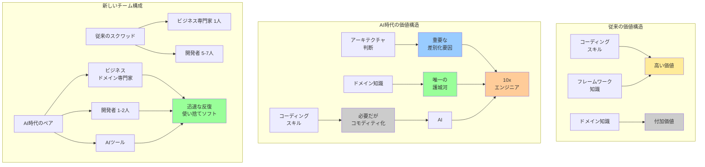

## 要約（Summary）

- AI時代、コーディングスキルのコモディティ化により、ドメイン知識と業界知識が開発者の唯一の持続的競争優位（護城河）となる
- 「ビジネスドメイン専門家 + 意欲的な開発者 + AIツール」のペアが、従来の「スクワッド（ビジネス専門家1人 + 開発者チーム）」を置き換える
- 10x エンジニアの実現：技術スキル + ドメイン知識 + AI活用の組み合わせ

## 本文（Body）

### 背景・問題意識

従来のソフトウェア開発では、技術的スキル（プログラミング能力、フレームワーク知識）が主要な差別化要因だった。しかしAIがコーディングを高速化する今、何が開発者の価値を決定するのか？

著者の観察：
> 「人間がエージェントを『監視』することには依然として大きな価値がある。作業をチェックし、アプローチを提案し、悪い方向性をショートカットする。」

しかし、このレベルでは不十分。真の価値は別の場所にある。

### アイデア・主張

**AI時代において、開発者の持続的競争優位は、ドメイン知識と業界知識に移行する。技術的な実装能力は依然として重要だが、それだけでは差別化要因にならない。最適なアーキテクチャ決定、適切なフレームワーク・ライブラリの選択、ビジネスドメインの深い理解が、巨大なレバレッジとなる。**

**3つの価値レイヤー：**

**1. 技術的監督（最低限のレイヤー）**
- AIの作業をチェック
- アプローチの提案
- 悪い方向性の早期発見
- → 必要だが、これだけでは不十分

**2. アーキテクチャ・技術選択（重要なレイヤー）**
- プロジェクトに最適なアーキテクチャ決定
- どのフレームワークを使うか
- どのライブラリが最適に機能するか
- → 技術的な経験と洞察が生きる

**3. ビジネスドメイン知識（最強のレイヤー）**
- 業界固有の問題の理解
- ビジネスプロセスの深い知識
- ユーザーニーズの本質的把握
- → これがあると「神話的な10x エンジニア」になれる

**新しい開発体制：**

従来：
- ビジネス専門家 1人
- 開発者チーム 5-7人
- → 「スクワッド」構成

AI時代：
- ビジネスドメイン専門家 1人
- 意欲的な開発者 1-2人
- AIツール
- → 「タイトなペアリング」

この組み合わせにより：
- 信じられないほど迅速な反復
- ソフトウェアがほぼ「使い捨て」に
- 方向性が悪ければ、捨てて学びを活かして再スタート

### 内容を視覚化するMermaid図

### 具体例・ケース

**1. 金融業界の例**
- **ドメイン知識なし**：
  - AIに「取引システムを作って」と指示
  - 基本的なCRUD + 計算機能は実装される
  - しかし：規制要件、監査証跡、リスク管理、決済ルールが抜け落ちる
  
- **ドメイン知識あり**：
  - 規制要件（SOX、GDPR等）を理解し、設計に組み込む
  - 監査証跡の要件を最初から考慮
  - 業界標準のリスク管理パターンを適用
  - 決済システムとの統合を適切に設計

**2. ヘルスケア業界の例**
- **技術スキルのみ**：
  - 患者管理システムを実装
  - データベース設計、CRUD、UI/UXは問題なし
  
- **ドメイン知識あり**：
  - HIPAA準拠の設計
  - 医療記録の保持期間ルール
  - 患者プライバシーの厳格な管理
  - 医療スタッフのワークフローの理解
  - 相互運用性標準（HL7、FHIR）の適用

**3. Eコマースの例**
- **基本実装**：
  - 商品カタログ、カート、決済
  
- **ドメイン知識による強化**：
  - 在庫管理の最適化（JIT vs バッファ在庫）
  - 価格戦略（ダイナミックプライシング、セグメント別価格）
  - フルフィルメントの複雑性（配送業者統合、返品処理）
  - マーケティング自動化の統合
  - 顧客生涯価値（LTV）の最適化

**4. 「概念的思考」vs「タイピング」**
著者の重要な洞察：
> 「困難な作業は『概念的思考』であり、『タイピング』ではない。」

- **概念的思考**（人間が優位）：
  - なぜこの機能が必要か
  - どういうアーキテクチャが最適か
  - どのようなトレードオフがあるか
  - ビジネス上の制約は何か
  
- **タイピング**（AIが優位）：
  - コードの実装
  - テストの作成
  - ボイラープレートの生成

### 反論・限界・条件

**「技術スキルは不要になる」という誤解**
- 誤り：技術スキルは依然として必要
- しかし、技術スキル「だけ」では差別化できない
- 技術スキル + ドメイン知識の組み合わせが重要

**「AIがドメイン知識も学習する」という反論**
- AIは一般的なドメイン知識をある程度持っている
- しかし、特定の企業・業界・文脈固有の知識は持たない
- 暗黙知、組織文化、歴史的経緯などは人間の領域

**「マインドセット転換の困難」**
- 「ソフトウェアは使い捨て」という考え方は、従来の開発文化と対立
- 「完璧に設計してから実装」から「試して学んで再構築」への転換
- 多くの組織・開発者がこの転換に抵抗

**キャリアへの影響**
- ジュニア開発者：コーディングスキル習得の機会減少？
  - 反論：AIを使いながら学ぶ新しいパス（[[20251129160322-junior-engineer-growth-with-ai|ジュニアエンジニアの成長戦略としてのAI活用]]）
  
- シニア開発者：アーキテクチャ・ドメイン知識が武器に
  
- ビジネスサイド：技術的なバックグラウンドなしでも、ドメイン知識 + AIツールで実装可能に

**組織の適応速度の差**
- 小規模企業・スタートアップ：迅速に適応可能
- 大企業：官僚的構造、ベンダー承認プロセスにより遅延
- → 競争力のギャップが拡大

## 関連ノート(Links)

- [[20251215102730-software-cost-reduction-ai-agents|エージェント型AIによるソフトウェア開発コストの劇的削減]] エージェント型AIによるソフトウェア開発コストの劇的削減
- [[20251215102907-software-latent-demand-jevons|ソフトウェアの潜在需要解放とJevonsパラドックス]] ソフトウェアの潜在需要解放とJevonsパラドックス
- [[20251129160322-junior-engineer-growth-with-ai|ジュニアエンジニアの成長戦略としてのAI活用]] ジュニアエンジニアの成長戦略としてのAI活用
- [[20251129160317-ai-role-division-what-why-how|AI連携開発における役割分担の原則]] AI連携開発における役割分担の原則

## To-Do / 次に考えること

- [ ] 自分のドメイン知識を棚卸しする
- [ ] 業界固有の知識を体系的に学ぶ計画を立てる
- [ ] ビジネスドメイン専門家との「タイトなペアリング」を試す
- [ ] 「使い捨てソフトウェア」のマインドセットを実践する
- [ ] 自分が「10x エンジニア」になるために何が必要かを定義する
