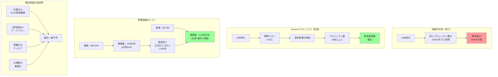

## 要約（Summary）

- ソフトウェア開発コストの劇的な削減により、膨大な潜在需要が解放される
- Jevonsパラドックス：コスト削減により、総需要が爆発的に増加し、開発者の仕事は減るどころか増える
- $50k → $5kへの価格低下により、「必須プロジェクトのみ」から「やりたいプロジェクト全て」へ

## 本文（Body）

### 背景・問題意識

一見すると、AIによるソフトウェア開発の効率化は、開発者にとって脅威に見える：
- 同じ仕事を10%の時間で完了できる
- → 90%の開発者が不要になる？

しかし、経済学の原理は異なる予測をする。

### アイデア・主張

**ソフトウェア開発コストの劇的な削減は、Jevonsパラドックスにより、開発者の仕事を減らすのではなく増やす。価格が1/10になると、これまで経済的に正当化できなかった膨大な数のプロジェクトが実行可能になり、市場全体が爆発的に拡大する。**

**Jevonsパラドックスの復習：**
- 19世紀、Wattの蒸気機関が石炭効率を劇的に改善
- 直感：石炭消費量が減るはず
- 現実：蒸気機関の用途が爆発的に拡大し、総石炭消費量が増加

同様に：
- 電気照明の効率化 → ろうそく・ガス灯の販売は減少
- しかし、総人工照明量は爆発的に増加

**ソフトウェアへの適用：**

価格弾力性が高い市場：
- $50,000のプロジェクト：必須のもののみ実行
- $5,000のプロジェクト：「あったらいいな」がすべて実行可能に

### 内容を視覚化するMermaid図

### 具体例・ケース

**1. 企業内のExcel地獄**
- 現状：多くの企業で数百〜数千のExcelシートが業務プロセスを管理
- 従来：
  - 代理店見積もり：$50,000
  - 経済的に正当化できるのは「必須」のもののみ
  - → 大部分はExcelのまま放置
  
- AI時代：
  - 開発者 + AIツール：$5,000
  - 投資回収期間が劇的に短縮
  - → これまで放置されていたすべてのプロセスがSaaS化の候補に

**2. 部門固有ツールの民主化**
- 従来：
  - カスタムツール開発は大規模プロジェクトのみ
  - 小規模な部門は「既製品で我慢」または「手作業」
  
- AI時代：
  - 各部門が独自のカスタムツールを持てる
  - マーケティング、営業、カスタマーサポート、人事、経理、それぞれに最適化されたツール

**3. 実験・MVP の爆発的増加**
- 従来：
  - MVP開発に$20,000〜$50,000
  - リスクが高く、慎重に選別
  
- AI時代：
  - MVP開発に$2,000〜$5,000
  - 失敗のコストが低い → 大量の実験が可能
  - 「試してみる」が気軽にできる

**4. 照明のアナロジー（Jevonsパラドックスの原例）**
- ろうそく時代：照明は高価 → 必要最小限の使用
- ガス灯時代：効率向上 → 使用量増加
- 電球時代：さらに効率向上 → 照明が至る所に
- LED時代：極めて安価 → 装飾照明、常夜灯、イルミネーションなど爆発的増加

同様に：
- 手作業コーディング時代：ソフトウェアは高価 → 必須のもののみ
- AI時代：開発コストが1/10 → あらゆる業務プロセスがソフトウェア化の候補

### 反論・限界・条件

**「需要の価格弾力性が低い場合」**
- Jevonsパラドックスは、需要の価格弾力性が高い場合に発生
- ソフトウェアの場合：弾力性は非常に高い
  - 理由：膨大な数の「やりたいがコストが見合わない」プロジェクトが存在
  - Excel地獄、手作業プロセス、既製品での妥協など

**「市場飽和の懸念」**
- 反論：すべての業務プロセスがソフトウェア化される日は、まだ遠い
- 理由：
  - 新しいビジネスモデルが常に生まれる
  - 既存プロセスの最適化は終わりがない
  - ユーザー期待は上昇し続ける

**「短期的な混乱」**
- 移行期には確かに混乱がある
- 特に：
  - 「実装スキルのみ」の開発者：厳しい
  - AIツールを拒否する開発者：置き去りに
  - 大企業の適応の遅れ：競争力低下

**「品質の懸念」**
- 大量のソフトウェアが短期間で生産される → 品質は？
- 反論：
  - 人間がループに入ることで、品質を維持
  - 使い捨てアプローチ：悪いものは捨てて再構築
  - テストの自動生成により、品質保証が容易に

**「雇用への影響の時間軸」**
- 短期（2025-2027）：
  - 先進的な開発者：生産性爆発
  - 保守的な開発者：変化に抵抗
  - 企業：様子見または小規模実験
  
- 中期（2027-2030）：
  - 潜在需要が顕在化し始める
  - 小規模プロジェクトの爆発的増加
  - 開発者需要が再び高まる
  
- 長期（2030以降）：
  - 新しい均衡点
  - ソフトウェア開発は「概念設計」「ドメイン理解」が中心に

## 関連ノート（Links）

- [[20251215101734-jevons-paradox-concept|Jevonsパラドックス：効率化が消費を増やす逆説]] Jevonsパラドックス：効率化が消費を増やす逆説
- [[20251215102730-software-cost-reduction-ai-agents|エージェント型AIによるソフトウェア開発コストの劇的削減]] エージェント型AIによるソフトウェア開発コストの劇的削減
- [[20251215101828-rebound-effect-mechanism|リバウンド効果と価格弾力性の関係]] リバウンド効果と価格弾力性の関係
- [[20251129160320-ai-task-granularity|AIへのタスク粒度と効率の関係]] AIへのタスク粒度と効率の関係

## To-Do / 次に考えること

- [ ] 自社・自部門の「Excel地獄」をリストアップし、SaaS化の優先順位をつける
- [ ] 潜在需要の定量化：「やりたいがコストが見合わない」プロジェクトを列挙
- [ ] 価格弾力性の推定：$50k → $5kで需要が何倍になるか
- [ ] 短期的な混乱を乗り越えるための戦略を立てる
- [ ] 2026年の市場変化を予測し、ポジショニングを考える
