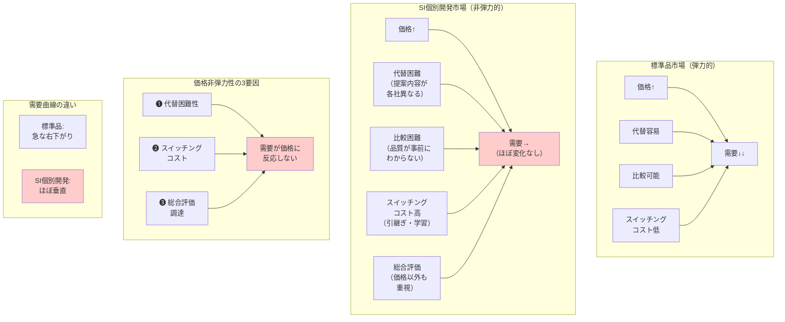

## 要約（Summary）

- SIerが受託する「個別開発（要件定義〜設計〜実装〜移行）」案件は、一般に価格弾力性が低い（非弾力的）
- 価格が上昇しても需要量があまり減少しない理由：(1) 代替困難性、(2) 高いスイッチングコスト、(3) 最低価格以外の評価基準
- 同じSIでも、案件の性質（新規/既存、定型/非定型、供給者数など）により弾力性は大きく変動する

## 本文（Body）

個別開発を中心とするSI案件は、経済学的に「価格非弾力的」な市場の典型例である。一般消費財と異なり、値上げしても需要が大きく減らない構造を持つ。

### 背景・問題意識

**価格弾力性（price elasticity of demand）とは**
- 定義：価格が1%変化したとき、需要量が何%変化するかを示す指標
- 弾力的（高い）：価格に対して需要が敏感に反応（値上げ→大幅な需要減）
- 非弾力的（低い）：価格変化に対して需要が鈍感（値上げ→需要はあまり減らない）

一般に以下の条件で弾力性は低くなる：
- 代替財が少ない（他に選択肢がない）
- 必需性が高い（なければ困る）
- 支出に占める割合が小さい（価格を気にしない）
- 乗り換えコストが高い（変更が困難）

SI個別開発は、特に1・2・4の条件を強く満たす。

### アイデア・主張

**SIの個別開発案件が価格非弾力的になる3つの構造的理由：**

#### 1) 代替が効きにくい（comparability の低さ）

標準品・既製品なら「同じ仕様の商品」を複数ベンダーから比較できるが、個別開発では：
- 提案内容が各社で異なる（要件解釈、設計方針、技術選定が多様）
- 品質・リスクの見極めが困難（実装してみないとわからない）
- 過去実績・体制・信頼性などの「価格以外の差」が大きい

→ 買い手は「多少高くても、失敗リスクが低いベンダー」を選ぶ合理性が働く

#### 2) スイッチングコストが重い

既存ベンダーから別ベンダーへ乗り換える際のコスト：
- 引継ぎコスト（ドキュメント、暗黙知、運用ノウハウの移転）
- 学習コスト（新ベンダーが仕様を理解するまでの時間・リスク）
- 関係構築コスト（信頼関係の再構築、意思疎通の確立）
- 技術的負債（前ベンダーの設計思想が残る影響）

ITアウトソーシング研究では、**スイッチングコストが継続/解約判断に強く影響する**ことが実証されている。

#### 3) 調達が「最低価格」では決まらない

公共調達・大企業調達では「総合評価方式」が主流：
- 価格：技術点 = 3:7 など、価格の重みが限定的
- 評価項目：実績、技術力、体制、リスク対応、保守体制など
- 「ベストバリュー（最良の価値）」で選定

UN調達教材でも、**価格が支配的基準になるのは仕様が明確で標準品に近い場合のみ**、と整理されている。

### 内容を視覚化するMermaid図

### 具体例・ケース

**ケース1：基幹系システム刷新（非弾力的の典型）**
- 規模：数億円、3年プロジェクト
- 状況：既存ベンダーA社が保守、新規開発コンペ
- 結果：
  - A社：8億円（既存知見あり、引継ぎ不要）
  - B社：6億円（価格競争力あり、ただし引継ぎリスク）
  - 選定：A社（「2億円の差より失敗リスク回避」）
- 弾力性：価格25%安でも需要（発注）は動かず

**ケース2：官公庁システム開発（総合評価の影響）**
- 調達方式：総合評価落札方式（価格30%、技術70%）
- 入札結果：
  - 最低価格：5,000万円（実績少ない中小）
  - 落札：6,500万円（実績豊富な大手）
- 理由：技術点で30%上回り、総合点で逆転
- 弾力性：最低価格でも需要は得られない

**ケース3：追加開発・保守（スイッチングコストの影響）**
- 状況：既存システムの機能追加（年間契約）
- 既存ベンダー：1,200万円/年
- 他社見積：900万円/年（25%安）
- 決定：既存ベンダー継続
- 理由：
  - 引継ぎに3ヶ月＋500万円必要（差額相殺）
  - 品質低下リスク、暗黙知の喪失リスク
- 弾力性：極めて低い（実質的ロックイン状態）

**ケース4：クラウド移行支援（中程度の弾力性）**
- 比較的定型的な作業（AWS→GCPなど）
- 複数社が同等のサービス提供可能
- 結果：価格差20%で発注先が変動
- 理由：成果物が明確、差別化要因が少ない
- 弾力性：個別開発より高いが、標準品ほどではない

### 反論・限界・条件

**「すべてのSI案件が非弾力的」ではない**
- 定型作業（単純な画面追加、データ移行など）は弾力的
- 供給者が多数存在する領域（SES、人月供給色が強い）も弾力的
- 新規コンペ（既存関係なし）は、既存案件より弾力的

**極端な価格差では需要は動く**
- 2倍・3倍の価格差なら、さすがに発注は減る
- ただし「10〜30%の価格変動」では需要はほぼ動かない
- 非弾力的 ≠ 完全に価格無関係

**発注側の成熟度による差**
- 内製能力が高い企業：ベンダー依存度低→弾力性高
- ドキュメント整備された案件：スイッチング容易→弾力性高
- 調達が最低価格落札中心の組織：価格の影響大→弾力性高

**長期的には弾力性が変化する可能性**
- AI・ローコードツールの普及→代替手段の増加
- クラウドネイティブ化→ベンダー依存度の低下
- 内製化の進展→外部発注自体の減少

**市場全体の需要 vs 個別ベンダーの需要**
- ここで論じているのは「SI市場全体」の弾力性
- 個別ベンダーにとっては「競合との相対価格」が重要
- 市場全体は非弾力的でも、ベンダー間の競争は価格に敏感

## 関連ノート（Links）

- [[20251215104431-switching-cost-vendor-lockin|スイッチングコストとベンダーロックイン]] スイッチングコストとベンダーロックイン
- [[20251215104432-si-project-elasticity-by-type|案件タイプ別の価格弾力性マトリクス]] 案件タイプ別の価格弾力性マトリクス
- [[20251215101828-rebound-effect-mechanism|リバウンド効果と価格弾力性の関係]] リバウンド効果と価格弾力性の関係（対比：こちらは弾力的な市場）
- [[20251215102907-software-latent-demand-jevons|ソフトウェアの潜在需要解放とJevonsパラドックス]] ソフトウェアの潜在需要解放（対比：AI時代の弾力性上昇）

## To-Do / 次に考えること

- [ ] 自社の案件ポートフォリオを「弾力性マトリクス」で分類する
- [ ] 案件別に (価格, 勝率, 失注理由, 既存/新規) データを収集
- [ ] ロジスティック回帰で「価格の係数」を推定（価格感応度の定量化）
- [ ] スイッチングコストを低減する施策（ドキュメント、標準化）の効果測定
- [ ] AI時代の「代替手段増加」が弾力性に与える影響を追跡
