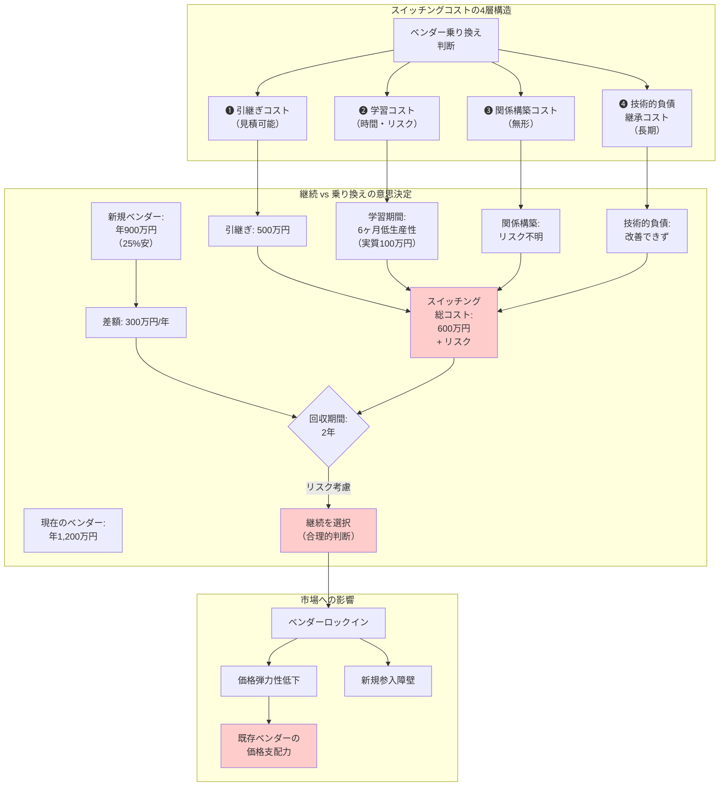

## 要約（Summary）

- スイッチングコスト（switching cost）は、現在の取引先から別の取引先へ乗り換える際に発生するコスト
- IT・SIの文脈では、引継ぎ、学習、関係構築、技術的負債の吸収などが該当
- スイッチングコストが高い市場では、価格弾力性が低下し、既存ベンダーが有利になる（ベンダーロックイン）
- ITアウトソーシング研究では、スイッチングコストが継続/解約判断に強く影響することが実証されている

## 本文（Body）

スイッチングコストは、ベンダーロックインの経済学的メカニズムを説明する中核概念である。SI・ITアウトソーシング市場では特に重要。

### 背景・問題意識

**スイッチングコストとは**
- 定義：取引相手を変更する際に発生する、金銭的・非金銭的なコストの総称
- 一般例：携帯キャリア変更時の手数料、ソフトウェア乗り換え時の学習コスト
- 効果：現状維持バイアスを生み、競争を阻害する

**経済学的な整理**
- スイッチングコストが高い市場では、**需要の価格弾力性が低下**する
- 既存顧客の離脱が困難になり、ベンダーは価格支配力を持つ
- 新規参入障壁となる（既存顧客の奪取が困難）

### アイデア・主張

**SI・ITアウトソーシングにおけるスイッチングコストは、以下の4層で構成される：**

#### 1) 引継ぎコスト（Transition Cost）

**内容**
- ドキュメント作成・整備（あるべき状態への補完）
- 仕様説明、設計思想の伝達
- 運用手順書の整備・移管
- 環境構築、アクセス権限の移行

**特徴**
- 金額で見積もりやすい（工数×単価）
- プロジェクト化して管理可能
- ただし「暗黙知」部分は定量化困難

**典型的規模**
- 小規模案件：0.5〜1人月（50〜100万円）
- 中規模案件：3〜6人月（300〜600万円）
- 大規模案件：10人月〜（1,000万円〜）

#### 2) 学習コスト（Learning Cost）

**内容**
- 新ベンダーが業務ドメインを理解するまでの時間
- システムの全体像把握、依存関係の理解
- 「なぜこの設計になっているか」の背景把握
- 既存の技術的負債・制約の理解

**特徴**
- 時間がかかる（数ヶ月〜1年以上）
- 初期は生産性が低い（質問・確認が頻発）
- ドキュメントがあっても、実態との乖離がある

**リスク**
- 理解不足による誤修正・障害
- 「知らずに壊す」パターンの頻発
- 顧客側の説明負担の増加

#### 3) 関係構築コスト（Relationship Cost）

**内容**
- 信頼関係の再構築（実績ゼロからのスタート）
- コミュニケーションスタイルのすり合わせ
- 意思疎通の効率化（阿吽の呼吸の再構築）
- エスカレーション・意思決定プロセスの確立

**特徴**
- 金額換算が困難（無形のコスト）
- 時間で解決する部分が大きい
- 「うまくいかない」リスクがゼロにならない

**実務的影響**
- 初期は細かい認識齟齬が多発
- 意思決定に時間がかかる
- 「前のベンダーならすぐわかったのに…」というストレス

#### 4) 技術的負債の継承コスト（Technical Debt Cost）

**内容**
- 前ベンダーの設計思想・技術選定が残る
- 「理想の設計」にはできない（既存資産の制約）
- 過去の妥協・回避策の影響を受け続ける
- リアーキテクチャには大規模投資が必要

**特徴**
- 長期的に効いてくる（数年スパン）
- 「乗り換えたのに改善しない」ジレンマ
- フルリプレースしない限り根本解決しない

### 内容を視覚化するMermaid図

### 具体例・ケース

**ケース1：基幹システム保守ベンダーの乗り換え（失敗例）**
- 状況：年間保守費1,500万円→他社提案1,000万円（33%削減）
- 決定：乗り換え実施
- 実績：
  - 引継ぎ期間：6ヶ月、追加費用800万円
  - 初年度障害率：3倍に増加
  - 復旧時間：平均2倍
  - 2年目に元のベンダーへ出戻り（再度引継ぎコスト発生）
- 総コスト：3年で4,500万円（継続より1,000万円高）
- 教訓：**見かけの価格差だけで判断すると失敗する**

**ケース2：クラウド運用保守の競争入札（成功例）**
- 前提条件：
  - ドキュメント完備（運用手順、構成図、過去障害履歴）
  - インフラコード化（Terraform、Ansible）
  - 顧客側にPM・アーキテクトが在籍
- スイッチングコスト：引継ぎ2人月（200万円）のみ
- 結果：年間600万円→400万円（33%削減）、品質維持
- 成功要因：**スイッチングコストを構造的に下げる投資をしていた**

**ケース3：SaaS vs 個別開発のスイッチングコスト比較**

| 項目 | SaaS（標準品） | 個別開発SI |
|------|----------------|------------|
| 引継ぎコスト | ほぼゼロ（アカウント移行のみ） | 高（数百万〜数千万） |
| 学習コスト | 低（マニュアル整備） | 高（個別仕様理解） |
| 関係構築 | 不要（セルフサービス） | 必須（人的関係） |
| 技術的負債 | なし（ベンダー側で解決） | 継承される |
| **総コスト** | **低→弾力的市場** | **高→非弾力的市場** |

**ケース4：オフショア開発への切り替え（部分的成功）**
- 状況：国内SIer年5,000万円→オフショア年2,500万円
- スイッチングコスト対策：
  - 国内ブリッジSEを配置（コミュニケーション補完）
  - 詳細仕様書の英語化（翻訳コスト500万円）
  - 初期は小規模案件で試行
- 結果：2年目から安定、年2,000万円削減達成
- 成功要因：**段階的移行とリスクヘッジ**

### 反論・限界・条件

**「スイッチングコストが高い」は絶対ではない**
- ドキュメント整備、標準化、内製PMで大幅に低減可能
- クラウドネイティブ化で技術的負債の継承を軽減
- マルチベンダー戦略（複数社に分散）でロックイン回避

**スイッチングコストの「投資的性格」**
- 初期は高コストでも、長期では競争効果で回収可能
- 「10年同じベンダー」なら、乗り換えで5年分のコスト削減も
- ただし、初期の痛みに組織が耐えられるかが問題

**「乗り換えない」が最適とは限らない**
- ベンダーが品質・サービスを劣化させるモラルハザード
- 技術進化への対応が遅れる（既存ベンダーが保守的）
- 「競争圧力」自体に価値がある（潜在的な乗り換え可能性）

**発注側の成熟度による差**
- 内製能力高：スイッチングコスト低（自分で理解している）
- ドキュメント文化：乗り換え容易
- ベンダー依存体質：スイッチングコスト高（知見がベンダーに集中）

**AI時代の変化可能性**
- AIによるドキュメント自動生成→引継ぎコスト低減
- コード理解AIの進化→学習コスト低減
- ただし「暗黙知」「組織知」は依然として障壁

## 関連ノート（Links）

- [[20251215104430-si-project-price-inelasticity|SI個別開発案件の価格非弾力性]] SI個別開発案件の価格非弾力性
- [[20251215104432-si-project-elasticity-by-type|案件タイプ別の価格弾力性マトリクス]] 案件タイプ別の価格弾力性マトリクス
- [[20251215102820-domain-knowledge-as-moat|AI時代のドメイン知識：唯一の護城河]] ドメイン知識とスイッチングコストの関係

## To-Do / 次に考えること

- [ ] 自社案件のスイッチングコストを4層構造で定量化する
- [ ] ドキュメント整備・標準化による「スイッチングコスト低減投資」のROIを試算
- [ ] マルチベンダー戦略の導入可能性を検討
- [ ] クラウドネイティブ化がスイッチングコストに与える影響を測定
- [ ] AI時代の「ドキュメント自動生成」がゲームチェンジャーになるか追跡
