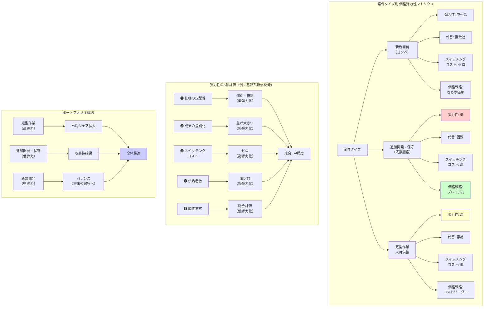

## 要約（Summary）

- 「SIは非弾力的」という一般論は不正確。案件タイプにより弾力性は大きく変動する
- 弾力性を決める5つの軸：(1) 仕様の定型性、(2) 成果の差別化度、(3) スイッチングコスト、(4) 供給者数、(5) 調達方式
- 実務的には「新規開発（コンペ）」「追加開発・保守（既存顧客）」「定型作業・人月供給」の3分類が有用
- ポートフォリオ戦略：弾力的案件で市場シェア拡大、非弾力的案件で収益性確保

## 本文（Body）

SI案件の価格弾力性は、案件特性により大きく異なる。一律の戦略ではなく、タイプ別の価格戦略が必要。

### 背景・問題意識

**「SIは非弾力的」の誤解**
- 個別開発の複雑案件は確かに非弾力的
- しかし同じ「SI」でも、定型的な作業や人月供給色が強い案件は弾力的
- 案件ポートフォリオ全体の弾力性は、構成比で決まる

**実務的な課題**
- 「価格弾力性」を一発で断定するより、案件分類別に推定する方が実用的
- 営業・受注戦略、価格設定、ポートフォリオ管理に直結

### アイデア・主張

**案件タイプ別の価格弾力性は、5つの軸で決まる：**

#### 弾力性を決める5つの軸

| 軸 | 弾力性「高い」← → 「低い」 |
|---|---|
| ❶ 仕様の定型性 | 定型・標準 ← → 個別・複雑 |
| ❷ 成果の差別化度 | 差が出にくい ← → 差が大きい |
| ❸ スイッチングコスト | 低い ← → 高い |
| ❹ 供給者数 | 多数存在 ← → 限定的 |
| ❺ 調達方式 | 最低価格落札 ← → 総合評価 |

**実務的3分類**

| タイプ | 弾力性 | 特徴 | 価格戦略 |
|--------|--------|------|----------|
| **新規開発（コンペ）** | 中〜高 | 複数社競合、既存関係なし | 攻めの価格（市場獲得） |
| **追加開発・保守（既存顧客）** | 低 | スイッチングコスト効く | 安定収益（価格支配力） |
| **定型作業・人月供給** | 高 | 相見積もりで裁定される | 薄利多売（効率勝負） |

### 内容を視覚化するMermaid図

### 具体例・ケース

#### タイプ1：新規開発（コンペ）【中〜高弾力性】

**ケース：官公庁基幹システム刷新コンペ**
- 5社による提案競争
- 弾力性の5軸評価：
  - ❶ 仕様：個別・複雑（低弾力化）
  - ❷ 差別化：大きい（各社提案が異なる）（低弾力化）
  - ❸ スイッチングコスト：ゼロ（新規）（高弾力化）
  - ❹ 供給者：限定的（大手のみ対応可能）（低弾力化）
  - ❺ 調達：総合評価（価格30%）（低弾力化）
- **総合：中程度の弾力性**
- 価格戦略：赤字覚悟の戦略価格（保守で回収）は機能しうる

**観測データ（架空例）**
- 最低価格：5億円、落札：6.5億円（30%高）
- 価格差30%でも落札可能（技術点で逆転）
- ただし、価格が2倍（10億円）なら落札困難→完全に非弾力的ではない

#### タイプ2：追加開発・保守（既存顧客）【低弾力性】

**ケース：既存システムの年間保守契約**
- 10年継続中の保守案件
- 弾力性の5軸評価：
  - ❶ 仕様：個別（過去の経緯依存）（低弾力化）
  - ❷ 差別化：大きい（既存ベンダーが有利）（低弾力化）
  - ❸ スイッチングコスト：非常に高い（低弾力化）
  - ❹ 供給者：実質1社（既存ベンダーのみ現実的）（低弾力化）
  - ❺ 調達：随意契約・一社見積もり（低弾力化）
- **総合：極めて低い弾力性（ほぼ垂直の需要曲線）**
- 価格戦略：毎年5〜10%の値上げでも契約継続

**観測データ（架空例）**
- 初年度：1,000万円
- 5年後：1,300万円（30%値上げ）
- 契約継続率：95%（5%は「我慢の限界」で解約）
- 弾力性：極めて低い

#### タイプ3：定型作業・人月供給【高弾力性】

**ケース：クラウド移行支援（AWS→GCP）**
- 標準的な移行手順、複数社が提供可能
- 弾力性の5軸評価：
  - ❶ 仕様：定型（手順書化可能）（高弾力化）
  - ❷ 差別化：小さい（成果物は同等）（高弾力化）
  - ❸ スイッチングコスト：低い（新規案件）（高弾力化）
  - ❹ 供給者：多数（オフショア含む）（高弾力化）
  - ❺ 調達：最低価格重視（高弾力化）
- **総合：高弾力性（価格に敏感）**
- 価格戦略：コストリーダーシップ、薄利多売

**観測データ（架空例）**
- A社：800万円
- B社：750万円（6%安）→ B社が受注
- C社：850万円（6%高）→ 失注
- 弾力性：価格5〜10%の差で需要が大きく動く

#### ケース4：ハイブリッド案件（弾力性の二面性）

**「アジャイル受託開発」の例**
- 初回契約（3ヶ月トライアル）：**高弾力性**
  - 複数社比較可能、スイッチングコストなし
  - 価格競争が激しい
- 継続契約（1年以上）：**低弾力性**
  - チームが固まり、ドメイン知識が蓄積
  - 乗り換えコストが急上昇
  - 値上げ交渉が通りやすくなる

→ **時間軸で弾力性が変化する**

### 反論・限界・条件

**「分類」は連続的スペクトラム**
- 実際の案件は「完全に定型」「完全に個別」の二分法ではない
- 5軸評価でグラデーションを見る方が現実的

**弾力性は「市場全体」か「個別ベンダー」か**
- ここでの議論は主に「市場全体の需要」
- 個別ベンダーにとっては「自社 vs 競合」の相対価格が重要
- 市場は非弾力的でも、ベンダー間競争は激しい場合がある

**顧客側の要因も影響**
- 内製能力が高い顧客：どの案件も弾力的（自作可能性）
- ドキュメント整備された組織：スイッチングコスト低→弾力的
- ベンダー依存体質：どの案件も非弾力的

**AI・ローコード時代の変化**
- 定型作業：AI/ローコードで代替可能→さらに弾力化（価格下落圧力）
- 複雑案件：AI支援でコスト減→潜在需要拡大（市場全体は拡大）
- ドメイン知識：人間の差別化要因として残る→非弾力的領域

**実証研究の必要性**
- 理論的整理だけでは不十分
- 自社データで「価格 vs 勝率」の回帰分析が必要
- 案件難易度の統制が重要（難しい案件ほど高見積もりのバイアス）

## 関連ノート（Links）

- [[20251215104430-si-project-price-inelasticity|SI個別開発案件の価格非弾力性]] SI個別開発案件の価格非弾力性
- [[20251215104528-switching-cost-vendor-lockin|スイッチングコストとベンダーロックイン]] スイッチングコストとベンダーロックイン
- [[20251215101828-rebound-effect-mechanism|リバウンド効果と価格弾力性の関係]] リバウンド効果と価格弾力性の関係（経済学的基礎）
- [[20251215102730-software-cost-reduction-ai-agents|エージェント型AIによるソフトウェア開発コストの劇的削減]] AI時代のコスト構造変化
- [[20251215102907-software-latent-demand-jevons|ソフトウェアの潜在需要解放とJevonsパラドックス]] コスト減少と市場拡大（対比：弾力的市場の事例）

## To-Do / 次に考えること

- [ ] 自社の案件ポートフォリオを3分類（新規/既存/定型）に分ける
- [ ] 各カテゴリの売上構成比、粗利率を算出
- [ ] 案件データ（価格、勝率、失注理由、既存/新規）を収集
- [ ] ロジスティック回帰で「価格の係数（=弾力性の代理指標）」を推定
- [ ] 「高弾力案件でシェア拡大→低弾力案件へ育成」の戦略設計
- [ ] AI時代の弾力性変化を継続観測（特に定型作業の価格下落）
