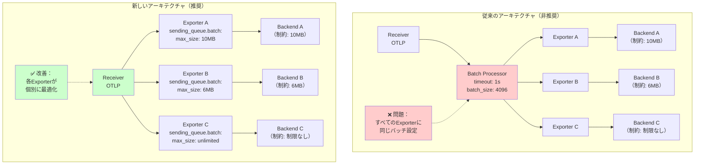

## 要約（Summary）

- OpenTelemetry Collectorにおいて、Batch Processorの利用推奨が取り止められた（2025年PR #13191）
- データのバッチ処理はProcessor層からExporter層へ移行し、`sending_queue.batch`設定で実現する方式に変更
- この変更により、パイプライン設計がシンプルになり、各Exporterが自身の要件に最適化されたバッチ処理を提供できるようになった

## 本文（Body）

### 背景・問題意識

**Batch Processorの従来の位置づけ**
- OpenTelemetry Collectorでは、複数のテレメトリーデータを1つのbatchにまとめて送信することでデータ転送を最適化
- 従来は「Batch Processorをすべてのcollectorに設定すべき」という強い推奨があった
- 公式ドキュメントの設定例でも、パイプラインに `processors: [batch]` が含まれていた

**推奨が取り止められた理由**
- Processor層でのバッチ処理は、すべてのExporterに対して一律の設定を強いる
- 各バックエンドの要件（リクエストサイズ制限、レート制限など）に個別対応できない
- パイプライン設計が複雑になり、設定の見通しが悪化

### アイデア・主張

**アーキテクチャの転換：Processor→Exporterへのバッチ処理移行**

OpenTelemetry Collectorのアーキテクチャ変更により、バッチ処理の責任が以下のように移行した：

#### 従来のアーキテクチャ（非推奨）

```
Receiver → [Batch Processor] → Exporter → Backend
             ↑
          すべてのExporterに
          共通のバッチ設定
```

- Processor層でデータをバッチ化
- 設定は `processors.batch` セクションで一元管理
- 複数のExporterがある場合、すべてに同じバッチ設定が適用される

#### 新しいアーキテクチャ（推奨）

```
Receiver → Exporter[sending_queue.batch] → Backend
                    ↑
                 Exporter毎に
                 最適化されたバッチ設定
```

- Exporter層で各自がバッチ処理を実行
- 設定は `exporters.<name>.sending_queue.batch` セクションで個別管理
- 各Exporterが自身のバックエンド要件に合わせてバッチサイズを調整可能

### 内容を視覚化するMermaid図



### 具体例・ケース

**ケース1：単一Exporterの設定移行**

```yaml
# 従来の設定（非推奨）
processors:
  batch:
    timeout: 1s
    send_batch_size: 4096
    send_batch_max_size: 4096

exporters:
  otlp:
    endpoint: backend.example:4317

service:
  pipelines:
    traces:
      receivers: [otlp]
      processors: [batch]  # ← Batch Processor使用
      exporters: [otlp]
```

```yaml
# 新しい設定（推奨）
exporters:
  otlp:
    endpoint: backend.example:4317
    sending_queue:
      batch:
        flush_timeout: 1s
        min_size: 4096
        max_size: 4096

service:
  pipelines:
    traces:
      receivers: [otlp]
      # processors: [batch] は削除
      exporters: [otlp]
```

**ケース2：複数Exporterで異なるバッチサイズが必要な場合**

```yaml
exporters:
  # Mackerel：6MB制限あり
  mackerelotlp:
    endpoint: mackerel.example:4317
    sending_queue:
      batch:
        max_size: 6291456  # 6MB

  # Prometheus：大きなバッチが効率的
  prometheusremotewrite:
    endpoint: prometheus.example:9090
    sending_queue:
      batch:
        max_size: 20971520  # 20MB

  # DataDog：デフォルトで十分
  datadog:
    endpoint: datadog.example:4318
    sending_queue:
      batch: {}  # デフォルト設定を使用

service:
  pipelines:
    traces:
      receivers: [otlp]
      exporters: [mackerelotlp, prometheusremotewrite, datadog]
```

従来のBatch Processorでは、すべてのExporterに同じバッチサイズが適用されていたが、新方式では各Exporterが個別に最適化できる。

**ケース3：公式ドキュメントの変更**

```yaml
# 最新の公式ドキュメント例（2025年）
exporters:
  otlp:
    endpoint: otelcol:4317
    sending_queue:
      batch:  # ← Exporter側でバッチ有効化

service:
  pipelines:
    traces:
      receivers: [otlp]
      exporters: [otlp]  # ← processorsにbatchが含まれていない
```

公式ドキュメント（https://opentelemetry.io/docs/collector/configuration/#basics）でも、Batch Processorを使わない設定例が標準となっている。

### 反論・限界・条件

**「Batch Processorを完全に廃止すべき」ではない**
- Batch Processorは非推奨（deprecated）ではなく、推奨が取り止められただけ
- 複数のExporterに同じバッチ設定を適用したい場合は、Batch Processorの方がDRY
- カスタムExporterが `exporterhelper` を使っていない場合、Batch Processorが必要

**移行時の互換性**
- 既存の設定をそのまま使い続けても動作する
- ただし、新規設定では `sending_queue.batch` の使用が推奨される
- 段階的な移行が可能（Processor→Exporterへ徐々に移行）

**パフォーマンスへの影響**
- 内部実装は同じ `exporterhelper.QueueBatch` を使用
- パフォーマンス特性は変わらない
- 設定の柔軟性が向上しただけ

**デフォルト動作の注意点**
- `sending_queue.batch` は**デフォルトでは無効**
- 明示的に `batch: {}` を設定しないとバッチ処理されない
- 移行時には設定を忘れずに追加する必要がある

## 関連ノート（Links）

- [[202511291430-delta-to-cumulative-processor|OpenTelemetry DeltaToCumulative Processorの概要]] 別のProcessor例
- [[20251129172153-opentelemetry-temporality-definition|OpenTelemetry Temporalityの基本概念]] メトリクスの処理方式
- [[202511291440-load-balancing-exporter|OpenTelemetry Collector Load Balancing Exporterの概要]] Exporter層での処理
- [[20251129172154-backend-temporality-choice|バックエンドによるTemporality選択基準]] バックエンド要件への対応

## To-Do / 次に考えること

- [ ] 既存のOpenTelemetry Collector設定でBatch Processorを使っている箇所を洗い出す
- [ ] 各Exporterのバックエンド要件（リクエストサイズ制限など）を調査
- [ ] sending_queue.batchへの移行計画を立てる（段階的移行の可否）
- [ ] カスタムExporterがexporterhelperを使っているか確認
- [ ] 移行後のパフォーマンス比較テストを実施
