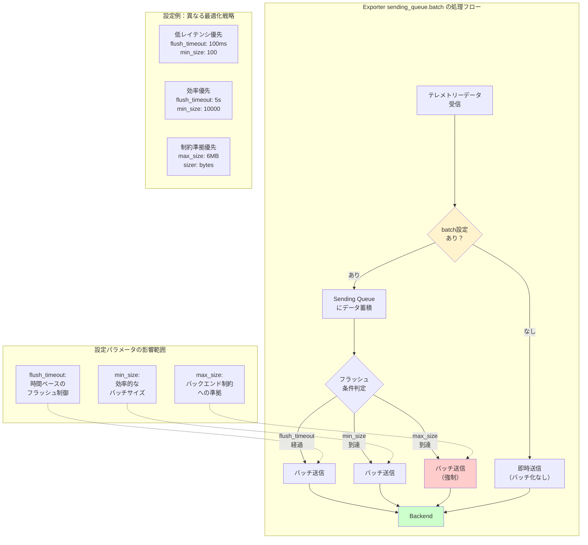

## 要約（Summary）

- OpenTelemetry CollectorのExporterには `sending_queue.batch` 設定があり、Exporter層でバッチ処理を実現できる
- 設定パラメータは `flush_timeout`, `min_size`, `max_size` の3つで、従来のBatch Processorと対応関係がある
- `exporterhelper` パッケージを使用するすべてのExporterで利用可能で、デフォルトでは無効（明示的に有効化が必要）

## 本文（Body）

### 背景・問題意識

**Batch Processorからの移行ニーズ**
- OpenTelemetry CollectorでBatch Processorの使用推奨が取り止められた
- 代替手段として、Exporter側でのバッチ処理機能が提供されている
- 設定方法を理解し、適切に移行する必要がある

**バッチ処理の目的**
- オブザーバビリティバックエンドへの接続数削減
- データ圧縮効率の向上
- ネットワーク転送の最適化
- バックエンド側の処理負荷軽減

### アイデア・主張

**sending_queue.batch設定の構造と使用方法**

Exporterの `sending_queue` セクション内で `batch` を設定することで、Exporter層でのバッチ処理が有効化される。この設定は `go.opentelemetry.io/collector/exporter/exporterhelper` パッケージが提供する標準機能である。

#### 設定パラメータと対応関係

| Batch Processor（旧） | sending_queue.batch（新） | 説明 |
|----------------------|--------------------------|------|
| `timeout` | `flush_timeout` | バッチをフラッシュするまでの最大待機時間 |
| `send_batch_size` | `min_size` | バッチを送信する最小サイズ（件数またはバイト数） |
| `send_batch_max_size` | `max_size` | バッチの最大サイズ（件数またはバイト数） |
| - | `sizer` | サイズ計算方法（件数 or バイト数）の選択 |

#### デフォルト動作の重要な注意点

**バッチ処理はデフォルトで無効**
- `sending_queue` セクションを書くだけでは不十分
- 明示的に `batch: {}` を記述する必要がある
- 設定を忘れると、テレメトリーデータが即時送信される（バッチ化されない）

### 内容を視覚化するMermaid図



### 具体例・ケース

**ケース1：最小限の設定（デフォルト値を使用）**

```yaml
exporters:
  otlp:
    endpoint: backend.example:4317
    sending_queue:
      batch: {}  # ← 空オブジェクトでもバッチ有効化
```

- `batch: {}` と書くだけで、exporterhelperのデフォルト値が適用される
- デフォルト値は実装依存（通常は適度なバランス設定）

**ケース2：Batch Processorからの設定移行**

```yaml
# 移行前（Batch Processor）
processors:
  batch:
    timeout: 1s
    send_batch_size: 4096
    send_batch_max_size: 4096

# 移行後（sending_queue.batch）
exporters:
  otlp:
    endpoint: backend.example:4317
    sending_queue:
      batch:
        flush_timeout: 1s    # timeout → flush_timeout
        min_size: 4096       # send_batch_size → min_size
        max_size: 4096       # send_batch_max_size → max_size
```

パラメータ名が変わるが、意味と動作は同じ。

**ケース3：サイズ単位の切り替え（件数 vs バイト数）**

```yaml
exporters:
  # 件数ベース（デフォルト）
  otlp_count:
    endpoint: backend1.example:4317
    sending_queue:
      batch:
        min_size: 1000        # 1000件でフラッシュ
        max_size: 5000        # 最大5000件
        # sizerを指定しない場合は件数ベース

  # バイト数ベース
  otlp_bytes:
    endpoint: backend2.example:4317
    sending_queue:
      batch:
        sizer: bytes
        min_size: 1048576     # 1MBでフラッシュ
        max_size: 6291456     # 最大6MB
```

バックエンドのAPI制約に応じて、件数ベースかバイト数ベースかを選択できる。

**ケース4：低レイテンシ vs 高スループットのトレードオフ**

```yaml
exporters:
  # 低レイテンシ優先（リアルタイム監視向け）
  otlp_realtime:
    endpoint: realtime-backend.example:4317
    sending_queue:
      batch:
        flush_timeout: 100ms   # 100msで即送信
        min_size: 10           # 少量でも送信

  # 高スループット優先（ログ分析向け）
  otlp_batch:
    endpoint: batch-backend.example:4317
    sending_queue:
      batch:
        flush_timeout: 10s     # 10秒まで待つ
        min_size: 10000        # 大量にまとめる
        max_size: 50000
```

同じバックエンドでも、ユースケースに応じて異なる設定を使い分けられる。

**ケース5：公式OTLPとカスタムExporterでの利用**

```yaml
exporters:
  # 公式OTLP Exporter
  otlp:
    endpoint: otel-backend.example:4317
    sending_queue:
      batch:
        flush_timeout: 1s
        min_size: 1000

  # 公式OTLP HTTP Exporter
  otlphttp:
    endpoint: https://otel-backend.example/v1/traces
    sending_queue:
      batch:
        flush_timeout: 1s
        min_size: 1000

  # カスタムExporter（exporterhelper使用）
  customexporter:
    endpoint: custom-backend.example:8080
    sending_queue:
      batch:
        flush_timeout: 2s
        min_size: 500
```

`exporterhelper` を使う限り、すべてのExporterで同じ設定構造が使える。

### 反論・限界・条件

**exporterhelperを使わないExporterでは利用不可**
- カスタムExporterが `go.opentelemetry.io/collector/exporter/exporterhelper` を使っていない場合、この設定は効かない
- その場合は、Batch Processorを使うか、Exporter独自のバッチ機能を使う必要がある
- 公式Exporterとcontribの大半は対応済み

**設定の複雑性増加**
- 複数のExporterがある場合、各Exporterで個別に設定が必要
- Batch Processorのように一箇所で管理できない
- 設定の重複が発生しやすい（トレードオフ）

**デフォルト無効の落とし穴**
- `sending_queue` セクションを書いただけでは無効
- `batch: {}` を忘れるとバッチ処理されない
- 既存のBatch Processor設定を削除するだけでは不十分

**パラメータのチューニングの難しさ**
- `flush_timeout`, `min_size`, `max_size` の最適値はワークロード依存
- バックエンドのレート制限、レイテンシ要件、データ量などを考慮が必要
- 試行錯誤やモニタリングが必要

**バッチサイズとメモリ使用量の関係**
- `max_size` を大きくすると、Collectorのメモリ使用量が増加
- 高カーディナリティなメトリクスでは特に注意
- OOMを避けるため、適切なリソース制限設定が必要

## 関連ノート（Links）

- [[20251215132004-batch-processor-deprecation|OpenTelemetry Batch Processorの非推奨化とアーキテクチャ変更]] Batch Processorからの移行背景
- [[202511291430-delta-to-cumulative-processor|OpenTelemetry DeltaToCumulative Processorの概要]] 別のProcessor例
- [[202511291440-load-balancing-exporter|OpenTelemetry Collector Load Balancing Exporterの概要]] Exporter層での高度な処理
- [[20251129172153-opentelemetry-temporality-definition|OpenTelemetry Temporalityの基本概念]] メトリクス処理の基礎
- [[20251129172154-backend-temporality-choice|バックエンドによるTemporality選択基準]] バックエンド要件への対応

## To-Do / 次に考えること

- [ ] 現在使用中のExporterが exporterhelper を使っているか確認
- [ ] 各バックエンドのAPI制約（リクエストサイズ上限、レート制限）を調査
- [ ] ワークロード特性（データ量、レイテンシ要件）を分析
- [ ] flush_timeout, min_size, max_size の最適値を実験的に決定
- [ ] Collectorのメモリ使用量をモニタリングし、max_sizeを調整
- [ ] 件数ベースとバイト数ベースのどちらが適切か検討
