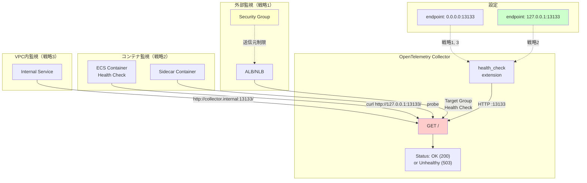

## 要約（Summary）

- OpenTelemetry Collectorの`health_check` extensionは、HTTP経由でCollectorの生存確認ができる監視用エンドポイントを提供する
- デフォルトポート13133でヘルスチェックエンドポイントを公開し、LBやコンテナオーケストレーターから監視可能
- セキュリティ観点からlocalhost bindが推奨されており、将来的にデフォルト動作が変更される可能性がある

## 本文（Body）

### 背景・問題意識

**ヘルスチェックの必要性**
- コンテナ環境（ECS/Kubernetes）では、プロセスが起動していてもCollectorが正常動作しているとは限らない
- OTLP受信ポート（4317 gRPC / 4318 HTTP）への直接ヘルスチェックは、プロトコル的に複雑
- Collector全体の健全性を簡単に確認できるエンドポイントが必要

**公式サポートの重要性**
- サードパーティツールに依存せず、Collector自身がヘルスチェック機能を提供
- 標準的な設定パターンとして確立されている

### アイデア・主張

**health_check extensionは、Collector監視のデファクトスタンダードである**

設定例：

```yaml
extensions:
  health_check:
    endpoint: 0.0.0.0:13133

service:
  extensions: [health_check]
  pipelines:
    metrics:
      receivers: [otlp]
      processors: []
      exporters: [prometheus]
```

**エンドポイントの公開範囲で3つの戦略がある：**

#### 戦略1：外部公開（ALB/NLBからのヘルスチェック）
```yaml
health_check:
  endpoint: 0.0.0.0:13133
```
- 用途：ALB/NLBのターゲットグループヘルスチェック
- 制約：Security Groupで送信元をLBに限定する必須

#### 戦略2：ローカル限定（同一コンテナ内のみ）
```yaml
health_check:
  endpoint: 127.0.0.1:13133
```
- 用途：ECSコンテナヘルスチェック、サイドカーからの監視
- 利点：外部からアクセス不可、最小権限の原則に合致
- 公式の推奨方向

#### 戦略3：VPC内公開（内部サービスメッシュ）
```yaml
health_check:
  endpoint: 0.0.0.0:13133
```
- 用途：同一VPC内の他のサービスからの監視
- 制約：Security Groupで送信元VPC CIDRに限定

### 内容を視覚化するMermaid図



### 具体例・ケース

**ケース1：ALBベースの1層Collector（推奨パターン）**
```yaml
# otel-collector-config.yaml
extensions:
  health_check:
    endpoint: 0.0.0.0:13133

service:
  extensions: [health_check]
```

ECS タスク定義：
```json
{
  "containerDefinitions": [{
    "name": "otel-collector",
    "portMappings": [
      {"containerPort": 4318, "protocol": "tcp"},
      {"containerPort": 13133, "protocol": "tcp"}
    ]
  }]
}
```

ALB ターゲットグループ：
- ヘルスチェックパス: `/`
- ヘルスチェックポート: `13133`
- インターバル: 30秒
- タイムアウト: 5秒
- Healthy threshold: 2

**ケース2：内部専用Collector（localhost bind）**
```yaml
extensions:
  health_check:
    endpoint: 127.0.0.1:13133
```

ECS タスク定義：
```json
{
  "containerDefinitions": [{
    "healthCheck": {
      "command": ["CMD-SHELL", "curl -f http://127.0.0.1:13133/ || exit 1"],
      "interval": 30,
      "timeout": 5,
      "retries": 3,
      "startPeriod": 10
    }
  }]
}
```
※ただしdistrolessイメージでは`curl`が無いため、別の対策が必要（後述）

**ケース3：Prometheusスタイルのヘルスチェック**
一部のバックエンドでは、health_check extensionが `/healthz` や `/ready` のようなエンドポイントも提供する実装がある。設定次第で複数のパスを定義可能：

```yaml
health_check:
  endpoint: 0.0.0.0:13133
  path: "/health"  # デフォルトは "/"
```

### 反論・限界・条件

**「0.0.0.0 bindは危険」は絶対ではない**
- Security Groupで適切に制限すれば、外部公開しても問題ない
- ただし「デフォルトで安全」ではないため、設定時に明示的な判断が必要

**「localhostに閉じれば完全に安全」も誤解**
- 同一コンテナ内の他プロセスからはアクセス可能
- マルチテナント環境では、コンテナ間のネットワーク分離が前提

**health_checkの限界**
- エンドポイントが200を返しても、全てのpipelineが正常とは限らない
- 例：exporter先のバックエンドが落ちていても、Collector自体は"healthy"と返す
- より詳細な監視には、Collectorの内部メトリクス（self-observability）との併用が必要

**公式ドキュメントの「将来的にlocalhost」への変更**
- breaking changeになるため、移行期間が長い可能性
- 既存の0.0.0.0設定に依存したデプロイは、将来の更新で動作が変わるリスク

**起動時間とヘルスチェックの競合**
- Collectorが起動して全てのreceiverがリスニング状態になるまで、数秒〜数十秒かかる
- health_checkエンドポイントは起動直後から200を返す可能性があり、「受信準備完了」とは限らない
- startPeriod（ECS）やinitialDelaySeconds（Kubernetes）での猶予が必須

### 関連ノート（Links）

- [[20251215171155-ecs-container-health-check-pattern|ECS Container Health Check設計パターン]] ECS側の設定詳細
- [[20251215171156-distroless-healthcheck-workaround|Distrolessコンテナでのヘルスチェック対策]] distroless環境での実装方法
- [[20251215171157-two-layer-collector-healthcheck|2層Collector構成のヘルスチェック戦略]] 2層構成での全体設計
- [[202511291430-delta-to-cumulative-processor|OpenTelemetry DeltaToCumulative Processorの概要]] 2層構成での使用例
- [[202511291440-load-balancing-exporter|OpenTelemetry Collector Load Balancing Exporterの概要]] スケーリング戦略

## To-Do / 次に考えること

- [ ] 自社のCollector構成で、0.0.0.0 bindとlocalhost bindどちらが適切か判断基準を作る
- [ ] health_checkエンドポイントと内部メトリクス監視の組み合わせパターンを確立
- [ ] Collector起動時間を計測し、startPeriodの適切な値を決定
- [ ] Security Groupのベストプラクティスをドキュメント化
- [ ] Collector公式イメージの将来的な変更をウォッチ（GitHub issue/PR追跡）
