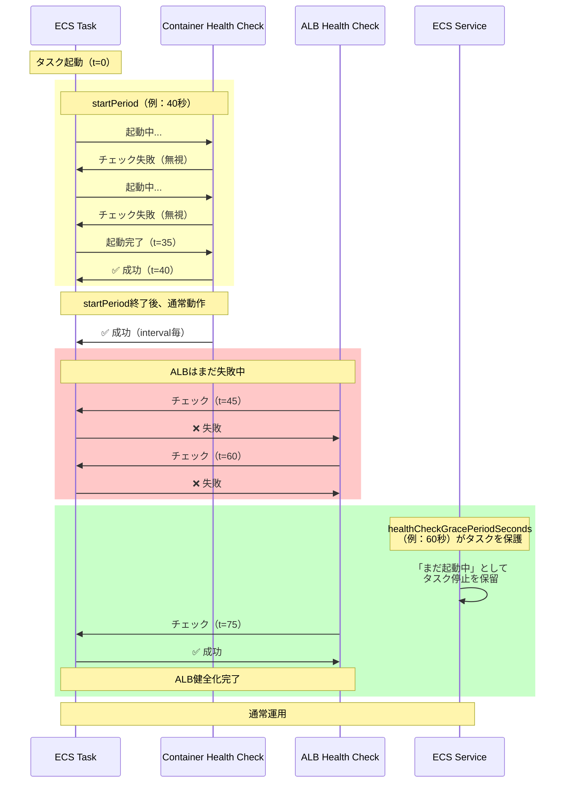

## 要約（Summary）

- ECSコンテナヘルスチェックは、interval/timeout/retries/startPeriodの4パラメータで挙動を制御する
- startPeriodは「起動直後の猶予時間」で、起動が遅いアプリケーションには必須
- healthCheckGracePeriodSeconds（サービスレベル）は、LB連携時にタスクが誤って刈られるのを防ぐ最後の砦

## 本文（Body）

### 背景・問題意識

**ECSのヘルスチェックは2層構造**
1. **Container Health Check**（タスク定義で設定）
   - コンテナ単体が健全かを判定
   - 失敗するとコンテナ再起動（essential=trueなら、タスク全体を停止）
2. **ELB Health Check**（サービス定義 + ターゲットグループで設定）
   - LBからのトラフィック振り分け判定
   - 失敗するとタスクをターゲットから除外（コンテナは停止しない）

**問題：起動が遅いアプリケーションでタスクが無限ループ**
- ヘルスチェックのタイムアウトより起動時間が長い
- 起動前に「不健康」判定されて再起動
- 永遠に起動完了しない

### アイデア・主張

**ECSヘルスチェック設計の3原則：**

#### 原則1：startPeriodは「起動時間 + バッファ」を確保する
startPeriodは、初回ヘルスチェック成功前の猶予時間。この期間中の失敗は「リトライ回数」にカウントされない。

**推奨値の決め方：**
```
startPeriod = (実測起動時間) × 1.5 + 10秒
```

OpenTelemetry Collectorの場合：
- 軽量設定（receiver 1-2個）：起動5秒 → startPeriod: 15秒
- 重量設定（receiver 10+個、processor多数）：起動20秒 → startPeriod: 40秒

#### 原則2：interval × retries > startPeriodにしない
この条件を満たすと、startPeriod中に全リトライを使い果たしてタスクが落ちる。

**悪い例：**
```json
{
  "interval": 10,
  "retries": 5,
  "startPeriod": 30
}
```
→ 10秒 × 5回 = 50秒だが、startPeriodは30秒なので、猶予終了後すぐ失敗扱い

**良い例：**
```json
{
  "interval": 30,
  "retries": 3,
  "startPeriod": 40
}
```

#### 原則3：ALB連携時はhealthCheckGracePeriodSecondsを併用
ECSサービスにLBを紐付けると、以下の競合が起きる：
- ECSコンテナヘルスチェック：早く成功（startPeriod短め）
- ALBヘルスチェック：起動確認に時間がかかる

この間にECSが「LBヘルスチェックに失敗している」としてタスクを停止する問題を防ぐため、healthCheckGracePeriodSecondsで猶予を与える。

```json
{
  "serviceName": "otel-collector",
  "healthCheckGracePeriodSeconds": 60,
  "loadBalancers": [...]
}
```

### 内容を視覚化するMermaid図



### 具体例・ケース

**ケース1：OpenTelemetry Collector（軽量、Fargate）**

実測：
- 起動時間：8秒
- イメージサイズ：200MB

推奨設定：
```json
{
  "healthCheck": {
    "command": ["CMD", "/probe", "http://127.0.0.1:13133/"],
    "interval": 30,
    "timeout": 5,
    "retries": 3,
    "startPeriod": 20
  }
}
```

理由：
- startPeriod: 8秒 × 1.5 + 10 = 22秒 → 20秒で丸める
- interval 30秒は、頻繁すぎないバランス

**ケース2：OpenTelemetry Collector（重量、多数のreceiver）**

実測：
- 起動時間：25秒（receiver初期化に時間）
- メモリ：2GB

推奨設定：
```json
{
  "healthCheck": {
    "interval": 30,
    "timeout": 10,
    "retries": 3,
    "startPeriod": 50
  }
}
```

理由：
- startPeriod: 25秒 × 1.5 + 10 = 47.5秒 → 50秒
- timeout 10秒：重量級なので応答に時間がかかる可能性

**ケース3：ALB + ECSサービス（デプロイ速度重視）**

目標：
- 新タスクを60秒以内にトラフィック受付可能にする

設定：
```json
// ECS タスク定義
{
  "healthCheck": {
    "interval": 15,
    "timeout": 5,
    "retries": 2,
    "startPeriod": 30
  }
}

// ECS サービス
{
  "healthCheckGracePeriodSeconds": 90
}

// ALB ターゲットグループ
{
  "HealthCheckIntervalSeconds": 10,
  "HealthyThresholdCount": 2,
  "HealthCheckTimeoutSeconds": 5
}
```

デプロイ時の流れ：
- t=0: タスク起動
- t=30: ECS container health成功
- t=30-50: ALBがヘルスチェック開始
- t=50: ALB 2回連続成功（10秒 × 2 = 20秒かかる）
- **t=50でトラフィック受付開始**

**ケース4：ALB無し、内部専用Collector**

設定：
```json
{
  "healthCheck": {
    "interval": 30,
    "timeout": 5,
    "retries": 3,
    "startPeriod": 20
  }
}
```

理由：
- healthCheckGracePeriodSecondsは不要（LB無し）
- interval/retriesは保守的に（再起動頻発を避ける）

### 反論・限界・条件

**「Docker HEALTHCHECKでは不十分」**
- ECSは、Dockerfileに埋め込まれた`HEALTHCHECK`命令を「見ない」
- タスク定義の`healthCheck`フィールドで明示的に設定しない限り、ヘルスチェックは動作しない
- 参考：AWS公式ドキュメント「ECS task definition health check」

**「startPeriodがあれば、intervalは短くても良い」は誤解**
- startPeriod終了後は通常のretries判定が働く
- intervalが短すぎると、一時的な高負荷で誤検知しやすい

**「healthCheckGracePeriodSecondsは長ければ良い」も危険**
- 長すぎると、実際に異常なタスクを検知するのが遅れる
- 推奨：起動時間の2〜3倍程度

**Fargateの起動時間の不確実性**
- Fargate（特に初回起動）は、イメージプル時間が含まれる
- 同じタスク定義でも、実行ごとに起動時間が±20%程度ブレる
- startPeriodは余裕を持たせる

**EC2起動タイプの場合**
- EC2インスタンスに既にイメージがキャッシュされていれば、起動が速い
- ただしインスタンス再起動後の初回は遅い
- 最悪ケースを基準にstartPeriodを設定

### 関連ノート（Links）

- [[20251215171154-otel-collector-health-check-extension|OpenTelemetry Collector Health Check Extension]] Collector側の設定
- [[20251215171156-distroless-healthcheck-workaround|Distrolessコンテナでのヘルスチェック対策]] CMD実行の課題
- [[20251215171157-two-layer-collector-healthcheck|2層Collector構成のヘルスチェック戦略]] 全体アーキテクチャ
- [[20251129165842-long-running-agent-failure-modes-solutions|長時間実行エージェントの失敗モードと対策]] 類似の起動時間問題

## To-Do / 次に考えること

- [ ] 自社のCollector起動時間を環境別（Fargate/EC2、初回/2回目以降）で実測
- [ ] startPeriodの推奨値を「環境×設定」のマトリクスで整理
- [ ] healthCheckGracePeriodSecondsの最適値を、デプロイ頻度と異常検知時間のトレードオフで決定
- [ ] ECSサービスイベントログから、ヘルスチェック失敗の頻度とパターンを分析
- [ ] CI/CDパイプラインに「起動時間計測」を組み込む
