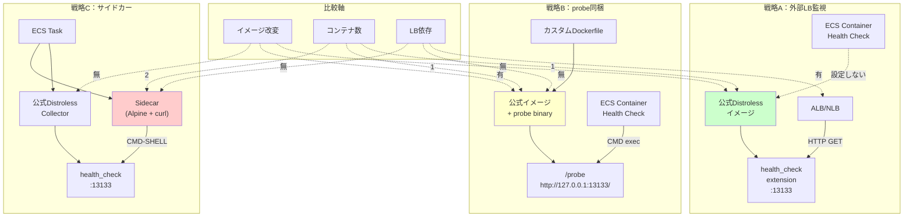

## 要約（Summary）

- Distrolessコンテナイメージには、curl/wget/shなどのユーティリティが含まれていない
- ECSのCMD-SHELLベースのヘルスチェックが動作しないため、3つの対策がある：外部LB監視、probe同梱、サイドカー
- OpenTelemetry Collectorの公式イメージは、セキュリティ重視でdistrolessベースが主流になりつつある

## 本文（Body）

### 背景・問題意識

**Distrolessとは**
- Googleが提唱する「アプリケーション実行に最小限必要なファイルだけを含むコンテナイメージ」
- シェル、パッケージマネージャー、コアユーティリティを全て除外
- 攻撃対象面（attack surface）の削減、イメージサイズの削減が目的

**ECSヘルスチェックとの不整合**
ECSのコンテナヘルスチェックは、2つの形式をサポート：
1. **CMD形式**：`["CMD", "バイナリ", "引数"]` → exec実行（シェル不要）
2. **CMD-SHELL形式**：`["CMD-SHELL", "シェルコマンド"]` → `/bin/sh -c`で実行

Distrolessは`/bin/sh`が無いため、CMD-SHELLが使えない。

**OpenTelemetry Collectorの状況**
- 公式イメージ：`otel/opentelemetry-collector:latest`はAlpine Linux派生（curlあり）
- Contrib版：`otel/opentelemetry-collector-contrib:latest`も同様
- しかし**distrolessへの移行**がコミュニティで議論されている（2024年時点）

### アイデア・主張

**Distrolessコンテナでヘルスチェックする3つの戦略（推奨順）：**

#### 戦略A：外部LB監視に任せる（推奨）

**方針**
- ECSコンテナヘルスチェックを設定しない（または最小限）
- ALB/NLBのターゲットグループヘルスチェックで監視
- Collectorのhealth_check extensionを0.0.0.0:13133で公開

**メリット**
- Dockerイメージを改変しない（公式イメージそのまま）
- 複雑なビルドプロセス不要
- LB層でのヘルスチェックはすでに確立された手法

**デメリット**
- LB無しの内部専用Collectorには使えない
- プロセス死だけでは検知できない（Collectorがハングした場合など）

**適用場面**
- 1層目（gateway/LB層）のCollector
- インターネットまたはVPC内部からのトラフィックを受けるエントリーポイント

**ECS設定例**
```json
// タスク定義：healthCheckを省略
{
  "containerDefinitions": [{
    "name": "otel-collector",
    "image": "otel/opentelemetry-collector-contrib:0.91.0",
    "portMappings": [
      {"containerPort": 4318},
      {"containerPort": 13133}
    ]
    // healthCheck: 設定しない
  }]
}

// サービス定義
{
  "healthCheckGracePeriodSeconds": 60,
  "loadBalancers": [{
    "targetGroupArn": "...",
    "containerName": "otel-collector",
    "containerPort": 13133
  }]
}
```

#### 戦略B：静的バイナリのprobe同梱（クリーン）

**方針**
- マルチステージビルドで、HTTP probeの小さなバイナリを作成
- Distrolessイメージに追加コピー
- ECS healthCheckでCMD形式（exec）で実行

**メリット**
- distrolessの利点（小サイズ、高セキュリティ）を維持
- 外部依存なし（LB不要でも動く）
- イメージ1つで完結

**デメリット**
- カスタムDockerfileが必要
- probe実装を自前で管理（または既存ツールを選定）
- イメージビルド・管理の複雑化

**実装例（Dockerfile）**
```dockerfile
# Stage 1: probeビルド
FROM golang:1.21 AS probe-builder
WORKDIR /app
COPY probe.go .
RUN CGO_ENABLED=0 GOOS=linux go build -ldflags="-w -s" -o /probe probe.go

# Stage 2: 公式イメージベース + probe追加
FROM otel/opentelemetry-collector-contrib:0.91.0
COPY --from=probe-builder /probe /usr/local/bin/probe
```

**probe.go（最小実装例）**
```go
package main

import (
    "fmt"
    "net/http"
    "os"
)

func main() {
    url := os.Args[1] // 例: http://127.0.0.1:13133/
    resp, err := http.Get(url)
    if err != nil || resp.StatusCode != 200 {
        os.Exit(1)
    }
    fmt.Println("OK")
    os.Exit(0)
}
```

**ECS タスク定義**
```json
{
  "healthCheck": {
    "command": ["CMD", "/usr/local/bin/probe", "http://127.0.0.1:13133/"],
    "interval": 30,
    "timeout": 5,
    "retries": 3,
    "startPeriod": 20
  }
}
```

**既存ツールの利用**
- `grpc_health_probe`：gRPC用だが、HTTP版を自作も可能
- `curl-static`：静的リンクされたcurlバイナリ（約2MB）

#### 戦略C：サイドカーコンテナで監視（運用重視）

**方針**
- 同一タスクに、軽量なサイドカーコンテナ（Alpine + curl）を追加
- サイドカーのhealthCheckで、Collectorのヘルスエンドポイントを叩く
- サイドカーをessential=trueにすれば、Collector死亡時にタスク全体が停止

**メリット**
- Collectorイメージを一切改変しない
- probeの実装をサイドカー側に閉じられる（更新容易）
- 監視ロジックの拡張が柔軟（複数エンドポイント監視、カスタムスクリプトなど）

**デメリット**
- コンテナ数が増える（リソース消費、料金増）
- タスク定義が複雑化

**ECS タスク定義**
```json
{
  "containerDefinitions": [
    {
      "name": "otel-collector",
      "image": "otel/opentelemetry-collector-contrib:0.91.0",
      "essential": true,
      "portMappings": [{"containerPort": 4318}, {"containerPort": 13133}]
    },
    {
      "name": "health-checker",
      "image": "curlimages/curl:8.5.0",
      "essential": false,
      "command": ["sh", "-c", "while true; do sleep 30; done"],
      "healthCheck": {
        "command": ["CMD-SHELL", "curl -f http://127.0.0.1:13133/ || exit 1"],
        "interval": 30,
        "timeout": 5,
        "retries": 3,
        "startPeriod": 10
      }
    }
  ]
}
```

**応用：Envoyスタイルの"admin API"**
サイドカーで、Collectorの内部メトリクスを取得して詳細判定も可能：
```bash
curl http://127.0.0.1:8888/metrics | grep -q 'otelcol_receiver_accepted_spans'
```

### 内容を視覚化するMermaid図



### 具体例・ケース

**ケース1：1層目Collector（戦略A採用）**
- 環境：ECS Fargate、ALB有り
- 要件：公式イメージそのまま、セキュリティ最優先
- 決定：戦略A
- 理由：LBがあるのでコンテナ内ヘルスチェック不要、運用シンプル

**ケース2：2層目Collector（戦略B採用）**
- 環境：ECS EC2、内部専用（LB無し）
- 要件：コンテナ死亡を即座に検知したい
- 決定：戦略B（probe同梱）
- 理由：distrolessの利点を保ちつつ、自律的な監視が可能

**ケース3：開発環境（戦略C採用）**
- 環境：ローカルDocker Compose、ECS開発環境
- 要件：実験的な監視ロジック（複数エンドポイント、メトリクス解析）
- 決定：戦略C（サイドカー）
- 理由：監視スクリプトを頻繁に変更するので、サイドカー分離が便利

**ケース4：セキュリティ監査が厳しい環境（戦略B強制）**
- 要件：「全てのコンテナが自己監視できること」が監査要件
- 決定：戦略B
- 理由：外部LBに依存せず、コンテナ単体で健全性証明が必要

### 反論・限界・条件

**「Alpine ベースなら問題ない」は短絡的**
- Alpine Linuxは軽量だが、distrolessより攻撃対象面は広い
- 組織のセキュリティポリシーによっては、distrolessが必須の場合も

**「Dockerfileを1つ増やすのは大した手間ではない」も状況次第**
- 公式イメージの更新追従が必要
- マルチアーキテクチャ（amd64/arm64）対応が複雑化
- CI/CDパイプラインのビルド時間増加

**「サイドカーはリソースの無駄」は必ずしも正しくない**
- サイドカーで監視ロジックを分離すると、メイン側の更新頻度が下がる
- 監視専門のサイドカーを複数サービスで共有すれば、再利用性が高い

**ECSの「essential=false」サイドカーの挙動**
- essential=falseのサイドカーが落ちても、メインコンテナは動き続ける
- 監視が死ぬとヘルスチェックが機能しないリスク
- 実務では、サイドカーもessential=trueにすることが多い

**distrolessの「デバッグ困難」問題**
- distrolessには`/bin/sh`が無いため、`docker exec`でデバッグできない
- 開発時は非distroless、本番はdistrolessのように使い分けも

### 関連ノート（Links）

- [[20251215171154-otel-collector-health-check-extension|OpenTelemetry Collector Health Check Extension]] Collector側のhealth_check設定
- [[20251215171249-ecs-container-health-check-pattern|ECS Container Health Check設計パターン]] ECS側の設定詳細
- [[20251215171157-two-layer-collector-healthcheck|2層Collector構成のヘルスチェック戦略]] 2層構成での適用例
- [[20251129165842-long-running-agent-failure-modes-solutions|長時間実行エージェントの失敗モードと対策]] 類似の監視課題

## To-Do / 次に考えること

- [ ] 自社のセキュリティポリシーで、distrolessが必須か確認
- [ ] 戦略Bを採用する場合、probe実装を社内標準化（Go/Rust/静的curl）
- [ ] 戦略Cの場合、サイドカーイメージを共通基盤として整備
- [ ] OpenTelemetry Collectorの公式イメージがdistroless化する動向を追跡
- [ ] 各戦略のコスト（ECS料金、ビルド時間、運用工数）を比較
