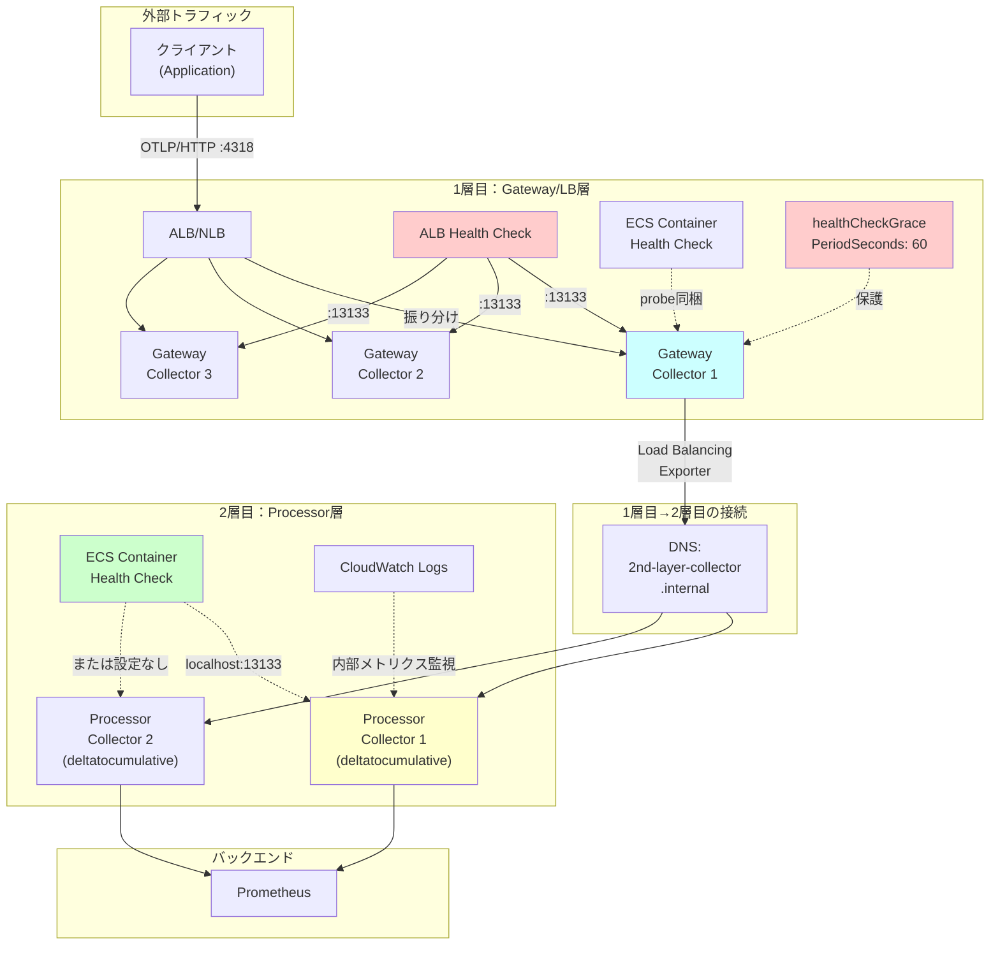

## 要約（Summary）

- 2層Collector構成では、1層目（gateway/LB層）と2層目（processor層）でヘルスチェック戦略を変える
- 1層目：ALB/NLBヘルスチェック + healthCheckGracePeriodSecondsで外部可用性を確保
- 2層目：ECSコンテナヘルスチェック（またはプロセス死検知のみ）で内部安定性を確保

## 本文（Body）

### 背景・問題意識

**2層Collector構成とは**
OpenTelemetry Collectorを2段に分けるアーキテクチャ：
- **1層目（Gateway/LB層）**：外部からのOTLP受信、トラフィック分散
- **2層目（Processor層）**：データ変換（例：DeltaToCumulative）、バックエンドへのexport

**なぜ2層に分けるか**
1. **スケーリングの分離**
   - 1層目：受信トラフィックに応じて水平スケール
   - 2層目：処理負荷（特にステートフル処理）に応じてスケール
2. **可用性の分離**
   - 1層目：高可用性（ALB + 複数タスク）
   - 2層目：処理の安定性（ステートフル処理の保護）
3. **責務の分離**
   - 1層目：ルーティング、認証、レート制限
   - 2層目：データ変換、集約、エンリッチメント

**ヘルスチェックの課題**
- 1層目と2層目で「健全性」の意味が異なる
- 1層目：「外部からリクエストを受け付けられるか」
- 2層目：「内部処理が正常に動いているか」

### アイデア・主張

**2層Collector構成では、層ごとに異なるヘルスチェック戦略を採用する：**

#### 1層目（Gateway/LB層）のヘルスチェック戦略

**目的**
- 外部からのトラフィックを健全なタスクにのみ振り分ける
- デプロイ時の無停止切り替え（Blue/Green）

**推奨構成**
```yaml
# 1層目 Collector設定
extensions:
  health_check:
    endpoint: 0.0.0.0:13133  # ALBから叩かれる

receivers:
  otlp:
    protocols:
      http:
        endpoint: 0.0.0.0:4318
      grpc:
        endpoint: 0.0.0.0:4317

exporters:
  loadbalancing:
    protocol:
      otlp:
        endpoint: "dns:///2nd-layer-collector.internal:4317"
    resolver:
      dns:

service:
  extensions: [health_check]
  pipelines:
    metrics:
      receivers: [otlp]
      exporters: [loadbalancing]
```

**ECS タスク定義**
```json
{
  "containerDefinitions": [{
    "name": "gateway-collector",
    "portMappings": [
      {"containerPort": 4318},
      {"containerPort": 4317},
      {"containerPort": 13133}
    ],
    "healthCheck": {
      "command": ["CMD", "/probe", "http://127.0.0.1:13133/"],
      "interval": 30,
      "timeout": 5,
      "retries": 3,
      "startPeriod": 20
    }
  }]
}
```

**ECS サービス定義**
```json
{
  "serviceName": "gateway-collector",
  "healthCheckGracePeriodSeconds": 60,
  "loadBalancers": [{
    "targetGroupArn": "...",
    "containerName": "gateway-collector",
    "containerPort": 4318
  }]
}
```

**ALB ターゲットグループ**
```json
{
  "HealthCheckProtocol": "HTTP",
  "HealthCheckPort": "13133",
  "HealthCheckPath": "/",
  "HealthCheckIntervalSeconds": 15,
  "HealthCheckTimeoutSeconds": 5,
  "HealthyThresholdCount": 2,
  "UnhealthyThresholdCount": 3
}
```

**ポイント**
- health_checkを`0.0.0.0`に公開（ALBから到達可能）
- Security GroupでALBからのみ13133を許可
- healthCheckGracePeriodSecondsで起動時の誤停止を防止
- ALBのHealthy threshold=2で、デプロイ速度を確保

#### 2層目（Processor層）のヘルスチェック戦略

**目的**
- 内部処理の異常を検知してタスク再起動
- ステートフル処理（DeltaToCumulative）の状態保持

**推奨構成**
```yaml
# 2層目 Collector設定
extensions:
  health_check:
    endpoint: 127.0.0.1:13133  # ローカルのみ

receivers:
  otlp:
    protocols:
      grpc:
        endpoint: 0.0.0.0:4317

processors:
  deltatocumulative:

exporters:
  prometheus:
    endpoint: "prometheus.monitoring:9090"

service:
  extensions: [health_check]
  pipelines:
    metrics:
      receivers: [otlp]
      processors: [deltatocumulative]
      exporters: [prometheus]
```

**ECS タスク定義（戦略A：LB無し）**
```json
{
  "containerDefinitions": [{
    "name": "processor-collector",
    "portMappings": [
      {"containerPort": 4317}
    ]
    // healthCheck: 設定しない（プロセス死だけ検知）
  }]
}
```

**ECS タスク定義（戦略B：probe同梱）**
```json
{
  "containerDefinitions": [{
    "name": "processor-collector",
    "healthCheck": {
      "command": ["CMD", "/probe", "http://127.0.0.1:13133/"],
      "interval": 30,
      "timeout": 5,
      "retries": 3,
      "startPeriod": 30
    }
  }]
}
```

**ポイント**
- health_checkは`127.0.0.1`に限定（外部公開不要）
- LB無しなのでhealthCheckGracePeriodSeconds不要
- ステートフル処理があるので、startPeriodを長めに（30-40秒）
- CloudWatch Logsで内部メトリクスを監視（self-observability）

### 内容を視覚化するMermaid図



### 具体例・ケース

**ケース1：標準的な2層構成（推奨パターン）**

| 項目 | 1層目（Gateway） | 2層目（Processor） |
|------|------------------|-------------------|
| **ECS起動タイプ** | Fargate | EC2 |
| **タスク数** | 3（Auto Scaling） | 2（固定） |
| **LB** | ALB（パブリック） | なし（内部DNS） |
| **health_check endpoint** | 0.0.0.0:13133 | 127.0.0.1:13133 |
| **ECS container health** | probe同梱（CMD） | probe同梱（CMD） |
| **healthCheckGracePeriod** | 60秒 | 不要 |
| **startPeriod** | 20秒 | 40秒（deltatocumulative起動遅い） |
| **監視** | ALB metrics + CloudWatch | CloudWatch Logs + 内部metrics |

**ケース2：高トラフィック環境（1層目を最速化）**

目標：
- 1層目のデプロイを30秒以内に完了
- 2層目は安定性重視（頻繁なデプロイ不要）

設定：
```json
// 1層目
{
  "healthCheck": {
    "interval": 10,
    "timeout": 3,
    "retries": 2,
    "startPeriod": 15
  }
}

// ALB
{
  "HealthCheckIntervalSeconds": 5,
  "HealthyThresholdCount": 2
}
```

結果：
- タスク起動→ALB健全化まで約25秒
- 2層目は変更なし（安定性優先）

**ケース3：低トラフィック環境（1層目のみ）**

前提：
- トラフィック少ない（1000 req/min以下）
- 2層構成の複雑さが不要

決定：
- 1層目のみでprocessorも実行
- DeltaToCumulativeなどのステートフル処理も1層目に集約

ヘルスチェック：
- ALBヘルスチェック + healthCheckGracePeriodSeconds
- startPeriodを長めに（processor起動時間考慮）

**ケース4：災害復旧訓練（Chaos Engineering）**

シナリオ：
- 2層目の全タスクを意図的に停止
- 1層目のヘルスチェックは健全
- データがバックエンドに届かない

検証項目：
- 1層目のexporterエラーメトリクスが上昇するか
- CloudWatch Alarmが発火するか
- 自動復旧（Auto Scaling）が動くか

教訓：
- **1層目のヘルスチェックだけでは不十分**
- エンドツーエンドの監視（synthetic monitoring）が必要

### 反論・限界・条件

**「2層構成は過剰設計」との批判**
- トラフィック/処理が軽量なら、1層で十分
- 2層にすると、運用コスト（監視、デプロイ、トラブルシュート）が増える
- 適用判断基準：
  - トラフィック > 10,000 req/min
  - ステートフル処理が必須（deltatocumulative、tail-sampling）
  - 可用性要件が高い（SLA 99.9%以上）

**「1層目にもprocessorを入れたい」は可能だが注意**
- 軽量なprocessor（batch、memory_limiter）なら問題ない
- 重量級（deltatocumulative、tail-sampling）は2層目に分離すべき
- 理由：1層目の再起動頻度が高いと、ステートが頻繁に失われる

**「ALBのコストが高い」場合の代替**
- NLB（より安価）への切り替え
- CloudMap + Route53（サービスディスカバリー）
- ただしヘルスチェックの柔軟性はALBが上

**「2層目のDNS解決が遅い」問題**
- ECS Service Discoveryは、タスク起動/停止時にDNS更新に遅延
- 1層目のloadbalancing exporterにDNSキャッシュ設定が必要

**「ステートフル処理の状態が失われる」問題**
- deltatocumulativeは、タスク再起動で累積値がリセット
- Prometheusは「カウンターリセット」として検知・補正できる
- ただし、短時間に頻繁な再起動は避けるべき

### 関連ノート（Links）

- [[20251215171154-otel-collector-health-check-extension|OpenTelemetry Collector Health Check Extension]] health_check extensionの設定
- [[20251215171249-ecs-container-health-check-pattern|ECS Container Health Check設計パターン]] ECS側のパラメータ調整
- [[20251215171339-distroless-healthcheck-workaround|Distrolessコンテナでのヘルスチェック対策]] distroless対応
- [[202511291430-delta-to-cumulative-processor|OpenTelemetry DeltaToCumulative Processorの概要]] 2層目での使用例
- [[202511291440-load-balancing-exporter|OpenTelemetry Collector Load Balancing Exporterの概要]] 1層目から2層目への接続
- [[202511291450-deltatocumulative-spof-design|OpenTelemetry DeltaToCumulative ProcessorのSPOF回避設計]] 2層目のステートフル処理の可用性

## To-Do / 次に考えること

- [ ] 自社の構成で、2層が必要か1層で十分かを判断（トラフィック量、処理内容）
- [ ] 1層目と2層目のヘルスチェックパラメータを、実測起動時間に基づいて決定
- [ ] エンドツーエンドの監視（synthetic monitoring）を導入して、全体可用性を測定
- [ ] 災害復旧訓練（Chaos Engineering）で、2層目停止時の挙動を検証
- [ ] CloudWatch Alarmの閾値を、1層目/2層目それぞれのメトリクスで設定
- [ ] 2層目のステートフル処理の状態保持戦略を検討（永続化、スナップショット）
