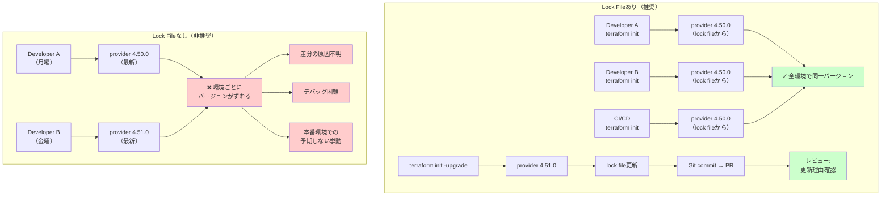

## 要約（Summary）

- `.terraform.lock.hcl` は**ほとんどのケースでリポジトリにコミットするのがベストプラクティス**
- Terraform公式も、providerバージョンの固定と変更のコードレビュー対象化を推奨
- 例外は「再利用モジュール専用リポジトリ」など限定的なケースのみ
- root moduleごとにlock fileを配置し、provider更新は `terraform init -upgrade` で明示的に行う

##本文（Body）

`.terraform.lock.hcl` のバージョン管理方針は、Terraform運用の安定性とチーム開発の効率に直結する。公式推奨に従った運用が最も安全で実用的である。

### 背景・問題意識

**Lock Fileの役割**
- providerの選択バージョンとチェックサムを記録
- 次回以降の `terraform init` で同じproviderバージョンを再利用
- 依存関係の意図しない変更を防止

**議論の背景**
- 「コミットすべき」「コミットすべきでない」の両論が存在
- チーム開発・CI環境での一貫性確保が課題
- 公式の推奨と実務の乖離が見られるケース

### アイデア・主張

**Terraform Lock Fileはソースコードの一部としてコミットし、providerの変更を明示的な操作とコードレビュー対象にすることで、環境間の一貫性とチーム開発の安全性を確保できる。**

#### なぜコミットするのが良いのか

**1) 環境間でのproviderバージョン統一**

Lock fileがコミットされていれば：
- ローカル開発環境
- CI/CD環境
- 別の開発者のマシン

すべてで**同じproviderバージョン**が使われる。

**問題のシナリオ（lock fileなし）:**
```
開発者A: terraform init → provider 4.50.0 をダウンロード
開発者B（1週間後）: terraform init → provider 4.51.0 をダウンロード
→ 同じコードなのに挙動が異なる可能性
→ 「なぜ差分が出た？」の原因特定が困難
```

**2) providerアップデートの意図的制御**

Lock fileをコミットすると、provider更新は以下の**明示的な操作**でのみ発生：
```bash
terraform init -upgrade
```

**メリット:**
- 意図しないprovider更新を防止
- 更新履歴がGit履歴に残る
- レビューで「設定変更」と「provider更新」を区別可能

Terraform自身も、lock fileが更新されたら「レビューしてコミットせよ」というメッセージを出力する。

**3) コードレビューでの可視性**

Provider更新がPR/MRの一部として可視化される：
```diff
# .terraform.lock.hcl
provider "registry.terraform.io/hashicorp/aws" {
-  version = "4.50.0"
+  version = "4.51.0"
```

**レビュー時の判断材料:**
- なぜproviderを更新したか？
- 新機能を使うため？バグ修正？
- 破壊的変更はないか？

### 内容を視覚化するMermaid図



### 具体例・ケース

#### ケース1: root moduleが複数ある構成（推奨運用）

**ディレクトリ構造:**
```
project/
├── envs/
│   ├── prod/
│   │   ├── main.tf
│   │   └── .terraform.lock.hcl  ← コミット
│   ├── stg/
│   │   ├── main.tf
│   │   └── .terraform.lock.hcl  ← コミット
│   └── dev/
│       ├── main.tf
│       └── .terraform.lock.hcl  ← コミット
└── modules/
    └── network/
        └── main.tf  ← lock fileは置かない
```

**運用ルール:**
- 各環境（root module）ごとに独立したlock fileを管理
- `modules/` 配下（子モジュール）にはlock fileを置かない
- `.gitignore` には `.terraform/` は含めるが、`.terraform.lock.hcl` は含めない

#### ケース2: Provider更新のワークフロー

**手順:**
```bash
# 1. 現在のバージョン確認
cd envs/prod
terraform version

# 2. 更新を実行
terraform init -upgrade

# 3. 差分確認（planで動作確認）
terraform plan

# 4. lock fileをコミット
git add .terraform.lock.hcl
git commit -m "feat: Upgrade AWS provider to 5.0.0 for new S3 features"

# 5. PRでレビュー依頼
# - なぜ更新したか
# - 破壊的変更はないか
# - plan結果は問題ないか
```

**PRレビューのチェックポイント:**
- Provider更新の動機は明確か？
- CHANGELOGを確認したか？
- 影響範囲（plan結果）は想定内か？

#### ケース3: 例外 - モジュール専用リポジトリ

**対象:**
- Terraform Registryに公開するモジュール
- 複数のroot moduleから利用される共通モジュール

**理由:**
- Lock fileは「構成全体（root module）」に属する
- 子モジュール単位でproviderバージョンを固定すべきではない
- 利用者側のroot構成でlock fileが生成される

**例: GitHub公開モジュール**
```
terraform-aws-vpc/  （Registryモジュール）
├── main.tf
├── variables.tf
└── .gitignore  ← .terraform.lock.hcl を無視
```

利用側：
```hcl
# ユーザーのroot module
module "vpc" {
  source  = "terraform-aws-modules/vpc/aws"
  version = "~> 5.0"
}
# → ここで .terraform.lock.hcl が生成される
```

#### ケース4: Pre-commitでlock fileが大量生成される問題

**状況:**
- pre-commit等が `modules/*/` で `terraform init` 相当を実行
- 各モジュールディレクトリにlock fileが生成される

**対策:**
```yaml
# .pre-commit-config.yaml
repos:
  - repo: https://github.com/antonbabenko/pre-commit-terraform
    hooks:
      - id: terraform_fmt
      - id: terraform_validate
        args:
          - --hook-config=--retry-once-with-cleanup=true
          # モジュールディレクトリでのinit抑制
```

**または `.gitignore` で除外:**
```gitignore
# Root以外のlock fileを無視
modules/**/.terraform.lock.hcl
```

**根本解決:**
- Terraform公式の整理では、lock fileはroot moduleに1つ
- ツール設定を見直し、モジュール内で init しない構成にする

### 反論・限界・条件

**「コミットしない方が良い」という主張について**

世の中には「lock fileをコミットしないのがベスト」という記事も存在するが、以下の理由で**Terraform公式推奨と矛盾**する：

**反対意見の論拠:**
- 依存関係の衝突を避ける
- 常に最新のproviderを使いたい

**公式の反論:**
- 依存関係は `terraform init -upgrade` で明示的に更新すべき
- 「常に最新」は予期しない破壊的変更のリスク
- Lock fileの目的は**再現性の確保**

**採用判断の原則:**
- 迷ったら公式ドキュメントに従う
- 独自運用は、公式を理解した上で逸脱する理由が明確な場合のみ

**適用条件:**
- チーム開発（複数人・複数環境）
- CI/CD環境の存在
- 長期運用を前提とする本番インフラ

**向いていないケース:**
- 1人での実験的な検証（とはいえコミットしても害はない）
- 使い捨てのデモ環境

**Terragrunt等の複雑な構成**

Terragruntのように「作業ディレクトリが動的に変わる」構成では：
- どこにlock fileを配置するか
- どのlock fileをコミット対象にするか

を明確にルール化する必要がある。

**AI時代の変化可能性**
- AIによる自動dependency更新（Renovate等）が普及
- ただし、更新の**レビュー・検証プロセス**は依然として必要
- Lock fileのコミットは、AI時代でも変わらず有効

## 関連ノート（Links）

- [[20251220012101-terraform-lock-cross-platform-hash|Terraform Lock Fileのクロスプラットフォームハッシュ問題と対策]] Mac/Linux環境でのlock file差分問題の解決策
- [[20251215090820-declarative-vs-imperative-migration|宣言型マイグレーションと手続き型マイグレーションの比較]] 宣言型（理想状態を定義）の思想はTerraformと共通
- [[20251215092710-sqldef-codebuild-integration|sqldefのCodeBuild統合パターン]] IaCツールによる設定管理の実例

## To-Do / 次に考えること

- [ ] 自社のTerraformリポジトリで `.terraform.lock.hcl` のコミット状況を確認
- [ ] `.gitignore` の設定を見直し、lock fileが除外されていないか確認
- [ ] Provider更新のワークフローをドキュメント化（`terraform init -upgrade` のタイミング）
- [ ] Terragrunt利用時のlock file配置ルールを整理
- [ ] RenovateBotなどの自動dependency更新ツールとの連携を検討
