## 要約（Summary）

- `.terraform.lock.hcl` はプラットフォーム（darwin/linux等）ごとに異なるハッシュを記録するため、Mac/Linuxでinitすると差分が発生する
- これは**仕様どおりの挙動**で、2025年時点でも自動解決されていない
- `terraform providers lock -platform=...` で事前に複数プラットフォーム分を生成する運用で差分を抑制できる
- チームで使うOS/arch分を明示的にロック対象にすることがベストプラクティス

## 本文（Body）

Terraform Lock Fileのクロスプラットフォーム対応は、チーム開発で頻出する実務的課題である。根本的な仕様理解と運用での対処が必要。

### 背景・問題意識

**典型的な問題シナリオ:**
```
開発者A（Mac）: terraform init → lock fileをコミット
CI（Linux）: terraform init → lock fileが変更される → コミットハッシュが変わる
開発者B（Mac）: git pull → ローカルでまた変わる

→ 「なぜ毎回lock fileが更新されるんだ？」
```

**何が起きているか:**
- `.terraform.lock.hcl` にはproviderバージョンだけでなく、**プラットフォームごとのチェックサム（hash）**が記録される
- `terraform init` は基本的に**実行したプラットフォーム向けのhashのみ**を記録
- 異なるOS/archで実行すると、そのプラットフォームのhashが追加/置換される

**なぜこうなっているか:**
- Terraformはproviderバイナリをダウンロード時にチェックサム検証する
- プラットフォームごとに異なるバイナリ → 異なるハッシュ
- セキュリティ上、落としたバイナリが正しいか確認するため

### アイデア・主張

**Terraform Lock Fileのクロスプラットフォーム差分問題は、`terraform providers lock -platform=...` でチームが使う全プラットフォームのハッシュを事前生成することで、運用上の混乱を回避できる。**

#### Lock Fileのハッシュ記録の仕組み

**Lock Fileの内容例:**
```hcl
provider "registry.terraform.io/hashicorp/aws" {
  version = "5.31.0"
  hashes = [
    "h1:abc123...",  # darwin_arm64
    "h1:def456...",  # linux_amd64
    "zh:ghi789...",  # その他のハッシュ形式
  ]
}
```

**プラットフォーム識別子:**
- `darwin_arm64`: Apple Silicon Mac
- `darwin_amd64`: Intel Mac
- `linux_amd64`: 一般的なLinux（x86_64）
- `linux_arm64`: ARM Linux（Graviton等）
- `windows_amd64`: Windows

**`terraform init` のデフォルト挙動:**
```bash
# Macで実行
terraform init
# → darwin_arm64 のハッシュのみが記録される

# Linuxで実行
terraform init
# → linux_amd64 のハッシュが追加される
# → lock fileが変更される → Gitコミットが変わる
```

#### 問題の本質：「全プラットフォーム分を自動で埋めない」仕様

Terraformは「実行したプラットフォーム分だけ」を記録する設計。

**理由（推測）:**
- 不要なプラットフォームのダウンロードを避ける（ネットワーク効率）
- 使わないプラットフォームの検証を強制しない

**結果:**
- クロスプラットフォームチームでは、誰かが別OSで init するたびにlock fileが更新される
- CI環境とローカルでOSが違う場合、特に顕著

**コミュニティの声:**
- 「init が全プラットフォーム分を勝手に埋めてほしい」という要望は継続的にある
- Terraform v1.4時点でも基本挙動は変わっていない

### 内容を視覚化するMermaid図

```mermaid
graph TB
    subgraph "問題: デフォルトの挙動"
        A1["Developer A<br/>（Mac / darwin_arm64）"] --> B1["terraform init"]
        B1 --> C1["lock file<br/>darwin_arm64 hash のみ"]
        C1 --> D1["Git commit"]
        
        D1 --> E1["CI<br/>（Linux / linux_amd64）"]
        E1 --> F1["terraform init"]
        F1 --> G1["lock file<br/>linux_amd64 hash 追加"]
        G1 --> H1["❌ Gitコミット変更<br/>（差分発生）"]
        
        H1 --> I1["Developer B<br/>（Mac）"]
        I1 --> J1["git pull"]
        J1 --> K1["terraform init"]
        K1 --> L1["❌ また差分<br/>（darwin hash更新）"]
    end
    
    subgraph "解決策: 事前に全プラットフォーム生成"
        M1["Developer A<br/>（初回セットアップ）"] --> N1["terraform providers lock<br/>-platform=darwin_arm64<br/>-platform=darwin_amd64<br/>-platform=linux_amd64"]
        N1 --> O1["lock file<br/>全プラットフォームhash"]
        O1 --> P1["Git commit"]
        
        P1 --> Q1["CI（Linux）"]
        Q1 --> R1["terraform init"]
        R1 --> S1["✓ lock file変更なし<br/>（既にlinux hash有）"]
        
        P1 --> T1["Developer B（Mac）"]
        T1 --> U1["terraform init"]
        U1 --> V1["✓ lock file変更なし<br/>（既にdarwin hash有）"]
    end
    
    style H1 fill:#ffcccc
    style L1 fill:#ffcccc
    style S1 fill:#ccffcc
    style V1 fill:#ccffcc
```



### 具体例・ケース

#### ケース1: Apple Silicon + Linux CIの標準構成

**チーム構成:**
- 開発者: Apple Silicon Mac（darwin_arm64）
- CI/CD: GitHub Actions（linux_amd64）

**運用手順:**
```bash
# 1. Provider追加・更新時
terraform init -upgrade

# 2. 両プラットフォームのハッシュを生成
terraform providers lock \
  -platform=darwin_arm64 \
  -platform=linux_amd64

# 3. lock fileをコミット
git add .terraform.lock.hcl
git commit -m "chore: Update provider locks for darwin_arm64 and linux_amd64"
```

**結果:**
- Mac開発者が init しても変更なし（darwin_arm64 hash済み）
- CI が init しても変更なし（linux_amd64 hash済み）

#### ケース2: Intel Mac混在環境

**チーム構成:**
- 開発者A: Apple Silicon Mac（darwin_arm64）
- 開発者B: Intel Mac（darwin_amd64）
- CI: Linux（linux_amd64）

**対応:**
```bash
terraform providers lock \
  -platform=darwin_arm64 \
  -platform=darwin_amd64 \
  -platform=linux_amd64
```

**注意点:**
- 3つのプラットフォーム分のハッシュが必要
- 1つでも欠けると、その環境で差分が出る

#### ケース3: ARM Linuxも含む構成（AWS Graviton等）

**チーム構成:**
- 開発者: Mac（darwin_arm64）
- CI: x86 Linux（linux_amd64）
- 本番インフラ: ARM Linux（linux_arm64、Graviton上のself-hosted runner等）

**対応:**
```bash
terraform providers lock \
  -platform=darwin_arm64 \
  -platform=linux_amd64 \
  -platform=linux_arm64
```

#### ケース4: Provider更新のワークフロー（統合版）

**手順（20251220005537との統合）:**
```bash
# 1. Provider更新
terraform init -upgrade

# 2. チーム全体のプラットフォームをロック
terraform providers lock \
  -platform=darwin_arm64 \
  -platform=darwin_amd64 \
  -platform=linux_amd64

# 3. 差分確認
terraform plan

# 4. コミット
git add .terraform.lock.hcl
git commit -m "feat: Upgrade AWS provider to 5.31.0

- Add support for new S3 feature X
- Lock for darwin_arm64, darwin_amd64, linux_amd64"

# 5. PRレビュー
```

**PRレビューポイント:**
- Provider更新の理由
- 全プラットフォームのハッシュが含まれているか
- plan結果は想定内か

#### ケース5: Makefileでの自動化

**プロジェクトルートの `Makefile`:**
```makefile
# チームで使うプラットフォームを定義
PLATFORMS := darwin_arm64 darwin_amd64 linux_amd64

.PHONY: init
init:
	terraform init

.PHONY: lock
lock:
	terraform providers lock \
		$(foreach platform,$(PLATFORMS),-platform=$(platform))

.PHONY: upgrade
upgrade:
	terraform init -upgrade
	$(MAKE) lock
```

**使い方:**
```bash
# Provider更新時
make upgrade

# lockだけ再生成したい時
make lock
```

**メリット:**
- プラットフォームリストを一元管理
- 開発者が `-platform=...` を覚える必要がない
- CI/CDでも同じコマンドを使える

#### ケース6: CIでの自動チェック

**.github/workflows/terraform.yml:**
```yaml
name: Terraform

on: [pull_request]

jobs:
  check-lock:
    runs-on: ubuntu-latest
    steps:
      - uses: actions/checkout@v3
      
      - name: Setup Terraform
        uses: hashicorp/setup-terraform@v2
      
      - name: Terraform Init
        run: terraform init
      
      - name: Check lock file unchanged
        run: |
          if ! git diff --exit-code .terraform.lock.hcl; then
            echo "❌ Lock file was modified by init"
            echo "Run: terraform providers lock -platform=darwin_arm64 -platform=linux_amd64"
            exit 1
          fi
```

**目的:**
- Lock fileが正しくクロスプラットフォーム対応しているか検証
- Linux環境でinitしても変更されないことを確認

### 反論・限界・条件

**「Lock Fileは意味ないのでは？」**

**反論:**
- Providerバージョンの固定には確実に効く
- チェックサム検証でセキュリティも向上
- クロスプラットフォーム対応は運用で解決可能

**「毎回 `-platform` 指定が面倒」**

**対策:**
- Makefile/タスクランナーで自動化
- CI/CDでチェック自動化
- チーム内で「Provider更新時の手順書」を整備

**「全プラットフォームのハッシュが必要？」**

**原則:**
- **チームで実際に使うプラットフォームのみ**でOK
- 誰も使わないWindowsのハッシュは不要

**判断基準:**
```
必要: ローカル開発、CI/CD、本番デプロイ環境で使うOS/arch
不要: 誰も使わない環境
```

**Terragrunt/Atlantisとの組み合わせ**

- Terragrunt: 各環境ディレクトリで `terraform providers lock` 実行
- Atlantis: サーバー側のプラットフォームを必ず含める
- どちらも「実行環境のプラットフォーム」を把握することが重要

**将来的な改善可能性**

- Terraform本体が「全プラットフォーム自動生成」に対応する可能性はある
- ただし2025年時点では、運用での対処が必要
- コミュニティでは継続的に議論されている

**「差分が出ても問題ないのでは？」**

**問題が起きるケース:**
- CI/CDで毎回lock fileが変更される → コミット履歴が汚れる
- 開発者間でlock fileの取り合い → 不要なコンフリクト
- 「なぜlockが変わった？」の調査コスト

**対処すべき理由:**
- 開発体験の向上
- lock file変更の意図を明確化（provider更新 vs プラットフォーム追加）
- コードレビューの効率化

## 関連ノート（Links）

- [[20251220005537-terraform-lock-file-commit-policy|Terraform Lock Fileのコミット推奨とベストプラクティス]] Lock Fileの基本的なコミット方針
- [[20251215090820-declarative-vs-imperative-migration|宣言型マイグレーションと手続き型マイグレーションの比較]] 依存関係の明示的管理の重要性

## To-Do / 次に考えること

- [ ] チームで使用している全プラットフォーム（OS/arch）をリストアップ
- [ ] Makefile等で `terraform providers lock` を自動化
- [ ] CIで「lock fileが変更されていないか」のチェックを追加
- [ ] Provider更新手順書に `-platform` 指定を明記
- [ ] Terragrunt/Atlantis利用時のプラットフォーム指定方法を確認
- [ ] Windows開発者がいる場合は `windows_amd64` も追加検討
