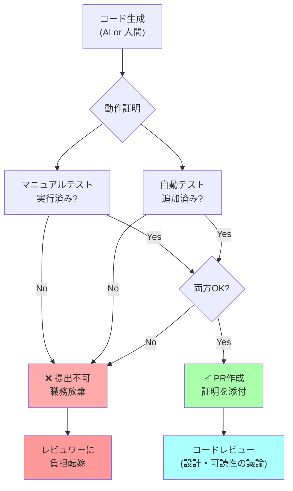

## 要約（Summary）

- ソフトウェアエンジニアの仕事は単にコードを書くことではなく、**動作することを証明したコードを届けること**である
- 検証されていないコードのPRを投げることは、検証作業をレビュワーに押し付ける職務放棄に等しい
- AI支援ツールの普及により、この原則の重要性はさらに高まっている

## 本文（Body）

### 背景・問題意識

AI支援ツール（LLM）の登場により、誰でも大量のコードを生成できるようになった。しかし、それに伴って**テストされていない巨大なPRをレビュワーに投げつける**というアンチパターンが頻発している。

特にジュニアエンジニアが「AIが生成したコードだから動くはず」と期待し、自ら検証せずにコードレビューを依頼するケースが増えている。これは他人の時間を浪費し、チームの生産性を下げる行為である。

### アイデア・主張

**ソフトウェアエンジニアの本質的な責任は、「動くことを証明したコードを届けること」である。コードを生成することは手段に過ぎない。**

現代ではLLMがコード生成を担当できるため、エンジニアの役割はむしろ「品質保証」「動作検証」「証明の提示」へとシフトしている。コードを書く能力よりも、**コードが正しく動くことを確認し、証明する能力**が重要になっている。

#### エンジニアの仕事の再定義

**従来の誤解**:
- エンジニア = コードを書く人
- コードレビュー = 書かれたコードが動くか確認する場

**正しい理解**:
- エンジニア = **動作を証明したコードを届ける人**
- コードレビュー = 設計・アーキテクチャ・可読性を議論する場（動作確認はその前提）

#### 動作証明がない場合の問題

検証されていないコードを提出することは：
1. **レビュワーの時間を浪費**: レビュワーが動作確認に時間を割かなければならない
2. **品質リスクの増大**: 動作確認が不十分なまま本番に到達する可能性
3. **チームの信頼低下**: 「この人のPRは動かない可能性がある」という認識が広がる
4. **プロフェッショナリズムの欠如**: 自分の成果物に責任を持たない姿勢の表れ

### 内容を視覚化するMermaid図



### 具体例・ケース

**ケース1: AIで生成したAPIエンドポイント**

**悪い例**:
1. ChatGPTにAPIエンドポイントのコード生成を依頼
2. 生成されたコードをそのままコピペ
3. 「AIが作ったのでレビューお願いします」とPR

**良い例**:
1. ChatGPTにAPIエンドポイントのコード生成を依頼
2. ローカル環境で実際に起動し、curlでリクエスト送信
3. レスポンスが期待通りか確認（マニュアルテスト）
4. テストコードを追加し、`pytest`で全テスト通過を確認
5. PRに動作確認結果を添付：
   ```
   ## 動作確認

   ローカル環境でテスト済み：
   ```bash
   curl -X POST http://localhost:8000/api/users \
     -H "Content-Type: application/json" \
     -d '{"name":"Alice","email":"alice@example.com"}'

   # Response: {"id":1,"name":"Alice","email":"alice@example.com"}
   ```

   テストも追加しました：
   ```bash
   pytest tests/test_users.py::test_create_user
   # PASSED
   ```
   ```

**ケース2: CSS変更**

Simon Willisonの例では、CSS変更の際にスクリーンショットを撮って視覚的な変更を証明することを推奨している。これにより、レビュワーは実際の変更内容を素早く理解できる。

### 反論・限界・条件

**「テストに時間がかかりすぎる」という反論**

確かにマニュアルテストと自動テストの作成には時間がかかる。しかし：
- **時間の転嫁**: 自分がテストに使う10分を省略すると、レビュワーが20分かけて検証することになる（結果的に非効率）
- **AI支援**: 現代のLLMはテストコード生成も得意なので、テスト作成コストは大幅に減少している
- **長期的価値**: 自動テストは将来のリグレッション検出にも役立つ

**「緊急の場合は省略しても良いか」**

緊急時でも動作確認は最低限必要。ただし：
- マニュアルテストは必須（動くことを自分の目で確認）
- 自動テストは後から追加することを明記する
- PRに「緊急対応のため自動テスト未追加、〇〇までに追加予定」と記載

**「ジュニアエンジニアには難しいのでは」**

むしろジュニアこそこの習慣を身につけるべき。動作検証の訓練は：
- エッジケースを見つける力を養う
- 良いテストの書き方を学ぶ機会
- プロフェッショナリズムを身につける基礎

## 関連ノート（Links）

- [[20251220050705-manual-and-automated-testing-two-step-verification|マニュアルテストと自動テストによる二段階検証]] - 具体的な検証方法論
- [[20251220050707-computer-cannot-be-accountable|コンピューターは説明責任を負えない]] - AI時代における人間の責任の原則
- [[20251215004321-ai-output-quality-check-responsibility|AI生成コンテンツの品質チェック責任]] - AI出力全般に対する品質責任
- [[20251129160321-ai-delegation-failure-patterns|AI丸投げの失敗パターン]] - テストせずにAIに任せる問題
- [[20251220050708-unverified-pr-burden-shift|未検証コードのPRはレビュワーへの負担転嫁である]] - この原則を破った場合の具体的な問題

## To-Do / 次に考えること

- [ ] 自分のチームで「PRに必要な証明」のガイドラインを作成する
- [ ] 過去のPRを振り返り、動作証明が不十分だったケースを分析する
- [ ] AI生成コードに対する動作検証のチェックリストを整備する
