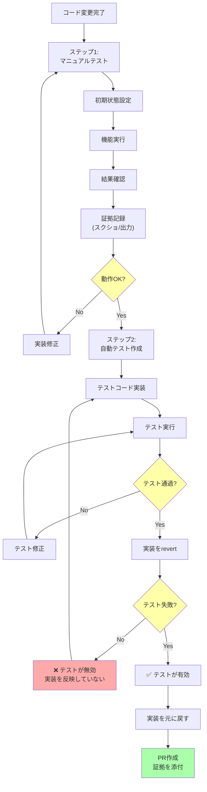

## 要約（Summary）

- コードが動くことを証明するには、**マニュアルテストと自動テストの両方**が必須である
- マニュアルテストで「実際に動くこと」を自分の目で確認し、自動テストで「将来も動き続けること」を保証する
- どちらか一方だけでは不十分：両方を実施して初めて真の品質保証となる

## 本文（Body）

### 背景・問題意識

コード変更後、多くのエンジニアは「自動テストが通ったから大丈夫」または「手動で確認したから大丈夫」と考えがちだが、これは不十分である。

- **自動テストだけ**: 実際のユーザー体験を見ていないため、思わぬUI/UXの問題を見落とす
- **マニュアルテストだけ**: 将来のリグレッションを防げず、別の変更で壊れる可能性が高い

### アイデア・主張

**コードの動作証明には、マニュアルテストと自動テストの「二段階検証」が不可欠である。どちらも省略してはならない。**

#### 二段階検証プロセス

```
ステップ1: マニュアルテスト（必須）
  ↓
自分の目で動作を確認
  ↓
ステップ2: 自動テスト（必須）
  ↓
将来も動くことを保証
```

Simon Willisonの記事では、**「自動テストがあるからマニュアルテストを省略」という判断を下すたびに後悔した**と述べられている。これは非常に重要な教訓である。

### マニュアルテストの実施方法

#### 基本プロセス

1. **初期状態の設定**: システムを既知の初期状態にする
2. **変更の実行**: 実装した機能を実際に動かす
3. **結果の確認**: 期待通りの動作をしているか検証
4. **証拠の記録**: スクリーンショット、ターミナル出力、動画などを保存

#### スキルとしてのマニュアルテスト

マニュアルテストは単なる「動かしてみる」ではなく、**開発すべきスキル**である：

- **再現可能な手順の設計**: 誰でも同じ結果を得られるよう手順を明確化
- **エッジケースの発見**: 正常系だけでなく、異常系・境界値も試す
- **実演可能な形式**: ターミナルコマンドの羅列など、PRに貼り付けられる形式で記録

**良い例**（Simon Willisonのスタイル）:
```bash
# 初期状態: データベースをリセット
./manage.py flush --no-input

# テストデータ作成
./manage.py create_test_user --name="Alice"

# 機能実行
curl -X POST http://localhost:8000/api/greet \
  -H "Content-Type: application/json" \
  -d '{"user_id": 1}'

# 期待される出力:
# {"message": "Hello, Alice!"}
```

この形式なら、レビュワーも同じ手順で動作確認できる。

#### シニアエンジニアの特徴

記事では、**エッジケースを見つける能力**がシニアエンジニアを定義する要素の一つとされている：

- 正常系だけでなく、異常系・境界値・競合状態などを試す
- 「どうやったら壊れるか」を考える習慣
- 見落としがちな前提条件を洗い出す

### 自動テストの実施方法

#### 基本要件

自動テストは以下を満たす必要がある：

1. **変更と一緒にバンドル**: PRに変更とテストの両方を含める
2. **実装を反映**: テストは実際の変更内容をカバーしている
3. **失敗可能性**: 実装を削除（revert）するとテストが失敗する（これでテストの有効性を確認）

#### マニュアルテストとのパターン一致

自動テストの構造は、マニュアルテストと同じパターンに従う：

1. **初期状態の設定** (Arrange): テストデータの準備
2. **変更の実行** (Act): 関数・APIの呼び出し
3. **結果の確認** (Assert): 期待値との比較

```python
def test_greet_user():
    # Arrange: 初期状態の設定
    user = create_test_user(name="Alice")

    # Act: 変更の実行
    response = client.post("/api/greet", json={"user_id": user.id})

    # Assert: 結果の確認
    assert response.json() == {"message": "Hello, Alice!"}
```

#### AI時代のテスト作成

現代のLLM（Claude Code、Copilotなど）は、テストコード生成が得意である：
- 既存のテストパターンを理解し、同様のテストを自動生成
- テストカバレッジを向上させる提案
- エッジケースのテスト追加

**そのため、「テスト作成に時間がかかる」という言い訳は通用しなくなっている。**

### 内容を視覚化するMermaid図



### 具体例・ケース

**ケース1: CLI ツールの開発**

Simon Willisonは、CLIツールの開発時に以下のようなワークフローを使用：

1. **マニュアルテスト**: ターミナルで実際にコマンドを実行し、出力を確認
2. **証拠記録**: コマンドと出力をPRコメントにペースト
3. **自動テスト**: Click's CLIRunnerを使った自動テスト作成

```python
# マニュアルテスト
$ myapp greet Alice
Hello, Alice!

# 自動テスト
def test_greet_command():
    runner = CliRunner()
    result = runner.invoke(greet, ['Alice'])
    assert result.exit_code == 0
    assert 'Hello, Alice!' in result.output
```

**ケース2: CSS変更**

CSSのような視覚的な変更では：

1. **マニュアルテスト**: ブラウザでページを開き、見た目を確認
2. **証拠記録**: スクリーンショットを撮影し、PRに添付
3. **自動テスト**: スクリーンショット比較ツール（Percy、BackstopJSなど）を活用

**ケース3: コーディングエージェントの活用**

Claude CodeやDevinなどのコーディングエージェントを使う場合：

- **エージェントにもマニュアルテストと自動テストを実施させる**
- エージェントはコマンド実行とテスト作成が得意なので、人間より効率的
- 人間は最終的な動作確認と、エージェントが見落としたエッジケースの検証に集中

### 反論・限界・条件

**「マニュアルテストは自動化すべきでは？」**

最終的には自動化が理想だが、開発中のマニュアルテストには独自の価値がある：
- **実際のユーザー体験**: 自動テストでは気づかないUI/UXの問題を発見
- **素早いフィードバック**: テストコード作成前に動作確認できる
- **学習機会**: システムの挙動を深く理解できる

**「時間がない場合は？」**

- **最低限マニュアルテストは必須**: 動かないコードをPRすることは許されない
- **自動テストは段階的に**: 最初は主要なパスだけ、後からエッジケースを追加
- **緊急時**: 自動テスト追加のチケットを作成し、必ず後で追加する

**「既存コードにテストがない場合は？」**

- 新規変更には必ずテストを追加する（「ボーイスカウトルール」）
- 既存コードのテスト追加は、変更する部分から徐々に
- テストカルチャーの醸成は時間がかかるが、誰かが始めなければならない

## 関連ノート（Links）

- [[20251220050704-code-delivery-with-proof-of-work|エンジニアの責任は動作証明されたコードを届けることである]] - この二段階検証が必要な理由
- [[20251220050706-coding-agent-proof-of-work|コーディングエージェントにも動作証明を求めるべき理由]] - AI時代におけるこの方法論の適用
- [[20251215004321-ai-output-quality-check-responsibility|AI生成コンテンツの品質チェック責任]] - AI出力の検証原則
- [[20251129160321-ai-delegation-failure-patterns|AI丸投げの失敗パターン]] - テストを怠った場合の具体的な失敗例
- [[20251129160322-junior-engineer-growth-with-ai.md|ジュニアエンジニアの成長戦略としてのAI活用]] - テストスキルの重要性

## To-Do / 次に考えること

- [ ] 自分のプロジェクトで「マニュアルテスト手順テンプレート」を作成する
- [ ] PRテンプレートに「動作確認結果」セクションを追加する
- [ ] エッジケース発見のチェックリストを整備する（境界値、null、競合状態など）
- [ ] AI生成テストの品質を評価する基準を定義する
