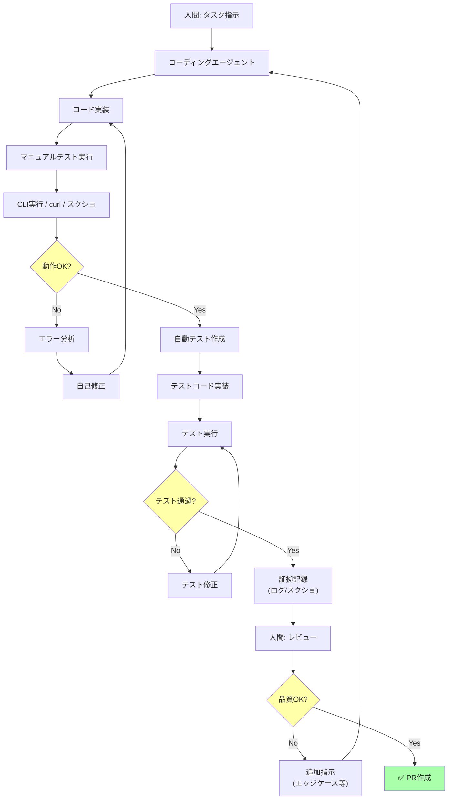

## 要約（Summary）

- 2025年の重要なトレンドは、コードを実行して検証できる**コーディングエージェント**（Claude Code、Codex CLIなど）の爆発的成長である
- これらのエージェントを使いこなすには、人間と同様に**マニュアルテストと自動テストの両方を実施させる**必要がある
- エージェントはテスト作成と実行が得意なため、動作証明のハードルは大幅に下がった

## 本文（Body）

### 背景・問題意識

従来のLLM（ChatGPT、Copilotなど）は「コード生成」はできたが、「そのコードが動くか確認する」ことはできなかった。そのため、人間が手動で検証する必要があった。

しかし、2025年にはClaude Code、Codex CLI、Devinなどの**コーディングエージェント**が台頭し、以下が可能になった：
- コードを実際に実行する
- テストを走らせる
- エラーを確認し、自己修正する
- 反復的に改善する

これにより、「AIが生成したコードは動かない可能性がある」という問題が、理論的には解決可能になった。

### アイデア・主張

**コーディングエージェントを活用する際は、人間と同じ品質基準を適用すべきである。つまり、マニュアルテストと自動テストの両方を実施させ、動作証明を求める。**

#### コーディングエージェントの特性

従来のコーディングアシスタントとコーディングエージェントの違い：

| 特性 | コーディングアシスタント<br/>(Copilot, ChatGPT) | コーディングエージェント<br/>(Claude Code, Devin) |
|------|----------------------------------------------|------------------------------------------------|
| **コード生成** | ✅ 可能 | ✅ 可能 |
| **コード実行** | ❌ 不可能 | ✅ 可能 |
| **テスト作成** | ✅ 可能（コード生成のみ） | ✅ 可能（作成 + 実行） |
| **エラー確認** | ❌ 不可能（人間が確認） | ✅ 可能（自己修正） |
| **反復改善** | ❌ 人間の指示が必要 | ✅ 自律的に可能 |

#### エージェントへの要求事項

人間に求めるのと同じ品質基準をエージェントにも適用する：

1. **マニュアルテスト**:
   - CLIツールなら実際にコマンドを実行させる
   - Webアプリならスクリーンショットを撮らせる
   - APIならcurlで動作確認させる

2. **自動テスト**:
   - 既存のテストパターンを学習し、同様のテストを作成
   - テストを実行し、通過することを確認
   - 実装をrevertするとテストが失敗することを確認

3. **証拠の提示**:
   - ターミナル出力のログ
   - スクリーンショット
   - テスト実行結果

### エージェントとの協働パターン

#### パターン1: CLIツール開発

Simon Willisonの例：

1. **エージェントに指示**: 「新しいコマンド `greet` を実装し、実際に実行して動作確認してください」
2. **エージェントの動作**:
   - コードを実装
   - `myapp greet Alice` を実行
   - 出力を確認
   - Click's CLIRunnerでテストを作成・実行
3. **人間の役割**:
   - エージェントのテスト結果をレビュー
   - エッジケースを追加指示（「空文字列の場合は？」など）

#### パターン2: CSS変更

1. **エージェントに指示**: 「ボタンの色を青に変更し、スクリーンショットで確認してください」
2. **エージェントの動作**:
   - CSSを修正
   - ローカルサーバーを起動
   - Puppeteerなどでスクリーンショット撮影
   - 画像を保存
3. **人間の役割**: スクリーンショットを目視確認し、意図通りか判断

#### パターン3: API開発

1. **エージェントに指示**: 「`/api/users` エンドポイントを実装し、curlで動作確認してください」
2. **エージェントの動作**:
   - エンドポイントを実装
   - ローカルサーバーを起動
   - curlでPOSTリクエスト送信
   - レスポンスを確認
   - pytest でintegration testを作成・実行
3. **人間の役割**:
   - curlの結果を確認
   - 認証、権限、バリデーションなどの追加要件を指示

### AI時代のテスト作成

記事では、**AI時代においてテスト作成の言い訳はなくなった**と強調されている：

- **テストパターンの学習**: エージェントは既存のテストを分析し、同じパターンで新しいテストを生成
- **ベストプラクティスの適用**: プロジェクトのテストコードが整理されていれば、エージェントも同じスタイルで書く
- **効率的な生成**: 人間が書くより速く、網羅的なテストを作成できる

**そのため、「テストを書く時間がない」という言い訳は通用しなくなっている。**

### 内容を視覚化するMermaid図



### 具体例・ケース

**ケース1: Claude Codeの活用例**

```
Human: 新しいAPIエンドポイント `/api/greet` を実装し、動作を確認してテストも作成してください

Claude Code:
1. エンドポイントを実装しました
2. ローカルサーバーで動作確認：
   $ curl -X POST http://localhost:8000/api/greet \
     -d '{"name":"Alice"}'
   {"message":"Hello, Alice!"}
3. テストを作成し、実行しました：
   $ pytest tests/test_api.py::test_greet
   PASSED

4. すべての証拠をPRに記録しました
```

**ケース2: エージェントは人間より徹底的にテストできる**

コーディングエージェントの利点：
- **疲れない**: 何度も同じテストを繰り返し実行できる
- **網羅的**: エッジケースを系統的にテストできる
- **再現性**: 同じ手順を正確に再現できる

**ケース3: エージェント活用における注意点**

- **過信しない**: エージェントのテスト結果を盲目的に信頼せず、人間がレビューする
- **エッジケースを指示**: エージェントは指示されたことしかテストしないため、追加のエッジケースを明示的に指示する
- **統合テストも重視**: 単体テストだけでなく、統合テストも実施させる

### 反論・限界・条件

**「エージェントに任せすぎると人間のスキルが低下するのでは？」**

確かにリスクはあるが、以下の点で緩和できる：
- **レビュースキルの向上**: エージェントのコードをレビューすることで、良いコード・悪いコードの判断力が養われる
- **設計スキルへの集中**: 実装から解放されることで、設計・アーキテクチャに時間を使える
- **定期的な手動実装**: 重要な機能は自分で実装し、基礎スキルを維持する

**「エージェントのコストが高いのでは？」**

- **時間コスト削減**: 人間がテストを書く時間 + デバッグ時間を考えると、エージェントのコストは相対的に低い
- **品質向上**: エージェントが徹底的にテストするため、本番での不具合が減少
- **学習効果**: エージェントが生成したテストから、人間が学ぶことができる

**「既存プロジェクトにテスト文化がない場合は？」**

- **エージェントが先生役**: エージェントに「このプロジェクトにテストを追加して」と指示すれば、ベストプラクティスに基づいたテストを生成してくれる
- **段階的導入**: 新規機能から始めて、徐々に既存コードにもテストを追加
- **テンプレート作成**: エージェントが生成したテストをテンプレート化し、チーム全体で活用

## 関連ノート（Links）

- [[20251220050826-manual-and-automated-testing-two-step-verification|マニュアルテストと自動テストによる二段階検証]] - エージェントにも適用すべきプロセス
- [[20251220050704-code-delivery-with-proof-of-work|エンジニアの責任は動作証明されたコードを届けることである]] - この原則はエージェント活用時も変わらない
- [[20251129160318-autonomous-ai-vs-coding-assistant|自律型AIとコーディングアシスタントの使い分け]] - コーディングエージェントの特性と使い分け
- [[20251129160321-ai-delegation-failure-patterns|AI丸投げの失敗パターン]] - エージェントに丸投げした場合の問題
- [[20251220050707-computer-cannot-be-accountable|コンピューターは説明責任を負えない]] - エージェント使用時の人間の責任

## To-Do / 次に考えること

- [ ] 使用しているコーディングエージェントの機能を把握する（実行可能なコマンド、スクリーンショット機能など）
- [ ] エージェントへの指示テンプレートを作成する（「実装 + マニュアルテスト + 自動テスト」セット）
- [ ] エージェントが生成したテストの品質を評価する基準を定義する
- [ ] チームでエージェント活用のベストプラクティスを共有する