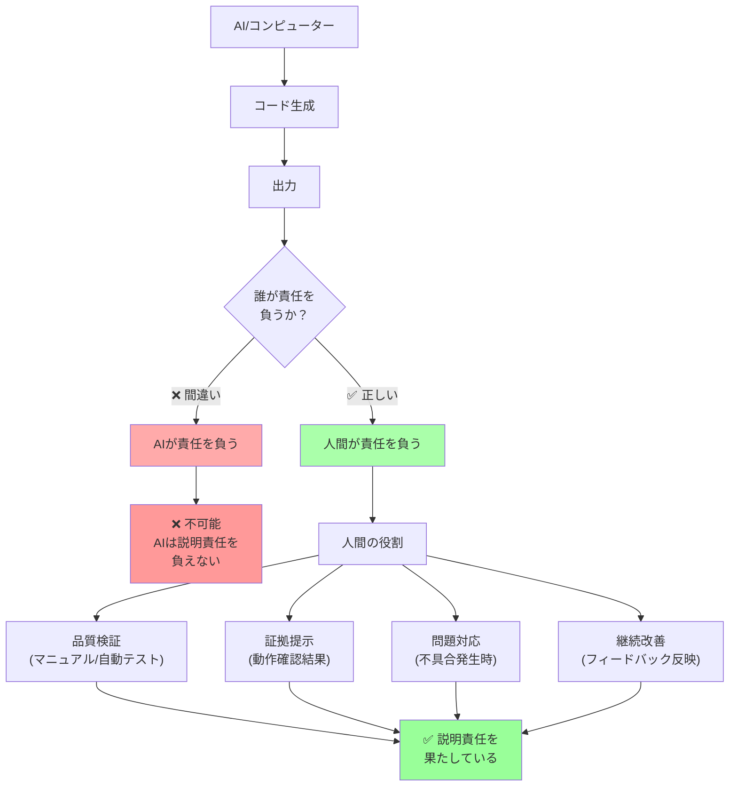

## 要約（Summary）

- コンピューター（AIやエージェント）は説明責任を負うことができない
- AI生成コードであっても、最終的な品質責任は**人間**にある
- 「AIが生成したから」は言い訳にならない：人間がループの中にいることで説明責任を果たす

## 本文（Body）

### 背景・問題意識

AI支援ツールの普及により、「AIが生成したコード」が大量に生産されるようになった。しかし、AIが生成したコードに問題があった場合、誰が責任を取るのか？

多くのエンジニアが「AIが生成したコードだから、自分の責任ではない」と考える傾向がある。しかし、これは根本的に間違っている。

### アイデア・主張

**コンピューターは説明責任（accountability）を負うことができない。そのため、AI生成コードであっても、最終的な品質責任は人間にある。**

Simon Willisonの記事では、この原則が明確に述べられている：

> "A computer can never be held accountable. That's your job as the human in the loop."
> （コンピューターは決して説明責任を負うことはできない。それはループの中の人間としてのあなたの仕事である。）

#### 説明責任とは何か

説明責任（Accountability）とは：
- **結果に対する責任**: 成果物が適切に機能することを保証する
- **意思決定の透明性**: なぜその選択をしたのかを説明できる
- **問題発生時の対応**: 不具合が起きた場合に修正する義務
- **継続的な改善**: フィードバックを受けて改善する責任

これらは人間にしかできない。AIは「責任を感じる」ことも「反省する」こともできない。

#### Human-in-the-Loop（人間がループの中にいる）

AI活用における「Human-in-the-Loop」の本質的な意味：

```
AI生成 → 人間の検証 → 人間の承認 → 提出
```

このループにおいて、人間は：
1. **品質の最終判断者**: AIの出力が適切かを判断する
2. **証拠の提供者**: 動作することを証明する
3. **説明責任者**: 問題が発生した場合に対応する

「人間がループの中にいる」とは、単に「人間が見ている」ではなく、**「人間が最終的な責任を持つ」**という意味である。

### 価値の転換

記事では、AI時代における価値の変化が述べられている：

**以前の価値**:
- コードを大量に生成する能力
- 速く書けること

**現在の価値**:
- 動作証明されたコードを届ける能力
- 品質を保証できること

> "Almost anyone can prompt an LLM to generate a thousand-line patch and submit it for code review. That's no longer valuable. What's valuable is contributing code that is proven to work."
> （ほぼ誰でもLLMに1000行のパッチを生成させてコードレビューに提出できる。それはもはや価値がない。価値があるのは、動作することが証明されたコードを貢献することである。）

### 内容を視覚化するMermaid図



### 具体例・ケース

**ケース1: AI生成コードの不具合**

**悪い対応**:
```
User: このAPIが本番で500エラーを出しています
Engineer: ChatGPTが生成したコードなので、私は知りません
```

→ これは説明責任の放棄

**良い対応**:
```
User: このAPIが本番で500エラーを出しています
Engineer: 申し訳ございません。すぐに調査して修正します。
         私がレビュー時にエッジケースのテストを怠りました。
```

→ 人間が責任を持って対応

**ケース2: コードレビューでの責任**

**悪い例**:
- PR: 「AIが生成したコードです。レビューお願いします」
- レビュワー: 「このコード、動きますか？」
- PR作成者: 「わかりません。AIが生成したので」

**良い例**:
- PR: 「以下の機能を実装しました（AIを活用）。動作確認済みです」
- 証拠: スクリーンショット、テスト結果、実行ログを添付
- レビュワー: 「動作確認ありがとうございます。設計について議論しましょう」

**ケース3: プロフェッショナルとしての姿勢**

AIを活用するプロフェッショナルエンジニアは：
1. **AIを道具として使う**: 生産性向上のツールとして活用
2. **品質は自分で保証**: AIの出力を盲目的に信頼せず、検証する
3. **説明責任を持つ**: 「AIが言ったから」ではなく、「私がレビューして適切と判断した」と言える

### 反論・限界・条件

**「AIの性能が上がれば、人間の責任は減るのでは？」**

いいえ、AIがどれだけ進化しても、説明責任は人間が負う：
- **法的責任**: 契約上、法律上の責任は人間（または組織）にある
- **倫理的責任**: 意思決定の倫理性を判断できるのは人間だけ
- **社会的信頼**: ユーザーや顧客は人間に対して信頼を置く

**「ジュニアエンジニアには責任が重すぎるのでは？」**

むしろジュニアこそ、この原則を早期に学ぶべき：
- **成長の基盤**: 責任感がプロフェッショナリズムの基盤
- **信頼の構築**: 責任を果たすことでチーム内の信頼を得る
- **キャリア形成**: 説明責任を果たせるエンジニアが評価される

ただし、以下のサポートは必要：
- シニアエンジニアのレビュー体制
- 失敗から学ぶ文化（ブレームレス文化）
- 段階的な責任の拡大

**「AIツールのベンダーに責任はないのか？」**

ツール自体の不具合（バグ、誤動作）はベンダーの責任だが、**そのツールを使ってどんなコードを生産するかは利用者の責任**：

- **ツールの不具合**: ベンダーの責任（例: AIが突然クラッシュ）
- **ツールの誤用**: 利用者の責任（例: 生成されたコードを検証せず使用）
- **最終成果物**: 利用者の責任（例: AI生成コードが本番で不具合）

### 責任を果たすための具体的行動

1. **検証の徹底**:
   - AI生成コードを盲目的に信頼しない
   - マニュアルテストと自動テストの両方を実施
   - エッジケースを自分で考えてテスト

2. **証拠の提示**:
   - 動作確認結果をPRに添付
   - テスト実行結果を記録
   - 不確実な部分は明記

3. **問題への対応**:
   - 不具合が発生したら速やかに対応
   - 根本原因を分析
   - 再発防止策を実施

4. **継続的学習**:
   - AIの限界を理解する
   - 自分の判断力を磨く
   - レビューフィードバックを活かす

## 関連ノート（Links）

- [[20251220050704-code-delivery-with-proof-of-work|エンジニアの責任は動作証明されたコードを届けることである]] - 説明責任の具体的な実践方法
- [[20251220051006-coding-agent-proof-of-work|コーディングエージェントにも動作証明を求めるべき理由]] - エージェント使用時の責任の所在
- [[20251215004321-ai-output-quality-check-responsibility|AI生成コンテンツの品質チェック責任]] - AI出力全般に対する品質責任
- [[20251129160321-ai-delegation-failure-patterns|AI丸投げの失敗パターン]] - 責任を放棄した場合の失敗例
- [[20251129160322-junior-engineer-growth-with-ai|ジュニアエンジニアの成長戦略としてのAI活用]] - 責任を持ちながらAIを活用する方法

## To-Do / 次に考えること

- [ ] 自分がAI生成コードをどこまで信頼しているか振り返る
- [ ] チームで「AI活用時の責任範囲」を明確化する
- [ ] 不具合発生時の対応プロセスを整備する（AI生成コードも含む）
- [ ] 「AIが生成したから」を言い訳にしていないか、過去のPRを振り返る
