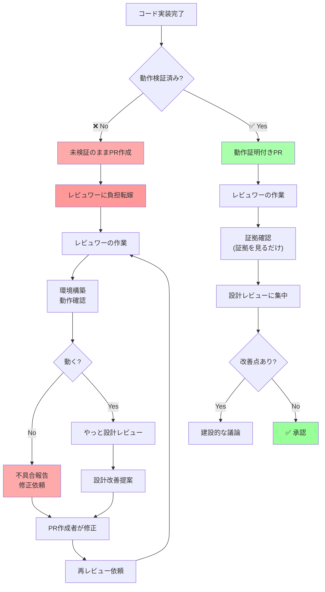

## 要約（Summary）

- テストされていない巨大なPRを投げることは、検証作業をレビュワーに押し付ける行為である
- これは礼儀に反し、他人の時間を浪費し、職務放棄に等しい
- AI時代において、このアンチパターンが頻発しているが、プロフェッショナルとして許されない

## 本文（Body）

### 背景・問題意識

Simon Willisonの記事では、冒頭でこの問題が強く批判されている：

> "In all of the debates about the value of AI-assistance in software development there's one depressing anecdote that I keep on seeing: the junior engineer, empowered by some class of LLM tool, who deposits giant, untested PRs on their coworkers—or open source maintainers—and expects the "code review" process to handle the rest."

（AI支援ツールの価値についてのすべての議論の中で、私が繰り返し目にする一つの憂鬱な逸話がある：LLMツールによって力を得たジュニアエンジニアが、巨大でテストされていないPRを同僚やOSSメンテナに投げつけ、「コードレビュー」プロセスが残りを処理してくれると期待していることだ。）

そして、記事はこう続ける：

> "This is rude, a waste of other people's time, and is honestly a dereliction of duty as a software developer."

（これは礼儀に反し、他人の時間の浪費であり、正直に言えばソフトウェア開発者としての職務放棄である。）

### アイデア・主張

**未検証のコードをPRすることは、本来自分がすべき検証作業をレビュワーに転嫁する行為であり、プロフェッショナリズムの欠如である。**

#### なぜ「負担転嫁」なのか

コードレビューのプロセスには、本来以下の前提がある：

1. **PR作成者の責任**: コードが動くことを証明する
2. **レビュワーの責任**: 設計、可読性、保守性、セキュリティなどを評価する

しかし、未検証のPRが投げられると：

```
【本来のフロー】
PR作成者: マニュアルテスト + 自動テスト（時間: 20分）
  ↓
レビュワー: 設計レビュー（時間: 15分）
  ↓
合計: 35分

【負担転嫁フロー】
PR作成者: 何もせず（時間: 0分）
  ↓
レビュワー: 動作検証 + 設計レビュー（時間: 40分）
  ↓
さらに修正指摘 → PR作成者が修正 → 再レビュー（時間: +30分）
  ↓
合計: 70分
```

**自分の20分を節約するために、レビュワーの時間を倍増させている。**

#### コードレビューの本質的な目的

コードレビューは「動作確認の場」ではなく、以下を議論する場である：

- **設計の妥当性**: より良いアーキテクチャはないか
- **可読性**: 他の開発者が理解しやすいか
- **保守性**: 将来の変更に耐えられるか
- **セキュリティ**: 脆弱性はないか
- **パフォーマンス**: ボトルネックはないか

未検証のコードがPRされると、レビュワーはこれらの本質的な議論に集中できず、「そもそも動くのか？」という初歩的な確認に時間を取られる。

### AI時代における問題の悪化

AI支援ツールの登場により、この問題が深刻化している理由：

#### 1. 生成の容易さ

従来は1000行のコードを書くのに数日かかったが、AIなら数分で生成できる。そのため、**検証せずにPRする心理的ハードルが下がった**。

#### 2. 「AIが生成したから動くはず」という誤解

多くのエンジニアが「AIが生成したコードは動く」と過信している。しかし実際には：
- AIは文法的に正しいコードを生成するが、論理的に正しいとは限らない
- コンテキストを完全に理解せず、プロジェクト固有のルールを無視する
- エッジケースを考慮しない

#### 3. 量産の誘惑

AIで大量のコードを生成できることから、「数撃てば当たる」的なアプローチを取るエンジニアが増えている。結果、質より量を優先し、一つ一つの検証を怠る。

### 内容を視覚化するMermaid図



### 具体例・ケース

**ケース1: OSSメンテナへの負担**

特にOSSプロジェクトでは、この問題が深刻である：

**悪い例**:
```
PR: "Added 15 new features using ChatGPT"
- 変更: 2500行追加
- テスト: なし
- 動作確認: なし
- 説明: 「ChatGPTが生成しました。レビューお願いします」
```

**メンテナの負担**:
- 2500行を読んで理解する
- 15の機能をそれぞれ動作確認する
- 不具合を見つけて報告する
- 設計の問題点を指摘する
- 結果的に数時間を消費

**良い例**:
```
PR: "Add user authentication feature"
- 変更: 300行追加
- テスト: 15個の自動テスト追加（カバレッジ95%）
- 動作確認:
  - ローカルで動作確認済み（スクリーンショット添付）
  - エッジケースもテスト済み（無効なパスワード、重複メールなど）
- 説明: 実装の設計判断について説明
```

**メンテナの作業**:
- 証拠を確認（5分）
- 設計レビュー（15分）
- 建設的なフィードバック

**ケース2: チーム内での信頼低下**

未検証PRを繰り返すエンジニアは、チーム内での信頼を失う：

1. **最初のPR**: 「動作確認してないけど、多分動くと思います」→ レビュワーが検証、不具合発見
2. **2回目のPR**: 「今回は大丈夫だと思います」→ また不具合
3. **3回目以降**: レビュワーは「この人のPRは全て詳細に検証が必要」と認識

結果：
- レビュー時間が常に長くなる
- 他のエンジニアがレビューを避けるようになる
- チーム内での評価が下がる

**ケース3: 時間コストの計算**

**シナリオ**: 5人のチームで、1人が未検証PRを投げ続ける

- **PR作成者の節約時間**: 20分/PR × 10 PR = 200分
- **レビュワーの追加時間**: 30分/PR × 10 PR = 300分
- **再レビュー時間**: 20分/PR × 5 PR（半分が修正必要） = 100分

**結果**:
- PR作成者: 200分節約
- チーム全体: 400分の損失
- **純損失: 200分**

一人の手抜きが、チーム全体の生産性を下げる。

### 反論・限界・条件

**「初学者は検証方法を知らないのでは？」**

確かに初学者には教育が必要だが：
- **学ぶべきスキル**: むしろ検証方法こそ、初学者が最初に学ぶべきスキル
- **チームのサポート**: テンプレートやガイドラインを提供する
- **段階的な成長**: 最初は小さなPRから始め、徐々に大きなPRに挑戦

**「時間がない場合は？」**

時間がなくても、最低限のマニュアルテストは必須：
- **優先順位**: 動かないコードをPRすることは、時間節約にならない（後で修正に時間がかかる）
- **範囲の調整**: 時間がないなら、PRの範囲を小さくする
- **明示的な依頼**: 「時間がなく十分なテストができていません。レビュー時に確認をお願いします」と明記すれば、まだ誠実

**「AIが完璧なら検証不要では？」**

将来的にAIが完璧になっても：
- **人間の責任**: 最終的な品質責任は人間にある（[[20251220051210-computer-cannot-be-accountable|コンピューターは説明責任を負えない]]）
- **検証の価値**: 検証プロセス自体が、コードへの理解を深める
- **信頼の構築**: 「検証済み」という証拠がチーム内の信頼を構築する

## 関連ノート（Links）

- [[20251220050704-code-delivery-with-proof-of-work|エンジニアの責任は動作証明されたコードを届けることである]] - この問題の根本原因と解決策
- [[20251220050826-manual-and-automated-testing-two-step-verification|マニュアルテストと自動テストによる二段階検証]] - 適切な検証方法
- [[20251220051210-computer-cannot-be-accountable|コンピューターは説明責任を負えない]] - AI生成コードでも人間が責任を持つべき理由
- [[20251129160321-ai-delegation-failure-patterns|AI丸投げの失敗パターン]] - この問題の具体的な失敗例
- [[20251215004321-ai-output-quality-check-responsibility|AI生成コンテンツの品質チェック責任]] - AI出力の品質責任

## To-Do / 次に考えること

- [ ] チームで「PRに必要な最低限の証拠」を定義する
- [ ] PRテンプレートに「動作確認」セクションを追加する
- [ ] 未検証PRを受け取った場合の対応フローを整備する（「動作確認をお願いします」と丁寧に依頼）
- [ ] 自分の過去のPRを振り返り、負担転嫁していなかったか確認する
