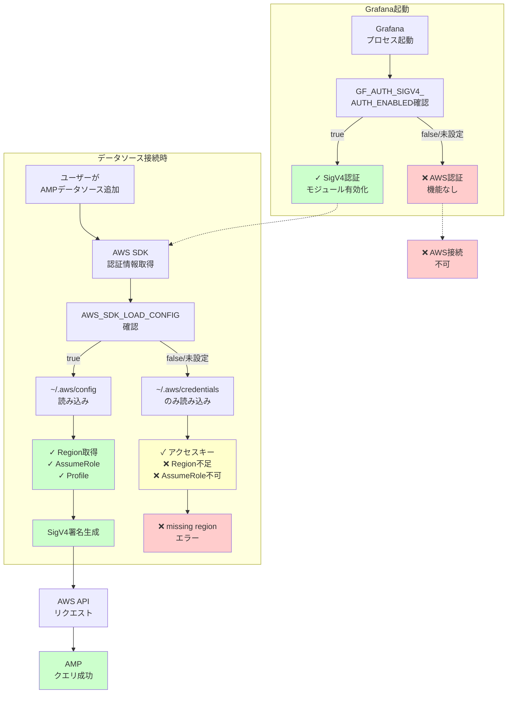

## 要約（Summary）

- Grafana が AWS サービス（AMP等）にアクセスする際、SigV4（AWS署名v4）認証が必要
- `AWS_SDK_LOAD_CONFIG=true` と `GF_AUTH_SIGV4_AUTH_ENABLED=true` の2つの環境変数が必要
- Grafana バックエンドは AWS SDK for Go を使用し、Credential Chain で認証情報を取得
- EC2/ECS のロールを使う場合は config ファイル不要だが、プロファイル・AssumeRole を使う場合は config の読み込みが必須

## 本文（Body）

Grafana から Amazon Managed Service for Prometheus（AMP）や CloudWatch などの AWS サービスにアクセスする際、AWS Signature Version 4（SigV4）による署名付きリクエストが求められる。この認証設定を正しく理解することで、環境ごとに適切な認証方式を選択できる。

### 背景・問題意識

**Grafana と AWS サービスの統合**

Grafana は以下の AWS データソースをサポート：
- Amazon Managed Service for Prometheus (AMP)
- CloudWatch
- Timestream
- Athena
- その他の AWS サービス

これらはすべて **AWS API への認証済みリクエスト**を必要とする。

**SigV4 とは**

AWS Signature Version 4 は、AWS API リクエストに対する署名メカニズム：
- リクエストのヘッダー・ボディ・パラメータをハッシュ化
- アクセスキー・シークレットで署名
- AWS 側で署名を検証して認証

**問題のパターン**

```
Error: unable to connect to AMP endpoint
Error: missing region
Error: no credentials found
```

多くの場合、Grafana の AWS 認証設定の不足が原因。

### アイデア・主張

**Grafana で AWS サービスにアクセスするには、SigV4 を有効化（`GF_AUTH_SIGV4_AUTH_ENABLED=true`）し、AWS SDK が設定ファイルを読むよう設定（`AWS_SDK_LOAD_CONFIG=true`）することで、プロファイル・リージョン・AssumeRole 設定を含む完全な認証情報を利用可能にする必要がある。**

#### 必要な設定の組み合わせ

**最小構成（AWS 公式推奨）:**
```bash
# 1. SigV4 認証を有効化
export GF_AUTH_SIGV4_AUTH_ENABLED=true

# 2. AWS SDK に config ファイルを読ませる
export AWS_SDK_LOAD_CONFIG=true

# 3. Grafana 起動
./bin/grafana-server
```

これにより：
- Grafana が SigV4 署名を生成できるようになる
- AWS SDK が `~/.aws/config` から region や AssumeRole 設定を取得できる

#### なぜ両方必要なのか

**`GF_AUTH_SIGV4_AUTH_ENABLED=true` の役割:**
- Grafana 自体に「AWS 認証を使う」と伝える
- データソース設定画面で「SigV4 Auth」オプションが有効になる
- バックエンドが AWS SDK を初期化する

**`AWS_SDK_LOAD_CONFIG=true` の役割:**
- Grafana のバックエンド（Go）が使う AWS SDK に config を読ませる
- Region や AssumeRole などの設定を有効化
- プロファイル指定を機能させる

### 内容を視覚化するMermaid図



### 具体例・ケース

#### ケース1: Docker Compose での Grafana + AMP

**構成:**
```yaml
# docker-compose.yml
version: '3.8'

services:
  grafana:
    image: grafana/grafana:latest
    environment:
      # SigV4 認証を有効化
      - GF_AUTH_SIGV4_AUTH_ENABLED=true
      # AWS SDK に config を読ませる
      - AWS_SDK_LOAD_CONFIG=true
      # プロファイル指定（オプション）
      - AWS_PROFILE=monitoring
    volumes:
      # AWS 設定ファイルをマウント
      - ~/.aws:/usr/share/grafana/.aws:ro
    ports:
      - "3000:3000"
```

**ホスト側の設定:**
```ini
# ~/.aws/config
[profile monitoring]
region = ap-northeast-1
role_arn = arn:aws:iam::123456789012:role/GrafanaRole
source_profile = default
```

**Grafana UI での設定:**
1. Configuration → Data Sources → Add data source
2. Prometheus を選択
3. URL: `https://aps-workspaces.ap-northeast-1.amazonaws.com/workspaces/ws-xxx`
4. Auth: **SigV4 auth** をチェック
5. Save & Test → "Data source is working" ✓

#### ケース2: EC2 インスタンスロールを使う場合

**メリット: config ファイル不要**

```bash
# EC2 起動時に IAM Role をアタッチ
# Role には AMP へのアクセス権限を付与

# Grafana 設定（シンプル）
export GF_AUTH_SIGV4_AUTH_ENABLED=true
export AWS_REGION=ap-northeast-1  # config なしでリージョン指定

# AWS_SDK_LOAD_CONFIG は不要
# → Instance Metadata から認証情報を取得
```

**なぜ動くのか:**
- Credential Chain で Instance Role が使われる
- リージョンは環境変数で指定
- プロファイルや AssumeRole を使わないのでシンプル

#### ケース3: Kubernetes (EKS) + IRSA

**IRSA（IAM Roles for Service Accounts）を使う場合:**

```yaml
# grafana-deployment.yaml
apiVersion: apps/v1
kind: Deployment
metadata:
  name: grafana
spec:
  template:
    metadata:
      annotations:
        # EKS が自動でトークンを注入
    spec:
      serviceAccountName: grafana-sa
      containers:
      - name: grafana
        image: grafana/grafana:latest
        env:
        - name: GF_AUTH_SIGV4_AUTH_ENABLED
          value: "true"
        - name: AWS_REGION
          value: "ap-northeast-1"
        # AWS_SDK_LOAD_CONFIG は不要
        # → IRSA のトークンで認証
```

**ServiceAccount と IAM Role の紐付け:**
```yaml
# service-account.yaml
apiVersion: v1
kind: ServiceAccount
metadata:
  name: grafana-sa
  annotations:
    eks.amazonaws.com/role-arn: arn:aws:iam::123456789012:role/GrafanaRole
```

#### ケース4: トラブルシューティング - 設定確認

**症状: "missing region" エラー**

```bash
# Grafana のログ
Error: failed to query AMP: missing region
```

**診断:**
```bash
# 1. 環境変数確認
docker exec grafana-container env | grep AWS
# → AWS_SDK_LOAD_CONFIG が true か？

# 2. config ファイル確認
docker exec grafana-container cat /usr/share/grafana/.aws/config
# → region が設定されているか？

# 3. マウント確認
docker exec grafana-container ls -la /usr/share/grafana/.aws
# → ファイルがマウントされているか？
```

**解決:**
```bash
# config に region を追加
# ~/.aws/config
[default]
region = ap-northeast-1
```

**症状: "no credentials found" エラー**

```bash
Error: NoCredentialProviders: no valid providers in chain
```

**診断:**
```bash
# Credential Chain の確認
# 1. 環境変数
env | grep AWS_ACCESS_KEY_ID

# 2. credentials ファイル
cat ~/.aws/credentials

# 3. Instance/Task Role（EC2/ECS の場合）
curl http://169.254.169.254/latest/meta-data/iam/security-credentials/
```

### 反論・限界・条件

**「なくても動くケース」との混乱**

以下の場合、`AWS_SDK_LOAD_CONFIG` がなくても動く：
- EC2 Instance Role で認証
- 環境変数 `AWS_REGION` で明示的にリージョン指定
- プロファイルや AssumeRole を使わない

しかし：
- 複数環境での柔軟性が失われる
- 既存の AWS CLI 設定を再利用できない
- プロファイル切り替えができない

**本番運用のベストプラクティス:**
- EC2/ECS: **Instance/Task Role** を使う（シンプル・セキュア）
- ローカル/開発: **プロファイル** を使う（柔軟）
- CI/CD: **環境変数** を使う（短命・セキュア）

**セキュリティ考慮**

Docker でクレデンシャルをマウントする場合：
```yaml
# 読み取り専用でマウント
volumes:
  - ~/.aws:/usr/share/grafana/.aws:ro  # ← :ro 重要
```

**本番では避けるべき:**
- コンテナイメージに credentials を焼き込む
- 長命のアクセスキーを使い続ける

**推奨:**
- Task/Instance Role を使う
- 一時的なセッショントークンを使う
- AWS Secrets Manager と統合

**Grafana バージョンによる違い**

- Grafana 8.0+ では SigV4 サポートが標準
- 古いバージョンではプラグインが必要な場合がある

**AWS SDK のバージョン**

Grafana が内部で使う AWS SDK for Go のバージョンにより：
- v1: `AWS_SDK_LOAD_CONFIG` が必要
- v2: デフォルトで config を読む

Grafana の新しいバージョンでは SDK v2 移行が進んでいるが、現時点では `AWS_SDK_LOAD_CONFIG` 設定が安全。

## 関連ノート（Links）

- [[20251220074112-aws-sdk-load-config-role|AWS_SDK_LOAD_CONFIGの役割と効果]] - config ファイル読み込みの詳細
- [[20251220074211-aws-sdk-credential-chain|AWS SDK Credential Chainの動作メカニズム]] - 認証情報の探索順序

## To-Do / 次に考えること

- [ ] 自社 Grafana の起動スクリプト/Dockerfile で環境変数を確認
- [ ] AMP/CloudWatch データソースの認証方式を整理
- [ ] 本番環境では Instance/Task Role への移行を検討
- [ ] Grafana のログで AWS SDK の認証フローを確認
- [ ] セキュリティ監査: アクセスキーの使用状況を確認
