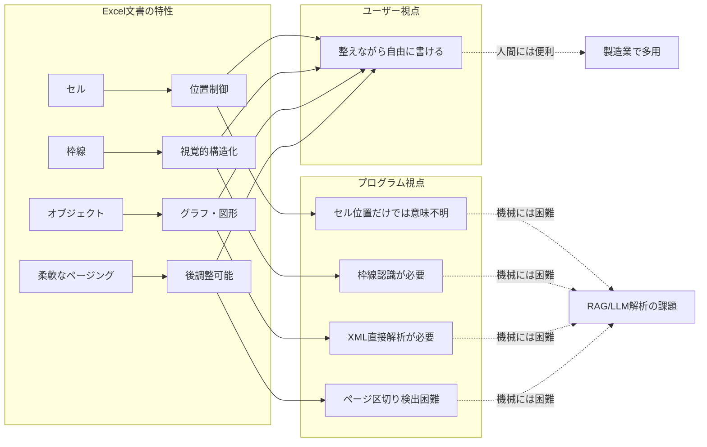

## 要約（Summary）

- 「Excel文書」とは、構造化テーブルではなく、セル・枠線・オブジェクトを駆使して一般的な文書を作成する手法を指す
- 製造業では見積書や仕様書作成に便利だが、LLM/RAGシステムでの解析は視覚的構造の理解が必要となり困難
- プログラム的な解析とユーザーの視覚的理解の間にギャップが存在する

## 本文（Body）

### 背景・問題意識

RAGシステムで製造業のドキュメントを扱う際、Excelファイルが頻繁に登場するが、これらは単なるデータテーブルではなく「文書」として使われている。WordやPowerPointではなくExcelで文書を作成する理由と、それがもたらす技術的課題を理解する必要がある。

### アイデア・主張

**Excel文書は「整えながら自由に」書ける点で優れているが、その自由度がプログラム的解析を困難にする。**

Excel文書が一般文書作成に使われる理由：
1. **枠線でグルーピング** - ドキュメント構成が見やすくなる
2. **セルによる位置制御** - 空白や文字の開始位置を正確に制御でき、文字を綺麗に揃えやすい
3. **柔軟なページ調整** - 先に一枚絵を作り、後からページの切り方を調整できる
4. **複合オブジェクト対応** - グラフやオブジェクトも入れられる

一方、LLM/RAGでの解析が困難な理由：
1. **視覚構造の理解** - 文字だけでなく枠の構造を視覚的に理解する必要がある
2. **レイアウトの意味** - セルの大きさやはみ出しもレイアウトの一部
3. **ページ区切りの曖昧さ** - ページ設定がされていないと区切りが不明
4. **複合データ形式** - グラフやオブジェクトも扱う必要がある

### 内容を視覚化するMermaid図

### 具体例・ケース

記事で紹介されている典型例：

**A. 枠線で構造化**: 工程管理書のような文書で、枠線を使って項目をグルーピング。個々のセルではなく枠線の範囲で意味が決まる。

**B. セルでフローチャート**: セルの枠線スタイルや配置でフローチャートを表現。セルの位置関係に意味がある。

**C. オブジェクト・画像・グラフ混在**: テキストセル、画像、グラフ、オブジェクト内テキストが混在。各要素の抽出方法が異なる。

**D. オブジェクト内テキスト**: セルではなく矩形オブジェクト内にテキストが埋め込まれている場合、通常のセルパースでは空ファイルに見える。

### 反論・限界・条件

**成立条件**:
- この問題は「Excel文書」に特有。構造化されたテーブルデータであれば、pandasなどで容易に扱える
- Excelが文書作成ツールとして使われる文化圏（特に日本の製造業）で顕著

**限界**:
- Excel文書の「自由度」は人によって異なり、どこまで複雑化するかは作成者次第
- 完全に視覚的レイアウトを理解するには、最終的に画像化してVision APIを使う必要がある場合も

**代替案**:
- 最初からWord/PowerPointで作成すれば構造化されやすいが、既存の文化・ワークフローを変えることは困難

## 関連ノート（Links）

- [[20251220083906-three-stage-approach-for-excel-document-parsing|Excel文書をLLM/RAGで扱うための3段階アプローチ]] - Excel文書を扱うための3段階アプローチ
- [[20251220084026-libreoffice-uno-page-break-control|LibreOffice UNOによるページ区切り制御のExcel→PDF変換]] - LibreOffice UNOによるページ区切り制御
- [[20251214135849-llm-instruction-following-limits|LLM指示追従能力の定量的限界と劣化特性]] - LLM指示追従能力の限界（視覚理解の課題と関連）
- [[20251214135546-llm-stateless-configuration-implication|LLMのステートレス性が設定ファイルに与える影響]] - LLMのステートレス性（構造理解の困難さと関連）
- [[20251214140318-agent-config-high-leverage-point|エージェント設定ファイルの高レバレッジ特性と慎重な設計の必要性]] - 設定ファイルの重要性（文書フォーマット標準化の示唆）

## To-Do / 次に考えること

- [ ] 他の「視覚的レイアウトが重要な文書形式」（PowerPointの図解、Visio図など）との比較
- [ ] Excel文書の複雑度を定量化する指標を考える（枠線数、オブジェクト数、セル結合率など）
- [ ] Excel文書作成の文化的背景を調査（なぜ日本の製造業で普及したのか）
