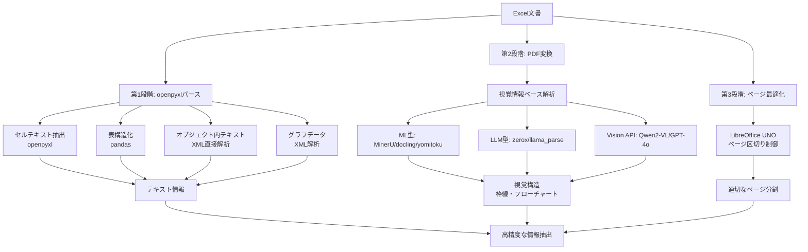

## 要約（Summary）

- Excel文書の解析には、テキストパース→PDF変換→視覚解析という3段階のアプローチがある
- 各段階で抽出できる情報が異なり、複合的に組み合わせることで精度が向上する
- openpyxlでは限界があるため、XML直接アクセスやVision APIの活用が必要

## 本文（Body）

### 背景・問題意識

Excel文書は視覚的レイアウトが重要な意味を持つため、単一の手法では完全な情報抽出が困難。製造業のRAGシステムでは、複数の手法を組み合わせた段階的アプローチが求められる。

### アイデア・主張

**Excel文書の解析は段階的にアプローチすることで、各段階の強みを活かして情報抽出精度を高められる。**

各段階で抽出できる情報と手法：

**第1段階: openpyxl等でExcelを直接パース**
- **テキスト情報抽出**: `openpyxl`で各セルの文字列を取得
- **表の構造化**: `pandas.read_excel()`でMarkdown形式に変換（構造化テーブル向け）
- **オブジェクト内テキスト**: zipファイル内のXML (`drawings/*.xml`) を直接パースして矩形オブジェクト内のテキストを取得
- **グラフデータ**: `charts/chart*.xml`から参照データを抽出し、画像ではなくデータとして扱う

**第2段階: PDFに変換して視覚情報ベースで解析**
変換ツール: `unoconv`, `gotenberg`, または有料API（CloudConvert等）

解析ツール（視覚情報考慮型）:
- **MinerU, docling, yomitoku**: 表・画像検出器とOCRの機械学習モデルを使用（yomitokuは日本語特化）
- **zerox, llama_parse**: LLMを用いてPDFをパース
- **Qwen2-VL, GPT-4o**: PDFを画像化してVision APIで直接読み取り（高精度OCR）

この段階で枠線構造やフローチャートをMarkdownやMermaid形式にテキスト化できる。

**第3段階: PDF変換時のページ区切り最適化**
- Excel側でページ設定がない場合、不適切な位置で区切られる問題に対処
- LibreOffice UNOを使って動的にページ区切りを調整（詳細は別ノート参照）

### 内容を視覚化するMermaid図

### 具体例・ケース

**ケース1: 枠線で構造化された工程管理書**
- 第1段階（openpyxl）: セル内テキストは取得できるが、枠線の構造は失われる
- 第2段階（PDF+視覚解析）: 枠線を認識してMarkdown表として構造化
- 結果: 工程内容や担当窓口などが適切にグルーピングされた表として抽出

**ケース2: セルで作成されたフローチャート**
- 第1段階: セルのテキストは取得できるが、フロー関係は不明
- 第2段階: セルの配置・枠線スタイルを認識してMermaid形式に変換
- 結果: `flowchart TD`形式でテキスト化され、LLMで理解可能に

**ケース3: オブジェクト内にのみテキストが記載**
- 通常のセルパースでは空ファイルに見える
- XML直接解析で`drawings/*.xml`からテキストを抽出
- ChatGPTに与えても正しく内容を認識

**ケース4: 防衛省のシステム経費資料**
- ページ設定がないため、表が途中で分断される
- 第3段階でLibreOffice UNOによりページ区切りを最適化
- 結果: 表が1ページに収まり、視覚解析の精度が向上

### 反論・限界・条件

**成立条件**:
- 複数手法の組み合わせが必要なため、処理コストと時間が増加
- 用途に応じて必要な段階を選択すべき（全て実行する必要はない）

**限界**:
- 極端に複雑なレイアウト（手書き図形の重ね合わせ等）は完全抽出が困難
- グラフをデータとして扱うか画像として扱うかはユースケース次第

**トレードオフ**:
- 第1段階のみ: 高速だがレイアウト情報を失う
- 第2段階追加: 視覚情報を獲得するが、変換・解析コストが増加
- 第3段階追加: ページ区切り最適化に追加処理が必要

**代替案の検討**:
- 構造化テーブルのみの場合: 第1段階（pandas）で十分
- 完全に視覚的な文書: 直接画像化してVision APIが効率的

## 関連ノート（Links）

- [[20251220083748-excel-document-as-visual-layout-tool]] - Excel文書の定義と解析困難性（前提）
- [[20251220084026-libreoffice-uno-page-break-control]] - LibreOffice UNOによるページ区切り制御（第3段階の詳細）
- [[20251214135849-llm-instruction-following-limits]] - LLM指示追従能力の限界（Vision APIの活用理由）
- [[20251214140318-agent-config-high-leverage-point]] - 設定ファイルの重要性（文書処理パイプラインの設計）
- [[20251129172155-temporality-conversion-challenges]] - データ変換の課題（形式変換の複雑性と類似）

## To-Do / 次に考えること

- [ ] 各段階の処理時間とコストを定量的に比較する
- [ ] どのタイプのExcel文書にどの段階が有効かのマトリクスを作成
- [ ] 他の複雑な文書形式（PowerPoint図解、Visio等）に同様のアプローチが適用可能か検証
- [ ] 各種PDF解析ツール（MinerU, yomitoku等）のベンチマーク結果を調査
