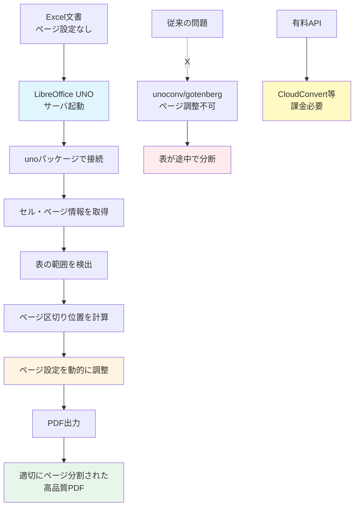

## 要約（Summary）

- Excel→PDF変換時、ページ設定がないと表が途中で分断される問題がある
- LibreOffice UNOを使えば、サーバとして動かしたLibreOfficeに対してAPIでセル・ページ情報を操作できる
- 有料ツール（CloudConvert等）に頼らず、独自実装でページ区切りを最適化できる

## 本文（Body）

### 背景・問題意識

Excel文書をPDFに変換して視覚解析する際、元のExcelファイルでページ設定が適切にされていないと、Office側が適当な位置でページを区切ってしまう。特に表が途中で分断されると、視覚情報ベースの解析精度が著しく低下する。

有料APIサービス（CloudConvert、Zamzar等）はこの問題を解決するが、プロダクトでの大量変換にはコストがかかる。また、内部処理をコントロールできないため、独自の最適化ロジックを組み込めない。

### アイデア・主張

**LibreOffice UNOを使うことで、Excel→PDF変換時のページ区切りを動的に制御し、有料ツールに頼らず高品質なPDFを生成できる。**

**仕組み:**
1. LibreOfficeをヘッドレスサーバとして起動
2. `uno`パッケージを使ってLibreOfficeにAPIアクセス
3. セル情報やページ情報を取得・編集
4. 最適なページ区切りを設定してPDF出力

**技術的詳細:**

LibreOfficeサーバの起動:
```bash
soffice --accept=socket,host=localhost,port=2002;urp;StarOffice.ServiceManager --headless
```

Python（uno）でのアクセス:
```python
import uno

# LibreOfficeサーバに接続
local_context = uno.getComponentContext()
resolver = local_context.ServiceManager.createInstanceWithContext(
    "com.sun.star.bridge.UnoUrlResolver", local_context
)
context = resolver.resolve(
    "uno:socket,host=localhost,port=2002;urp;StarOffice.ComponentContext"
)
desktop = context.ServiceManager.createInstanceWithContext(
    "com.sun.star.frame.Desktop", context
)

# Excelファイルを読み込み
input_url = "file:///path/to/excel.xlsx"
document = desktop.loadComponentFromURL(input_url, "_blank", 0, ())

# シート・セル情報にアクセス
for sheet in document.Sheets:
    cell = sheet.getCellByPosition(0, 0)
    # ページ区切りの設定などを操作
```

**利点:**
- **コスト削減**: 有料APIの課金不要
- **カスタマイズ性**: ページ区切りロジックを独自に実装可能
- **オープンソース**: LibreOfficeはフリーソフト
- **Dockerコンテナ化**: APIサーバとして再利用可能

### 内容を視覚化するMermaid図



### 具体例・ケース

**ケース: 防衛省のシステム経費実績資料**

**問題**:
- 元のExcelファイルにページ設定がない
- `unoconv`で変換すると、表が複数ページに分断される
- 視覚解析ツール（MinerU、yomitoku等）が表の全体構造を認識できない

**解決**:
1. LibreOffice UNOで表の範囲（行数・列数）を検出
2. 表全体が1ページに収まるようページサイズやマージンを調整
3. 必要に応じて縮小率を設定
4. PDF出力

**結果**:
- 表が1ページに収まった高品質なPDFが生成
- 視覚解析の精度が大幅に向上
- Markdown形式への変換も正確に

**実装例（GitHubで公開）**:
記事の著者はDockerを使ったExcel→PDF変換APIサーバとして公開している。
- LibreOfficeをコンテナ内でサーバとして稼働
- FastAPI等でHTTPエンドポイントを提供
- ページ区切り最適化ロジックを組み込み

### 反論・限界・条件

**成立条件**:
- LibreOfficeがサポートするファイル形式（Excel, Calc, Word等）であること
- ページ区切り最適化のロジックを実装する必要がある（手動設定では解決しない）

**限界**:
- **複雑な判断が必要**: 表のサイズが大きすぎる場合、どこで区切るかの判断が難しい
- **フォーマットの多様性**: Excel文書の複雑さによっては、完全自動化が困難
- **処理時間**: LibreOfficeの起動・処理にはそれなりの時間がかかる（秒単位）

**トレードオフ**:
- **開発コスト vs 運用コスト**: 独自実装には開発工数がかかるが、運用コストは削減
- **有料API vs LibreOffice UNO**: 有料APIはすぐ使えるが継続課金、UNOは初期実装が必要だが無料

**代替案**:
- 単純な変換のみなら`unoconv`や`gotenberg`で十分
- ページ区切りが適切なExcelファイルなら、最適化は不要
- 予算があれば有料APIサービスも選択肢

## 関連ノート（Links）

- [[20251220083906-three-stage-approach-for-excel-document-parsing]] - 3段階アプローチの第3段階として位置づけられる
- [[20251220083748-excel-document-as-visual-layout-tool]] - Excel文書の視覚的レイアウトの重要性（ページ区切りの影響）
- [[20251214140318-agent-config-high-leverage-point]] - 設定ファイルの高レバレッジ性（自動化パイプラインの設計）
- [[20251129190003-github-api-copilot-usage-conversion]] - API変換処理の例（データ変換パイプライン）
- [[20251129172155-temporality-conversion-challenges]] - 変換処理の課題（形式変換の複雑性）

## To-Do / 次に考えること

- [ ] LibreOffice UNOのドキュメントを深掘りし、他の操作可能な要素を調査
- [ ] ページ区切り最適化アルゴリズムのベストプラクティスを研究（表サイズ、余白、縮小率のバランス）
- [ ] LibreOfficeサーバの処理時間とリソース消費を測定し、スケーラビリティを評価
- [ ] 他のOffice形式（PowerPoint→PDF、Word→PDF）にも同様の手法が適用可能か検証
- [ ] Docker環境でのLibreOffice UNO APIサーバの構築例を試す
